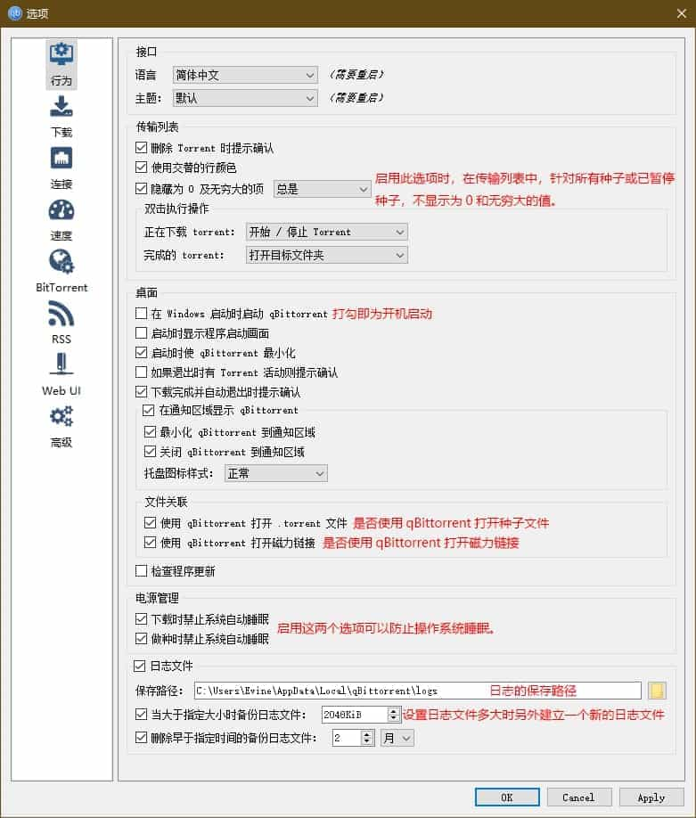
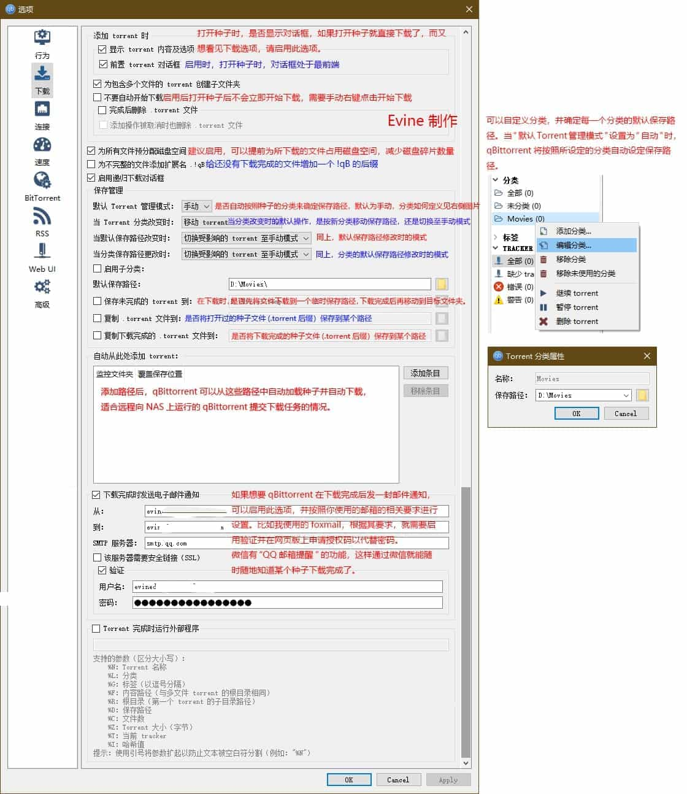
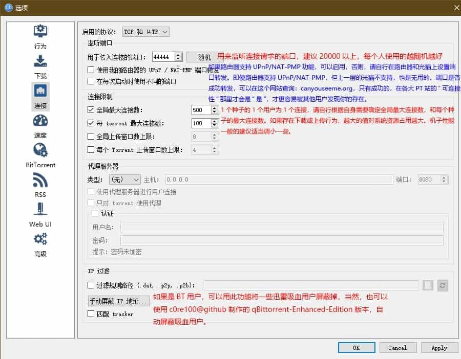
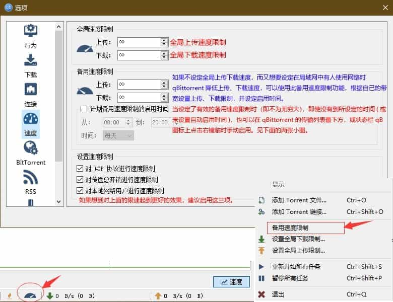
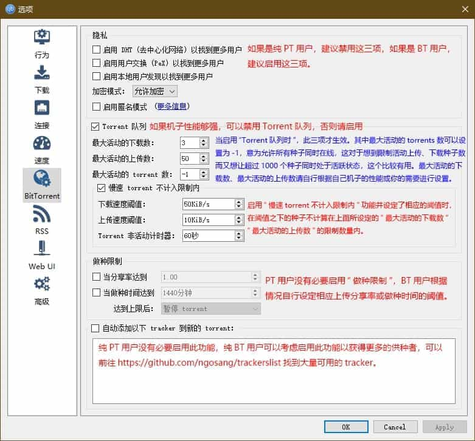
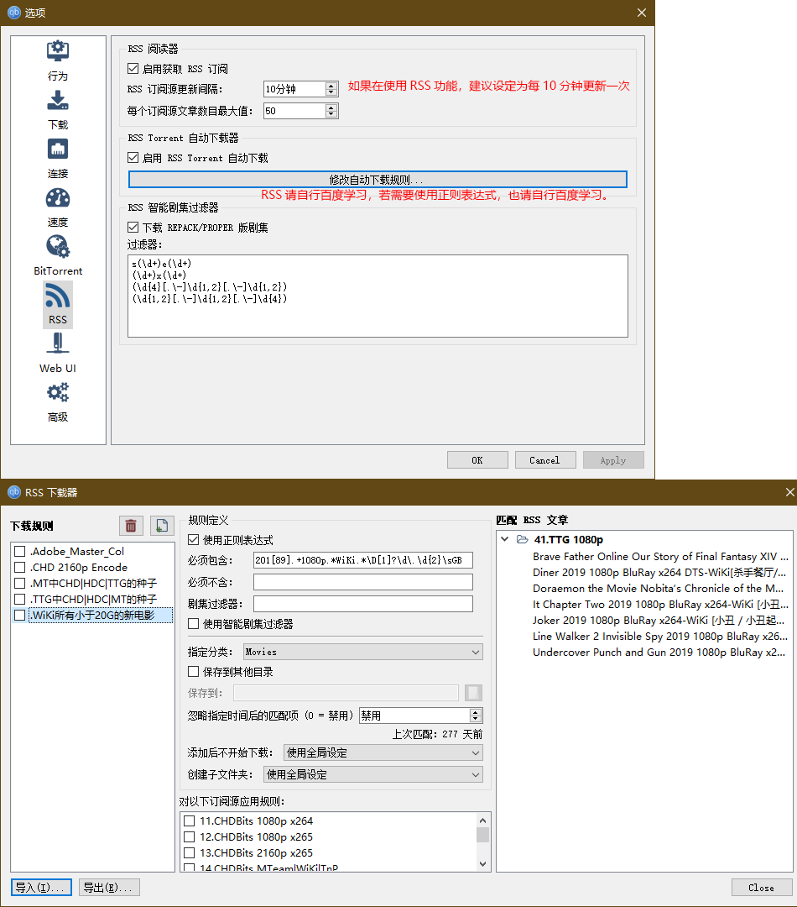
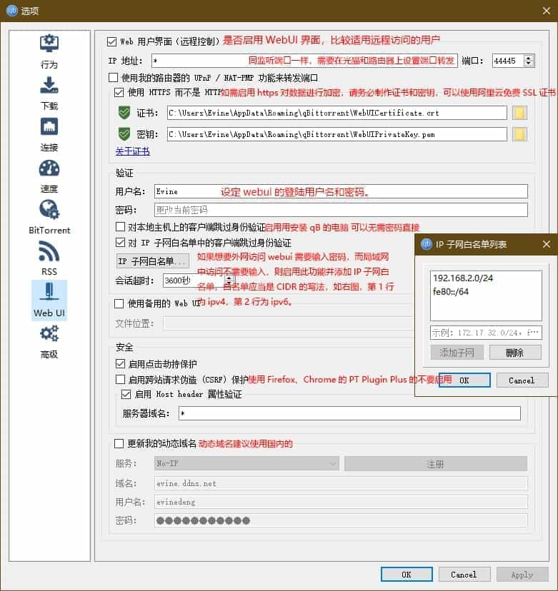
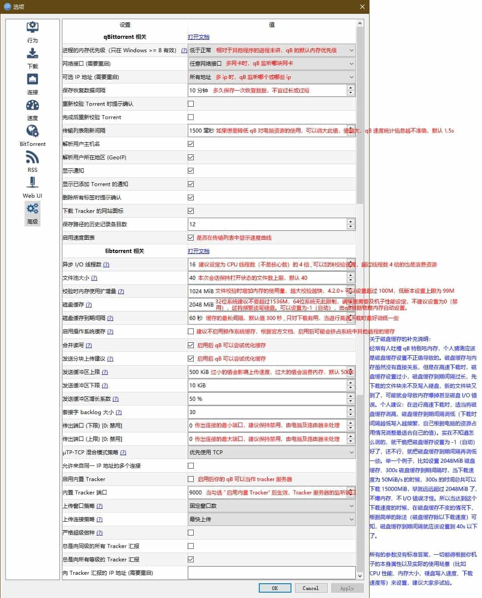

---
tags:
  - qBittorrent
  - 教程
  - 站外文档
---

# qBittorrent 参数详细设置教程

!!! info "关于"
    本文（源站）发布于 2021-08-18，更新于 2022-07-18。  
    本站归档时间：2022-08-04。更新时间：2022-08-04

!!! note "注意"
    - 全文将以目前的最新版 v4.2.1 为例，进行参数设置，老版本某些功能不太一致，请知悉。特别鸣谢 原创者：Evine！  
    - 更多参数，官方说明 [libtorrent 参数设置说明](https://www.libtorrent.org/reference-Settings.html)

## 版权信息

- 作者: [夜法之书](https://github.com/appotry)
- 原文: [qBittorrent 参数详细设置教程](https://blog.17lai.site/posts/f6b32521/)
- 许可证：[CC-NC-BY-SA 4.0](https://creativecommons.org/licenses/by-nc-sa/4.0/deed.zh)

----
    
## 行为参数

## 下载参数

## 连接参数

## 速度参数

## BT 参数

## RSS 设置

## Web 参数

## 高级参数

## 关于磁盘缓存的补充说明

经常有人吐槽 qB 特别吃内存，个人猜测应该是磁盘缓存设置不正确导致的。磁盘缓存设置过小，磁盘缓存到期间隔过长，先下载的文件块来不及写入硬盘，新的文件块又到了，可能就会导致内存爆掉甚至磁盘 I/O 错误。个人建议：在进行高速下载时，适当将磁盘缓存调高，磁盘缓存到期间隔调低（下载时间隔越低写入越频繁，自己根据电脑的资源占用情况调整最适合自己的值）。实在不知道怎么调的，就干脆把磁盘缓存设置为 -1（自动）好了，还不行，就把磁盘缓存到期间隔再调低一些。举一个例子，比如设置 2048MiB 磁盘缓存、300s 磁盘缓存到期间隔时，当下载速度为 50MiB/s 的时候，300s 的时间总共可以下载 15000MiB，早就远远超过 2048MiB 了，不爆内存、不 I/O 错误才怪。所以当达到这个下载速度的时候，在磁盘缓存不变的情况下，根据简单的除法（磁盘缓存除以下载速度）可知，磁盘缓存到期间隔就应该设置到40s以下了。

qB 在正常运行后，其占用的内存会比你所设置的磁盘缓存多几百 M。所有的参数没有标准答案，一切都得根据你机子的本身属性以及实际的使用场景（比如 CPU 性能、内存大小、硬盘写入速度、下载速度等）来设置，建议大家多试验。

## 关于TCP、UTP的补充说明

TCP 是 Internet 上最常用的协议，是一种面向连接的、可靠的、基于字节流的传输层通信协议。TCP 的优势在于双向互动机制兼顾数据传输的完整性、可控制性和可靠性，但复杂的校验与控制机制也使其没有 UDP 传输效率高。

UDP 协议与 TCP 协议一样用于处理数据包，是一种无连接的协议。UDP 的缺点是不提供数据包分组、组装和不能对数据包进行排序的缺点，也就是说，当报文发送之后，是无法得知其是否安全完整到达的。UDP 优势在于带宽占用小、传输效率和连接成功率高，有益于内网用户（如通过 UDP 内网穿透 UDP Hole Punching 连接），但 UDP 与 TCP 协议相比也存在无反向确认机制、无流量和序列控制等弊端。

uTP(Micro Transport Protocol) 是一种正在标准化的开放式 BT 协议，主要功能是提高宽带使用效率、减少网络问题。在减缓网络延迟和拥堵的同时最大化网络吞吐量、克服多数防火墙和 NAT 的阻碍，增强网络穿透和传输效率，同时增益流量控制，这对 BT 用户和 ISP 都是互利的。uTP 虽基于 UDP 协议但有所不同，uTP 通过拥堵控制算法（Ledbat）可限制延时，当延时不严重时可最大限度利用带宽，并能通过 uTP 提供的信息用于选择 TCP 连接的传输率，即使在不作限速设置的情况下，也能减少网络拥堵产生，当用户端之间都启用 uTP 时，可见明显的传输速率提升。内网无法实现端口映射的用户启用 uTP，可以改善与网外用户的连接。

使用 uTP 进行连接的用户，其标志将包含 “P”。