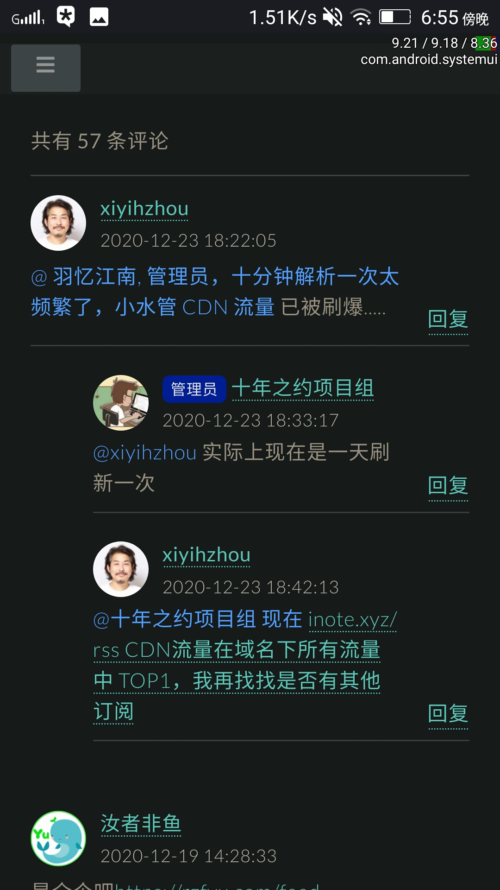
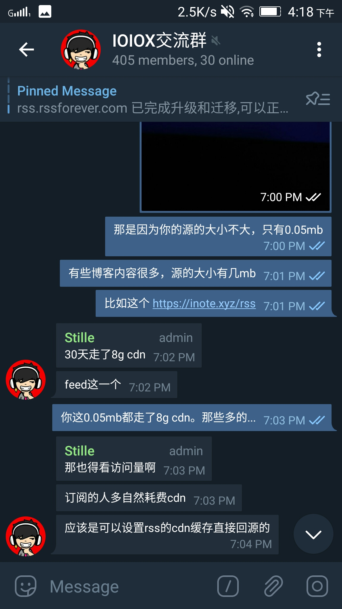
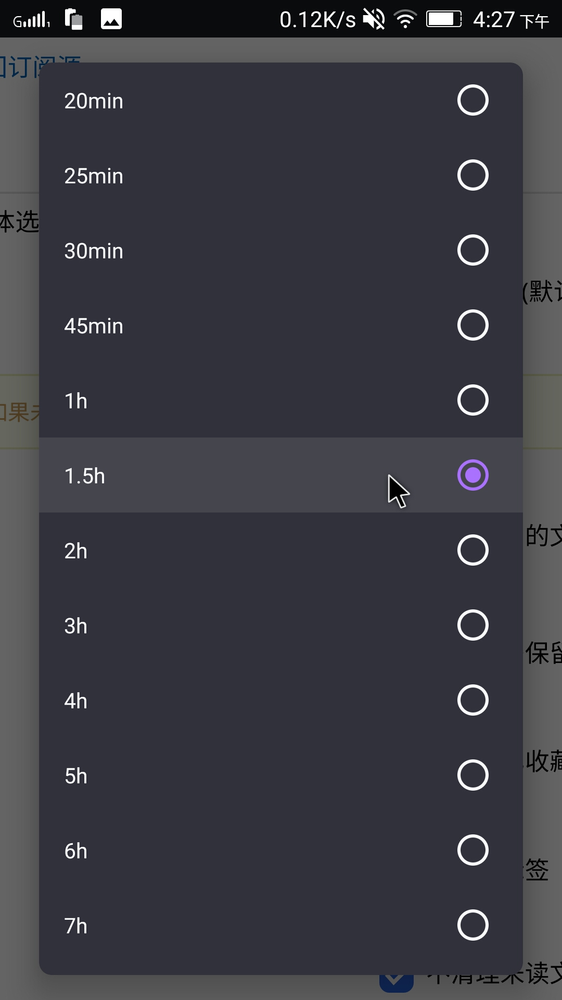
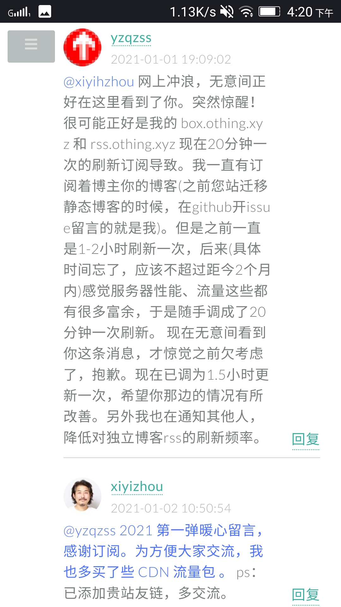
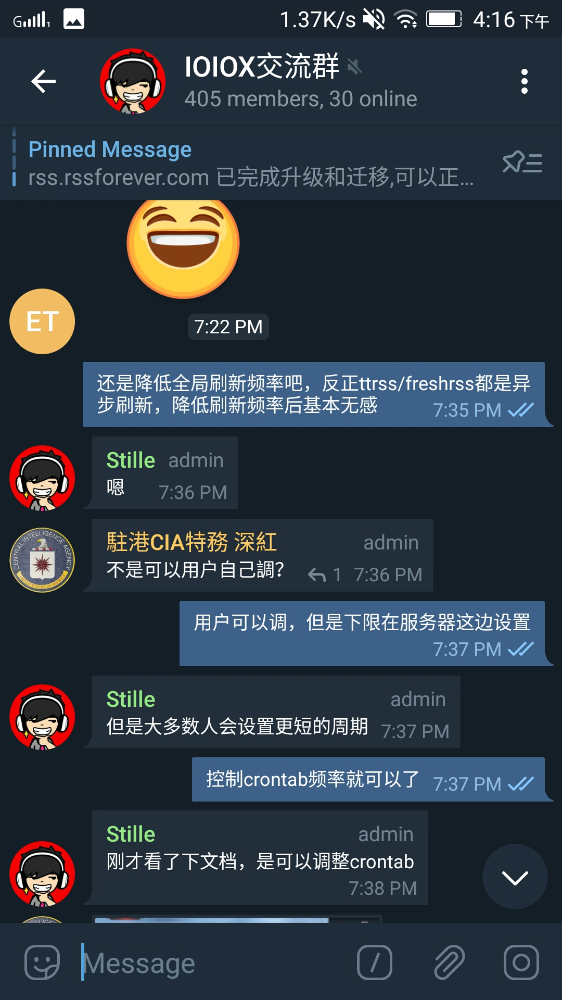

---
tags:
  - RSS
  - 归档
---

# 『给 RSS 爱好者们的一封信』为什么我们应该提高 RSS 刷新间隔？

## 版权信息

- 作者: [一座桥在水上](https://blog.othing.xyz/about-me.html)
- 原文: [『给RSS爱好者们的一封信』为什么我们应该提高RSS刷新间隔？](https://blog.othing.xyz/archives/rss-refresh.html)
- 许可证：[CC0](https://creativecommons.org/share-your-work/public-domain/cc0/)
- 源站最后更新时间：2021-01-02 17:03
- 本站收录时间：2023-03-17

----

！！！此文章一些存在悖误，具体错误详情情查看[文章末尾](#ending)点击跳转 ！！！ 所以这篇文章还正在完善中……

---

> 这是一个倡议，倡议大家自觉降低对于博客&播客这类 更新频率低/及时性要求不高 feed 的更新频率。

注：如果你不清楚文中 rss/atom/feed/源 四个词的区别和意思，把它们都当 rss 就好，没有太大问题，~~我们日常使用也会混淆它们~~😂

----

你的高频率刷新可能正在给一些网站带来伤害！！

## 全文章和全文输出

有些博客会将他们的全部文章和全文内容输出到 feed 。从 rss 用户的体验和互联网开放精神的角度看，这样的无疑是好事:

- 一些博客的 feed 不输出全文，哪怕可以用css来获取全文，也很麻烦。“**没有全文的 feed 没有灵魂**”失去了全文体验，rss 的意义就失去了一半。
- 博客只输出最近的十几篇文章，但我想看看更多**早前的文章**，又懒得主动打开网站去翻，我可能就没机会看到之前的博文。毕竟它**不输出**以前的文章，我哪怕知道这个博客以前的文章肯定不在feed里，但我连这些文章的**标题都不知道**，主动上博客 web 浏览的**冲动**也就少了几分。
- 且当博客网站突然间消失在互联网时(比如**科学松鼠会**关站、以及很多个人博客不打招呼**删库跑路**)，我并没有把它的全部文章保存到本地。虽然那些文章我不一定看，但是没有保存下来的话我会有种像丢了东西一样的“损失”感和淡淡的悲伤。（为这些站长 R.I.P 几秒😥）

## 源的大小带来的影响

不过往往这样的良心 feed 源比其他的只输出最近 5/10/15/20 条文章的源的大小要大很多，特别是在文章很多很长的情况下。

* [inote](https://inote.xyz/)，他的 feed 输出全部文章和全文，有 1.5MB。(update:本文发出后，这位博主的 feed 不再输出全部文章)
* [一大加贝](https://blog.yidajiabei.xyz/)，他的 feed 输出全部文章**但不输出全文**，有 0.15MB，如果再输出全文，大小可想而知。
* ……

对于**独立播客**，这样的情况更普遍，播客不可能给你只输出最近 15 期这样来吧，肯定会把从第一期开始的所有节目都放 feed 里。

* [津津乐道](https://dao.fm/)，feed 有 1.45MB；
* [故事 FM](https://storyfm.cn/)，feed 有 2.49MB；
* [一天世界](https://yitianshijie.net/)，feed 有 0.57MB；
* ……

> 这里写的是经过 http 压缩后的大小（网络实际传输大小）

{ width=300px }

### 流量很贵

如果你每 5 分钟刷新一次 feed ，对应站点的 feed 大小为 500KB。

> 5 分钟一次刷新不极端，还挺普遍。很多人设置的刷新频率都是软件能提供多短，就设置多短，而 telegram 的 rssbot 更是只能 5 分钟刷新一次，还不能改🤒

那么一个月你将使用 <em>60min × 24hour × 30day ÷ 5min × 0.5MB = <strong>4.32GB</strong></em> 的流量用于刷新该 rss。你用流量不要紧，但如果博主使用了付费 CDN 来优化网站访问体验，那博主就需要为 CDN 支付流量费用。

> 
{ width=300px }

So，你频繁的 rss 更新并不会像频繁访问 web 那样给网站带来大量 pv (浏览量)，让博主在浏览后台时收获快乐。

>Just like：(这么多浏览量，开心开心😜；哇，这个来自火星的访客把我全部文章都看了，开心开心😝）。
>
>况且，RSS 看文章，除非去评论留言，你不会再去访问博主的网站。

这就意味着博主的 CDN 账单可能就得为了你而每月增加几块钱的费用。听上去不多对吧？

> - 但博主本可以用这几块钱 CDN 费，用在 web 的访问上，给上千个访客更好的 web 体验。
- 费用是持续产生的，除非你不再订阅对应博客。

这样博主就在为你能仅仅早几十分钟收到最新文章而被动付费。

而对于独立播客（podcast），他们的情况还好，如果是订阅量上万的热门播客，他们的流量大，所以可以与 CDN 厂商谈拢到几分钱每 GB 的 CDN 流量价格。但广大中小型博主就没这么幸运了，博客流量总量不大，根本没资格与 CDN 厂商谈条件（这里赞扬一下又拍和七牛，免费的“联盟”计划对于博主们算是福利了）。

如果各位 rss 使用者大部分没有意识到这个问题，受伤的将会是你所喜欢的博客和播客本身。

{ width=300px }
{ width=300px }

当然，我知道很多博客使用免费的无限流量的 Cloudflare CDN，对于这类博客的 feed 确实可以想怎么更新就怎么更新。但是 CDN 有缓存啊，你作为用户，更新再频繁，CDN 不回源拉新版文件，你也没有办法不是。😂

### RSS 面向内容而不是面向即时

这有必要吗？博主每个月就产出那几篇文章，无论你是 1 秒刷新一次，还是一天刷新一次，你一个月其实就只能看到这些个博文。更不用说绝大多说 rss 爱好者的未读计数都上百上千了。

虽然博客是时间流式的 web 平台，但是它不是 Twitter、微博这样的社会性社交网络，它不是朋友圈或 QQ 空间。 你用上了 rss ，但你的心没有完全静下来，还在被 IM（即时通讯）和社交网络的即时理念所影响。我知道有人用 rss 来看 Twitter，我知道有 PubSubHubbub 技术提高 rss 本身的即时性和通达性。 但是我想引用这篇文章的一段话：

> “需要注意的是，所谓的「实时」只是相对的，通知的发送不可能快过 RSS 服务抓取到订阅源更新的时间，而我们已经知道后者往往存在不可避免的时间差。因此，实时推送功能的作用只是提醒我们不要错过关心的内容；要真正做到分钟级的先知先觉，当今媒体生态下恐怕还是直接瞄准社交网络更为靠谱。”  
—— From [『2018 年主流 RSS 服务选哪家？Feedly、Inoreader 和 NewsBlur 全面横评』](https://sspai.com/post/44420)  
by PlatyHsu 2018-05-04

写到这里我突发奇想。假如你每天会收到一定量的文章，那么延长刷新间隔时间后，平均每次刷新将为你带来更多文章，某种意义上你赚了。~~“好吧，我这是 短视损失厌恶 的反向举例😗”~~

现在还在写独立 Blog 和开 Podcast ，哪一个不是兴趣驱动并用爱发电？So，为了更好的博客/博客以及整个 rss 生态环境的健康发展，在此倡议各位 rss 同好 ：

- 延长 rss 自动更新时间，最好 1 小时以上---推荐设为 1.5 小时。
- 仅对即时性要求较高的资讯源或论坛源适当缩短刷新间隔。
- 让更多的 rss 同好们一起提高刷新间隔。
- 让 rss 软件开发者也知道此事。

{ width=300px }

## 本不应该出现这样的问题

### http 缓存

互联网的老祖宗老早就想到了这个问题。http 头有 etag、Last-Modified、Cache-Control 等参数来实现缓存。

比如 **Last-Modified**，它会记录文件的最后修改时间。

当你第一次通过网络访问服务器上某个文件时，服务器会通过这个 http 头告诉客户端：“这个文件最后修改时间是 2021/03/20-17:55 ” ，

当你下次再访问这个文件时，你会告诉服务器：“我之前收到的文件的最后修改时间是 2021/03/20-17:55，请问文件有改动吗？有改动就把新文件发给我！没有就吱我一声”

服务器收到后会比对修改时间是否一致，如果一致，就会告诉你：“没有改动（304 Not-Modified）”，就不会给你再次发送相同的文件，整个过程也仅仅只消耗不到 1kb。

而 etag，它的作用的 **Last-Modified** 类似，不过它是基于文件内容生成的特征码，具体机制不细说了。**Cache-Control** 也不细说了。

但是很多博客是基于 PHP 的动态博客（比如本站使用的 Typecho）

\* 此处待完善

如果想拿到 Etag，就必须先拿到要输出的数据，所以 Etag 只能减少带宽的占用，并不能降低服务器的消耗。如果是静态页面，可以判断文件最近一次的修改时间（Last-Modified），获取文件上次修改时间的消耗比拿到整个数据的消耗要小的多。所以很多时候 Etag 都是配合这 Last-Modified 一起使用的。

其实 rss 标准在 xml 文件的开头有 lastBuildDate 和 pubDate 参数，atom 标准在开头有 updated 参数。但是……似乎订阅器们都没有仔细认真对待过这些参数。

> 这几个参数大家理解可能都会不太一样，所以是较少有仔细对待的。  
@about_rss

按道理来说，订阅器应该一边下载一边解析。而不是把 feed 下载到本地后再解析。这样只要订阅器解析到 lastBuildDate/update/pubDate 时间和上一次更新时相同，就终止下载。这样无论多大的源，在源本身没有更新的情况下，每次刷新都只会消耗仅仅几 kb 的流量。

但现在订阅器更多只把这些参数用到了减少数据库重复写入，提高数据库性能上去。而没有用到减少更新 feed 时的流量消耗上。都是不管三七二十一，先把 feed 下到本地，再对下下来的 feed 文件进行解析处理。

\* 此处待完善

### RSS 软件们/开发者应该做点什么

当然，实现这样的优化确实相对比较难，毕竟这样需要把 feed 下载到内存中处理（毕竟需要边下载边解析），估计网上还找不到用于处理这样功能的库。

真诚希望各个 rss 软件开发者在这方面下下功夫。

实在不济，还有个最简单的方案，也是我想倡议的。在您开发的 rss 软件中，在调整更新频率的页面那里设置一个对话框。只要用户一点击小于 45～60 分钟的刷新间隔的选项，就弹出对话框，这个对话框需要 10 秒钟才能点击“我已了解”。上面写有：“<red>如非绝对必要，我们不推荐使用更高频率的刷新间隔，这可能会对你所订阅的网站造成不必要的流量开销和压力。</red>”

\* 此处待完善

## 对于博主的建议

如果你的博客 CDN 流量在 feed 这方面消耗大，我个人建议先发一篇文章提醒订阅者降低刷新频率。或通过技术手段，比如将feed单独托管在一个不用担心流量消耗的地方（比如GitHub、Gitee、coding、Cloudflare Workers等），然后将 feed 的 URL 重定向过去。当然，在这个过程中再套一层免费的 CDN 也是可以的，比如用 jsdeliver+GitHub。✌ 如果你只是担心频繁的抓取对服务器造成压力，可以考虑给博客或只针对 feed 加上 Redis 之类的内存缓存。

\* 此处待完善

## The End

我知道大部分人设置较短更新间隔时没有考虑到这一点，也许本文部分用词较激进，但这是一个“如果人人都了解了，那么问题就不再存在”的问题。

💪💪

{ width=300px }
{ width=300px }

## Others＆Update {#ending}

感谢 @about_rss 对于本文的帮助。推荐看看他的 Telgram 频道 [All About RSS](https://blog.othing.xyz/archives/t.me/aboutrss)，里面都是关于 rss 的优秀内容！

---

**更正：**

2021-01-02 Update:（写得太快，文章有很多问题，感谢以下网友指正）  
＠AA: 我记得 Google reader 会根据文章频率自适应刷新频率的，其他的阅读器应该也会 另外就算刷新也可以利用上 http 缓存，并不会每次都返回完整内容 如果没更新只会返回 304 not modified

＠BB: 而且也没考虑压缩 故事 FM 的 feed 压缩之后 323kB

＠AA: 如果用的是通用的 http client 应该都支持 cache，我觉得除非写错了，要不然都应该能想到启用 cache 吧😅 嗯，但是不知道 CDN 流量会不会按压缩之后算  
＠CC: CDN 会

＠DD: 作者没理解 http 协议有个 etag 字段，不需要全部拉取内容也能知道 feed 是否更新。  
否则我早就破产了。  
另外 cdn 费用通常是可以谈的，像我们这种流量比较大的客户，基本可以谈到几分钱每个GB的低价。  
另外，像是苹果播客这类比较健全的系统，通常会有一个 bot 去检查并拉取节目的最新更新，而这个拉取是采用 range 字段限制拉取的字节数的，他们只比较每个 xml 文件的前部某个长度的内容是否更新，并将更新通知给客户端拉取，而不是由每个客户端定时各自发起请求，不然以我们用户的体量，也早就被拉死了。overcast 甚至小宇宙等客户端通常都有类似的机制。

所以大家尽可以按默认值来，我们撑得住，互联网的老祖宗们早就想到这些问题了，哈哈哈哈。

CC:  
emmmmm，我刚刚看了下 gofeed 好像没有做判断（  
或许有空去提个 pr

我：  
“根据文章频率自动调整刷新频率的阅读器还是少数，大多都是 ino，feedly 这样的商业化的服务器端的 rss 订阅器才具备的功能，其实之前是有想到这点，但忘写了😂”（如果我没记错，ttrss 和 freshrss 应该都没有这样的功能）  
“http 缓存和压缩，我遗漏了这两点。发这篇文章丢人显眼了😥，我过度看重于 rss 软件对于feed文件本身的处理上了，却忘记考虑最基础的 http”但回过头来看，很多 PHP 动态博客程序是即时生成的 RSS，并不是真正放主机上的 xml 文件，所以没有任何 http cache control。“CDN 可以谈到几分钱 GB 的价格，这个我知道，但是由于这篇文章一开始我的主题是面向那些浏览不大的小博客来讲的，中途才想起来‘好像播客在 rss 方面的消耗应该普遍很大’，所以也忘了在文章中说” “所以，我们应该更注重让软件开发者来完善这个问题，而不是仅在用户层面上呼吁强调大家降低更新频率之类的”

欢迎转载，无需申请，可衍生，不强求署名。

By yzqzss|一座桥在水上 起草于 2021-01-01 发布于 2021-01-02