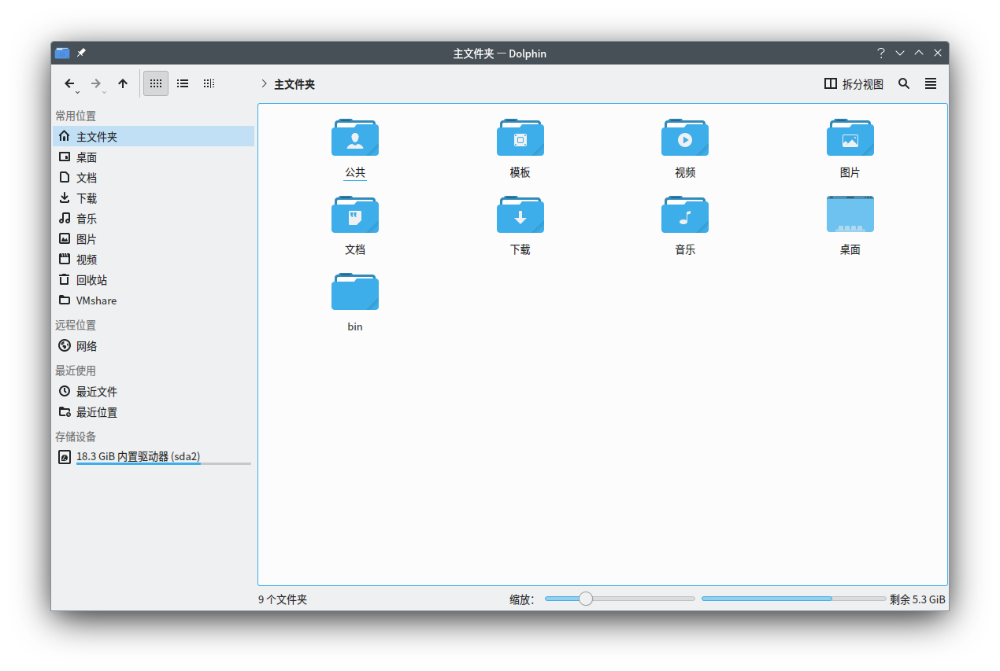
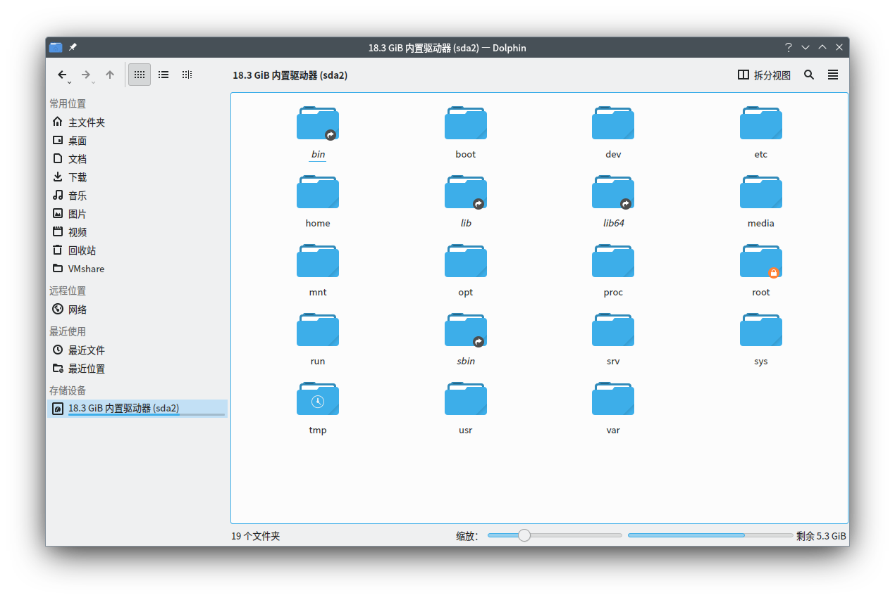
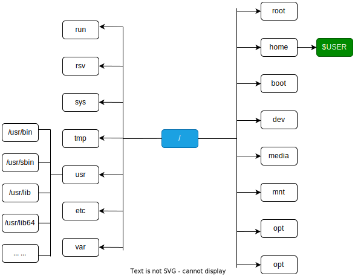
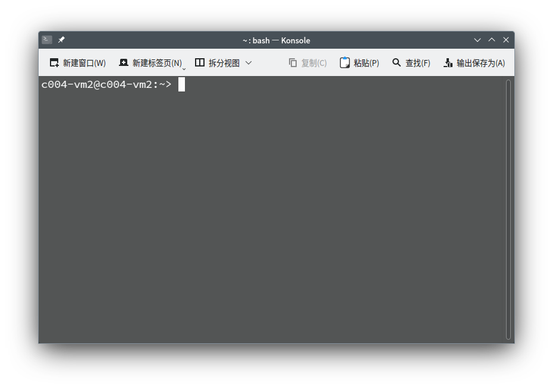

# 使用 shell

## 什么是 Shell

Linux 诞生于 1991 年，那时图形化用户界面（GUI）还未出现。电脑系统的操作人员普遍通过命令行界面（CLI）中使用命令（command）和计算机进行交互。

在 Linux 中，用于解释，管理命令的程序被称之为 **shell**。shell 提供了一个创建可执行脚本文件、运行程序、与文件系统进行交互、编译源码和管理计算机系统的办法。虽然命令行界面不太直观，但 shell 可以简单明了地配置许多并不存在于图形化界面中的设置参数，许多 Linux 专家认为命令行的效率高于图形化界面。

如果没有特别说明，本文及后续内容都是基于 [bash shell](https://www.gnu.org/software/bash/)。

## Linux 文件系统

在了解 shell 的使用方法之前，有必要先了解一下 Linux 的文件系统。

Linux 系统中所有东西（数据、命令、符号连结、设备和文件夹）都是以文件夹或文件的形式储存在文件系统中，而整个文件系统就像一棵树一样。所有的主要文件夹都存储在根目录（`/`）的下方，所有的文件都分散在各个文件夹中。

与 Windows 不同的一点，Linux 的不同层级的文件夹之间都是使用斜杠 `/` 进行分隔，而不是 NTFS 文件系统常用的反斜杠，比如 `C:\Program Files (x86)\Microsoft`。这也是为什么当今所有的网页地址都是使用斜杠而非反斜杠的原因之一。且 Linux 中所有的绝对路径都是以 `/` 开头。

同时，Linux 文件名是有分区大小写的。例如 Apple.c、APPLE.c、apple.C 和 ApplE.c 是四个不同的文件。

以 openSUSE Tumbleweed（KDE 桌面环境）为例，在登陆系统后，找到并启动 [dolphin 文件管理器](https://apps.kde.org/dolphin/)后，你会看到如下场景：

=== "用户目录"

    

=== "根目录"

    

Linux 文件系统（文件树[^1]）的结构如下：



在 Linux 文件系统中，要确认某个文件的位置有两种办法，分别是**相对路径**与**绝对路径**。

假设你在用户目录（`/home/$USER`）的`图片`文件夹下存放了一个图片文件（`example.png`），以最顶层的目录（根目录）作为参考系，这个图片文件的绝对路径是 `/home/$USER/图片/exmaple.png`。某些时候，使用绝对路径可以精确地表示某个文件在文件系统中的位置，但它很长，且不方便。此时，将用户目录作为参考系，那么这张图片的路径可以简短地表示为 `./图片/example.png`。

对于 `/` 目录之下的文件的常见用途，如下所示：

|名称|用途|
|---|---|
|/bin|包含普通的 Linux 用户命令，如 `ls`、`date` 等|
|/boot|具有可引导的 Linux 内核、初始 RAM 磁盘和引导加载程序配置文件 (GRUB)。|
|/dev|包含代表系统上设备访问点的文件。这些包括终端设备（tty\*）、硬盘（hd\* 或 sd\*）、RAM（ram\*）和 CD-ROM（cd\*）。用户可以通过这些设备文件直接访问这些设备； 但是，应用程序通常会向最终用户隐藏实际的设备名称|
|/etc|包含管理配置文件。 这些文件中的大多数都是纯文本文件，只要用户有适当的权限，就可以使用任何文本编辑器对其进行编辑。|
|/home|包含分配给每个具有登录帐户的普通用户的目录。（root 用户是一个例外，使用 /root 作为他的主目录。|
|/media|为自动安装设备（尤其是可移动媒体）提供标准位置。 如果介质具有卷名，则该名称通常用作安装点。例如，卷名为 myusb 的 USB 驱动器将挂载到 `/media/myusb`。|
|/lib|包含 `/bin` 和 `/sbin` 中的应用程序启动系统所需的共享库|
|/mnt|在被标准 `/media` 目录取代之前，它是许多设备的通用挂载点。一些可引导的 Linux 系统仍然使用这个目录来挂载硬盘分区和远程文件系统。许多人仍然使用这个目录来临时挂载本地或远程文件系统，这些文件系统不是永久挂载的。|
|/misc|有时用于根据请求自动挂载文件系统的目录。|
|/opt|可用于存储附加应用软件的目录结构。|
|/proc|包含有关系统资源的信息。|
|/root|root 用户的主目录|
|/sbin|包含管理命令和守护进程。|
|/sys|包含调整块存储和管理 cgroup 等参数。|
|/temp|包含应用程序使用的临时文件。|
|/usr|包含用户文档、游戏、图形文件 (X11)、库 (lib) 以及引导过程中不需要的各种其他命令和文件。/usr 目录用于存放安装后不会更改的文件（理论上，/usr 可以只读方式挂载）</p>有关社区对于文件目录的调整（[Usr Merge](https://wiki.debian.org/UsrMerge)），详见[此处](https://www.suse.org.cn/%E6%8A%80%E6%9C%AF%E6%96%87%E7%AB%A0/2021/04/28/%E9%87%87%E5%8F%96-UsrMerge-%E6%8E%AA%E6%96%BD%E7%9A%84%E7%90%86%E7%94%B1.html)。|
|/var|包含各种应用程序使用的数据目录。特别地，你可以在此处放置作为 FTP 服务器 (`/var/ftp`) 或 Web 服务器 (`/var/www`) 共享的文件。它还包含所有系统日志文件 (`/var/log`) 和 `/var/spool` 中的假脱机文件（例如 mail、cups 和 news）。`/var` 目录包含经常更改的目录和文件。在服务器上，通常使用可以轻松扩展的文件系统类型将 `/var` 目录创建为单独的文件系统。|

在 Linux 中，文件不需要像 windows 那样的后缀名（.txt、.xls）。文件的后缀名并不影响文件自身的功能，但它有助于帮助用户快速了解此文件的用途以及能打开此文件的软件。文件夹也可以认为是一种特殊的，可以包含其他文件的文件。

## 使用终端

Linux 上访问 shell 界面的方法有很多，其中最常见的三种办法是：shell 提示符、终端、虚拟控制台。

一般而言，Linux 桌面都会有自己的终端模拟器。以 KDE 为例，打开终端应用程序 [Konsole](https://konsole.kde.org/)（它一般叫“终端”或者“Terminal”），你就能直接看到一个命令行界面（CLI）提示符，例如：



你首先看到的是：

```
c004-vm2@c004-vm2:~> 
```

其中，`@` 字符左侧的 `c004-vm2` 是此系统的用户名，`@` 字符右侧的 `c004-vm2` 是此系统的主机名。冒号后紧跟的 `~` 表示当前你所在的目录是你登陆的账户的用户目录（即 `/home/c004-vm2`）。有时，它也会表示为 `[c004-vm2@c004-vm2 ~]$`，末尾的 `$` 表示该用户为非特权用户，尽管形式可能不同，但基本的含义是一致的。

要退出终端，你只需要关闭窗口或者键入 `exit` 即可。注意，直接关闭终端窗口会导致该窗口运行的程序或命令终止。

要在终端中运行命令，只需要在提示符后输入命令，然后按下 `Enter` 键即可，如：

```
c004-vm2@c004-vm2:~> date
2023年 03月 08日 星期三 17:21:10 CST
```

`date` 命令可以用于显示当前的系统时间，日期和时区（输出内容的格式与你设置的语言和地区有关系）。相同命令还有 `uptime`，用于查看系统的开机时间。`echo` 命令可以将你输入的内容打印在屏幕上。

```
c004-vm2@c004-vm2:~> uptime
 17:23:04  已启动  0:03， 3 个用户， 平均负载：0.22, 0.48, 0.24
c004-vm2@c004-vm2:~> echo Hellow World!
Hellow World!
```

如上，系统于 `17:23:04` 启动，已开机 3 分钟，共有三个已登录用户。1 分钟，5 分钟和 15 分钟内的系统平均负载分别是 0.22、0.48 和 0.24。

系统负载（System Load）是系统 CPU 繁忙程度的度量，即有多少进程在等待被 CPU 调度（进程等待队列的长度）。平均负载（Load Average）是一段时间内系统的平均负载，这个一段时间一般取 1 分钟、5 分钟、15 分钟。

假设你的 CPU 是单核，它在单位时间内的事件处理能力有限的，当它被待处理事件填满，满负载运作的时候，load = 1；小于表示 CPU 未满载，大于 1 则表示超载工作，此时 CPU 不仅需要处理当前事务，还有更多的事务正在排队等待处理。如果你有一个四核 CPU，则当 load = 4 时，表示你的四个 CPU 核心均在满负载工作。对于单核 CPU，当 load 超过 1 时，你应该检查一下什么东西占用了大量的 CPU 资源，以此类推。

此外还有几个命令值得一试：

```
c004-vm2@c004-vm2:~> ls
公共  模板  视频  图片  文档  下载  音乐  桌面  bin
c004-vm2@c004-vm2:~> pwd
/home/c004-vm2
c004-vm2@c004-vm2:~> hostname
c004-vm2
```

`pwd` 即，print working directory（打印你当前所在的文件夹至输出结果），`hostname` 用于显示你的主机名，`ls` 用于显示你所在文件夹的所有文件。

最后，你可以使用 `clear` 命令将整个屏幕上的文本清空。


[^1]: Linux 的文件系统就像一棵倒放着的树，最顶层是根目录。