# 部署虚拟机

!!! note "注意"
    本文只是虚拟化软件的简单介绍和使用，具体更为细节的内容请自行翻阅相关文档。同时，本文假定读者当前使用的操作系统是 Windows。

## 虚拟机与物理机

在不熟悉 Linux 基本知识的情况下，直接在物理机上安装 Linux 可能会导致数据丢失，或者是硬件损坏。

虚拟机作为一个让你在不破坏当前系统结构的情况下，能够获得最接近原生 Linux 环境体验的工具。非常适合 Linux 初学者安全地练习如何安装和使用 Linux。

!!! attention "注意"

    在物理机上安装 Linux 并非是必须的步骤，不安装到物理机上可以省去大量的迁移工作，但安装到物理机上会让系统具备更强的性能和更多的功能。  

本文主要描述如何使用流行的开源虚拟机软件 [Virtualbox](https://www.virtualbox.org/) 安装 Linux。

----

## 大致流程

### 安装 Virtualbox

打开 [Download VirtualBox](https://www.virtualbox.org/wiki/Downloads) 页面，点击 `Windows hosts` 下载适用于 Windows 系统的 virtualbox 安装包。然后在此页面找到并下载 `VirtualBox Oracle VM VirtualBox Extension Pack`。

打开 virtualbox 安装程序，依照提示完成安装。完成安装后，即可启动管理器：

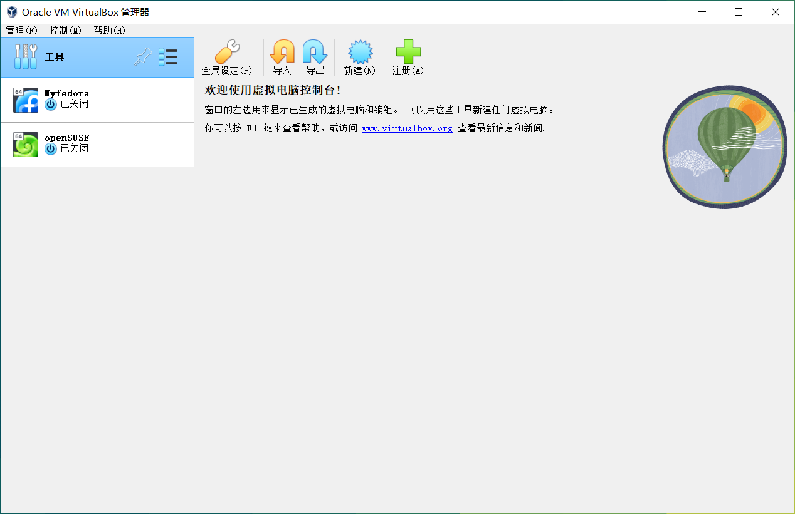

### 安装扩展包

`VirtualBox Oracle VM VirtualBox Extension Pack` 扩展包主要提供了 USB 驱动和 3D 加速驱动等因版权无法自由分发的内容。

要安装扩展包，请先打开 VirtualBox，点击左侧**工具**栏上的选项按钮，切换到**扩展**页面，然后再点击上方的 **install** 安装你刚刚下载保持的扩展包文件，然后你就会看到扩展包的使用许可协议，滚动到底端，然后点击**我同意**，即可安装扩展包：

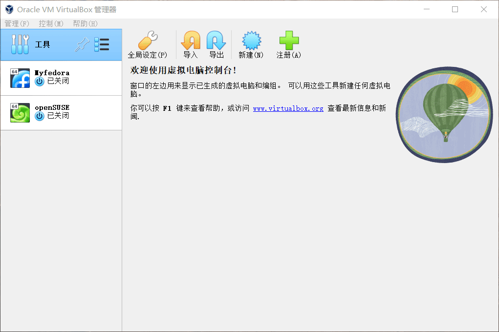

### 新建虚拟机

!!! note "注意"

    - 将鼠标光标停留在某个选项上会显示该选项的简易使用说明。  
    - 注意，请将虚拟机安装在固态硬盘分区中以提高虚拟机的性能。  

打开 VirtualBox ，点击**新建** ，输入虚拟机的名称（VirtualBox 会根据你输入的名称快速筛选虚拟机的版本和类型），点击下一步:

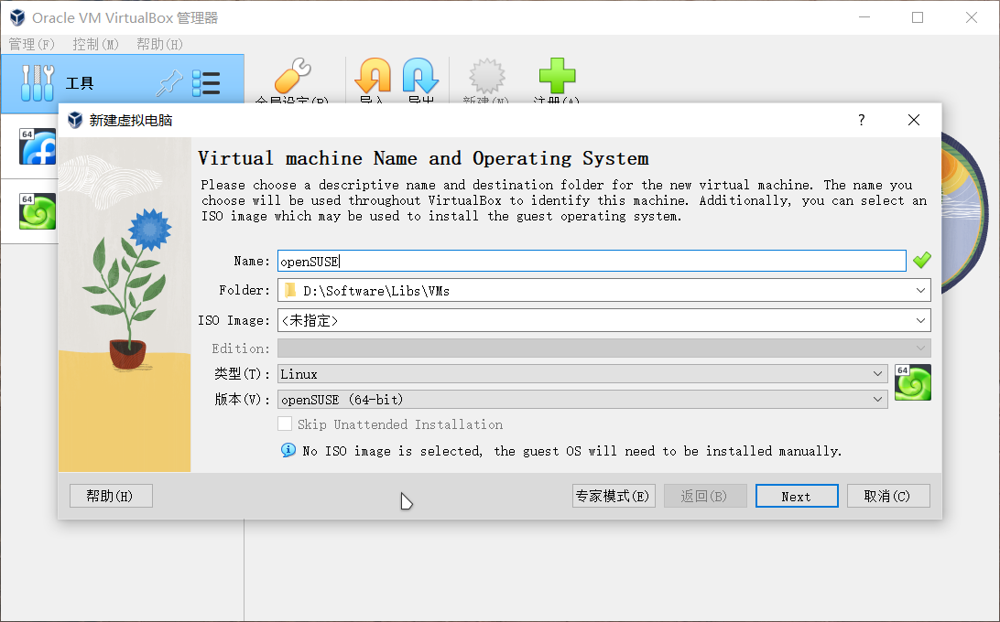

内存大小建议最小值为 **2048MB**，具体的最低配置要求详见你所安装的系统版本的[最低配置要求](./prepare.md)。点击下一步:

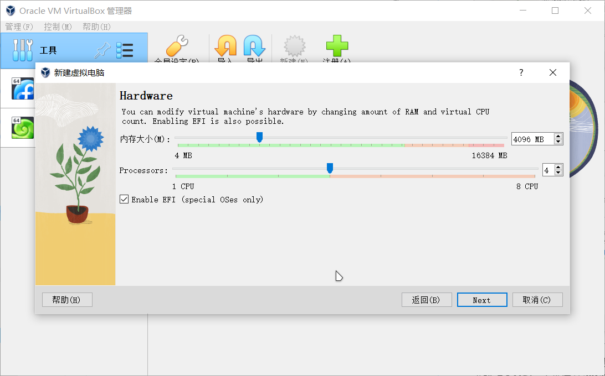

- CPU 核心数量可以拉到一半的位置，同时可以根据使用情况考虑是否启用 EFI。
- 并不建议将指针拖动到红色区域，这可能会对主机的正常运行造成影响。

在选择默认的**现在创建虚拟硬盘**，虚拟硬盘文件类型默认为 VDI。点击下一步，选择**动态分配**，大小建议 **20GB** 或更高值，具体的最低配置详见你所安装的系统版本的[最低配置要求](./prepare.md)。点击下一步完成创建：

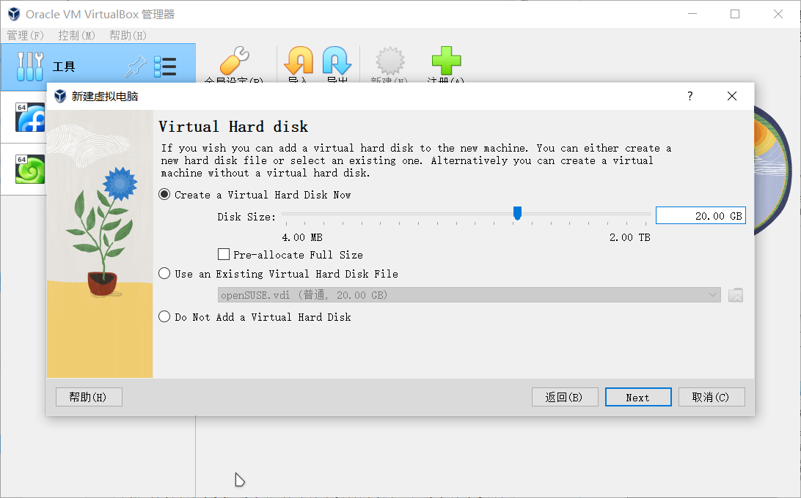

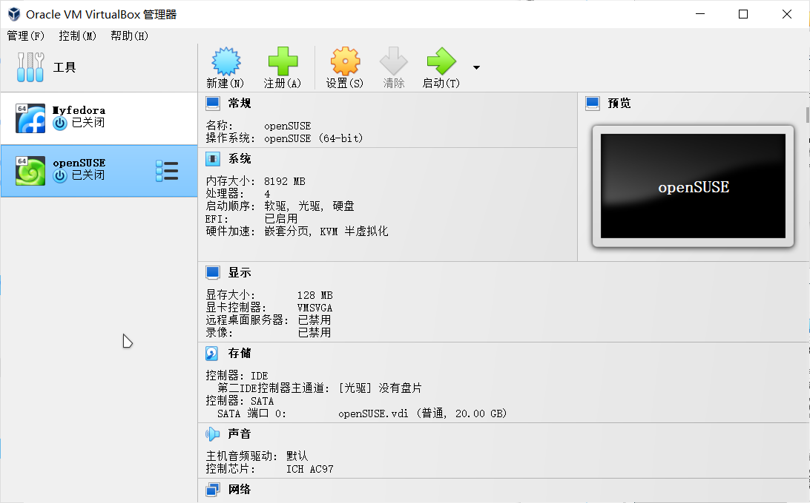

### 配置虚拟机

在启动安装前，你还需要进行一些额外的配置。

点击虚拟机详情页中的**设置** ，在**常规**页面中，点击**高级**，然后为虚拟机启用剪贴板共享和文件拖放：

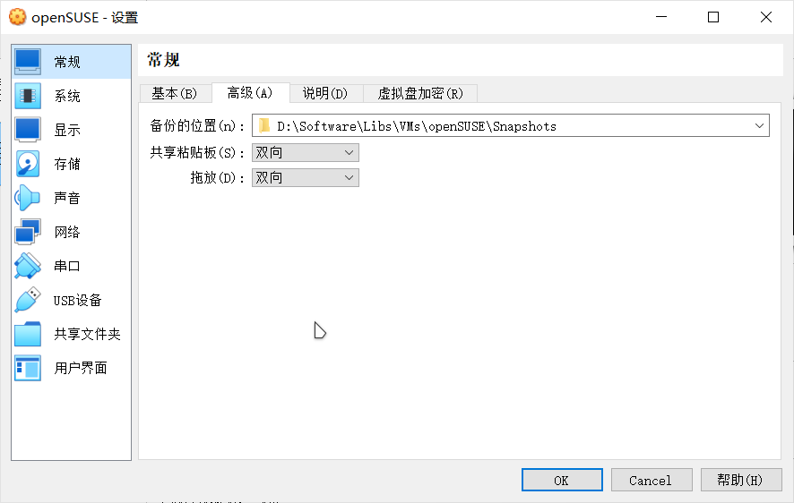

再点击**系统**；在**主板**页面，你可以点击勾选**启用 EFI**（某些系统需要用户启用 UEFI 支持）或安全启动支持。在**处理器**页面，你可以更改虚拟机使用的**CPU 核心数**：

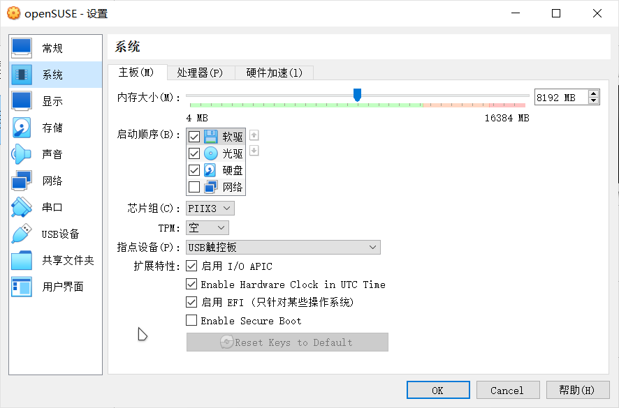

!!! note "注意"

     给虚拟机分配过多的资源会导致宿主机卡顿。你可以修改该页面中的启动顺序来改变虚拟机启动时引导设备的顺序。虚拟机系统安装完成后 VirtualBox 需要用户手动移除虚拟盘片。

注意，你必须在**显示**页面中，将**显存大小**拉满，否则你很有可能会遇到显存耗尽的问题。同时可以考虑是否为虚拟机启用 3D 图形加速（具体取决于你的硬件性能）。 

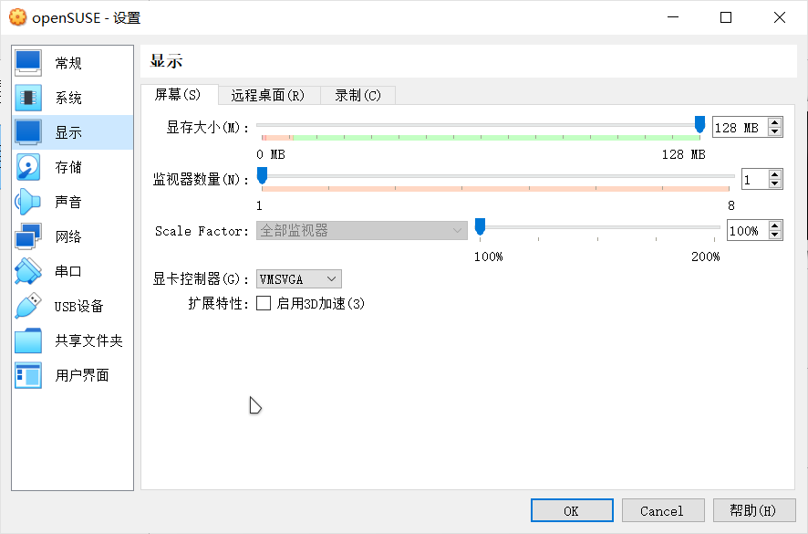

!!! note "注意"

    如果你遇到无法调节虚拟机屏幕分辨率的问题，你可以在关闭虚拟机后，更换虚拟机使用的虚拟显卡或者关闭 3D 图形加速。

在**存储**中，点击**没有盘片** ，再点击**分配光驱**右侧的光碟小图标，再点击**选择虚拟盘**，找到并选中你准备好的 ISO 镜像文件。 

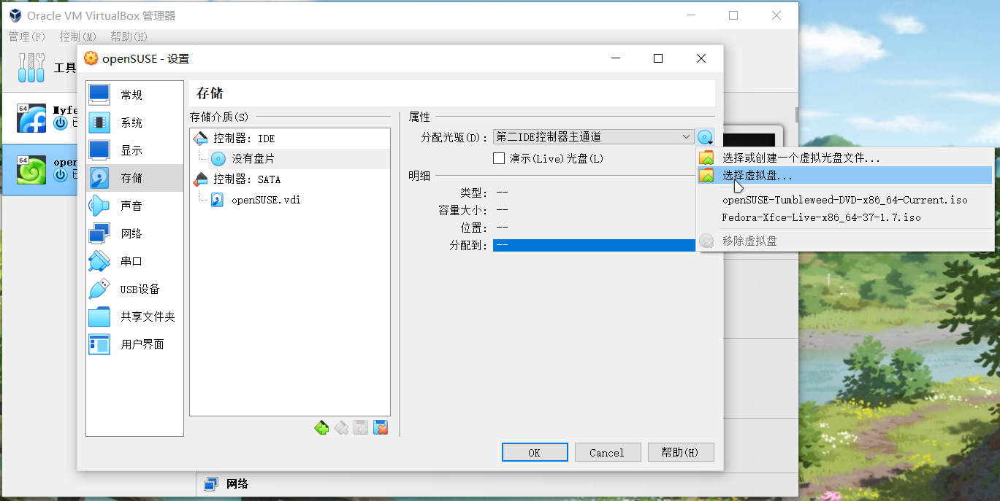

在 **USB 设备**中，点击右侧的**添加一个 USB 筛选器**，勾选你插入宿主机的 USB 设备。

!!! note "注意"

    该步骤为可选操作。一旦启动虚拟机，你插入宿主机的 USB 设备就会自动被重定向到虚拟机中，并且在虚拟机关机前，你都不能在宿主机访问该 USB 设备。

在**共享文件夹**中，点击右侧的**添加共享文件夹** ，点击**共享文件夹路径**右侧的倒三角符号，点击**其他**，选择一个文件夹用于共享文件:

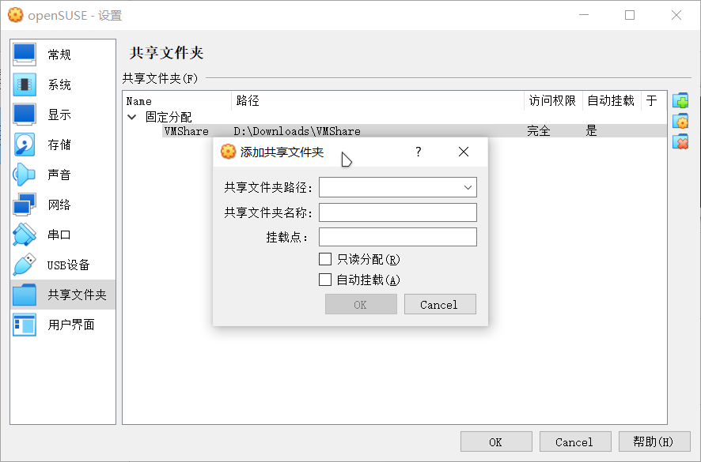

!!! note "注意"

    - 该步骤为可选操作。共享文件夹可以实现主宿机间文件的实时交流。请勿将虚拟机的任何程序或者程序所使用的文件夹安装或存放到共享文件夹中。  
    - 建议勾选**自动挂载**以便于虚拟机在开机后自动发现共享文件夹。

如果你在配置虚拟机的时候，没有指定使用的系统镜像文件。虚拟机在启动的时候会提醒你选择一个镜像文件。点击提示页面右侧的**选择一个虚拟光盘文件** ，再点击**注册**，找到并选中你下载的光盘文件，点击你新添加的镜像文件，再点击**选择**，确定无误后启动虚拟机。

### 注册 ISO 文件

打开 Virtualbox，点击**工具**，然后切换到**介质**页面，此时你可以看到 virtualbox 已经使用的虚拟机磁盘和镜像文件：

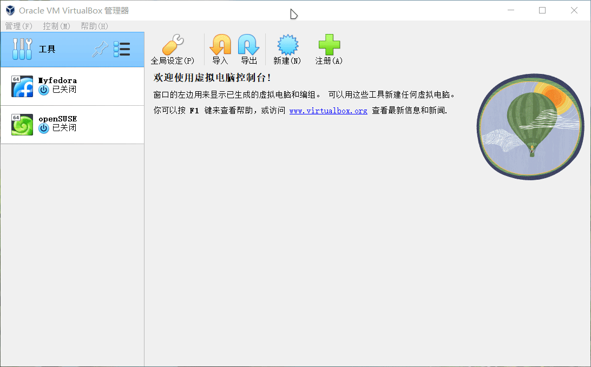

你可以在虚拟镜像文件页面中将已下载好的 ISO 文件都导入到此列表中，方便后续新建虚拟机的时候可以直接使用。

### 快照

快照是一个非常有用的功能，它可以将你的虚拟机恢复到指定的状态，特别适合于测试环境。

点击要生成快照的虚拟机，然后切换到**备份**页面，新建一个快照即可。当你需要使用的时候，再点击恢复备份：

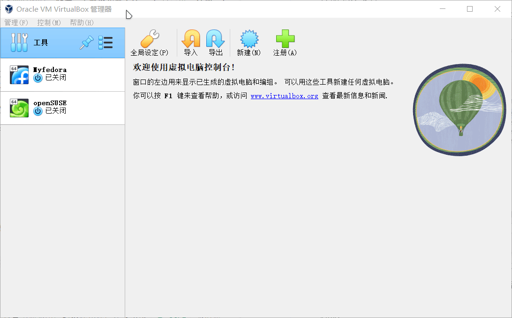

### 安装增强功能

启动虚拟机后，Virtualbox 会自动捕获用户的鼠标光标，你可以按 `右 Ctrl` 取消捕获。按 `右 Ctrl + F` 进入全屏。

你可以通过命令行安装 virtualbox 的增强功能包：

```
sudo zypper in virtualbox-guest-tools    #适用于 openSUSE
sudo dnf in virtualbox-guest-tools       #适用于 Fedora
```

然后将你的用户添加至 `vboxsf` 用户组：

```
sudo usermod -aG vboxsf $USER
```

重新登录系统即可看到你之前设置好的共享文件夹（该共享文件夹一般位于 `/media` 目录之下，如果你没有看到自动挂载的文件夹，你需要手动将共享文件夹固定到文件浏览器的侧边栏之中）。

### 断开网络连接和虚拟盘

要断开网络连接，只需要点击底部图标，取消勾选网络连接即可：

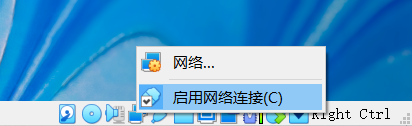

在系统安装完成后，virtualbox 并不会自动弹出 ISO 文件，你可以手动点击底栏图标，移除虚拟盘即可：

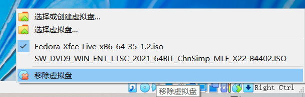

### 其他

- [Virtualbox Documentation](https://www.virtualbox.org/wiki/Documentation)

### 增强虚拟机的图形性能

要增强虚拟机的性能，主要有以下几个办法：

1. 提高虚拟机可使用的 CPU 核心数；
2. 提高虚拟机可使用的 RAM；
3. 将虚拟机放置在宿主机的固态硬盘上以提高读写性能；
4. 使用独立显卡运行 virtualbox（如果出现撕裂问题，可以在设置中关闭 3D 图形加速）。