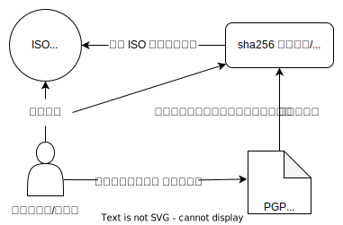
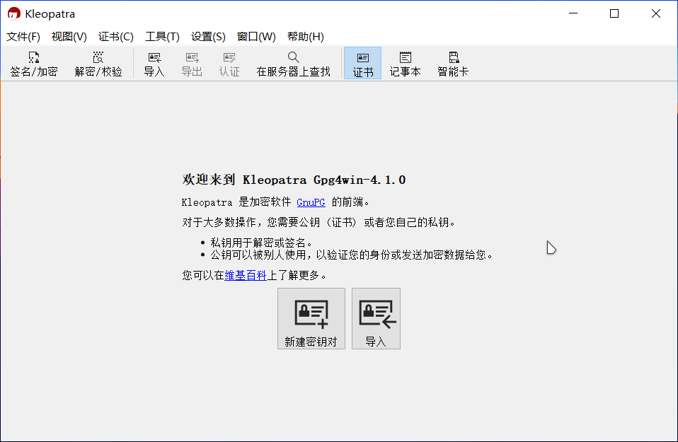
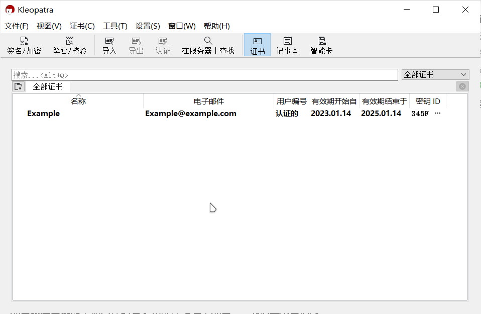
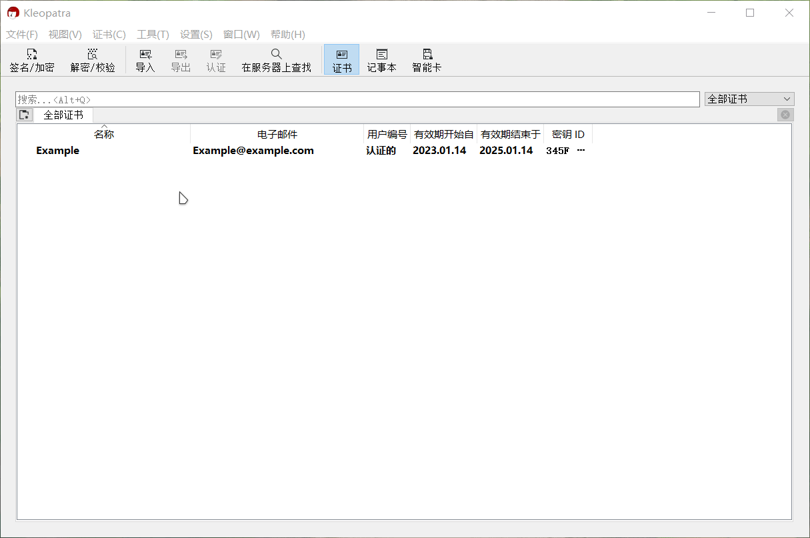
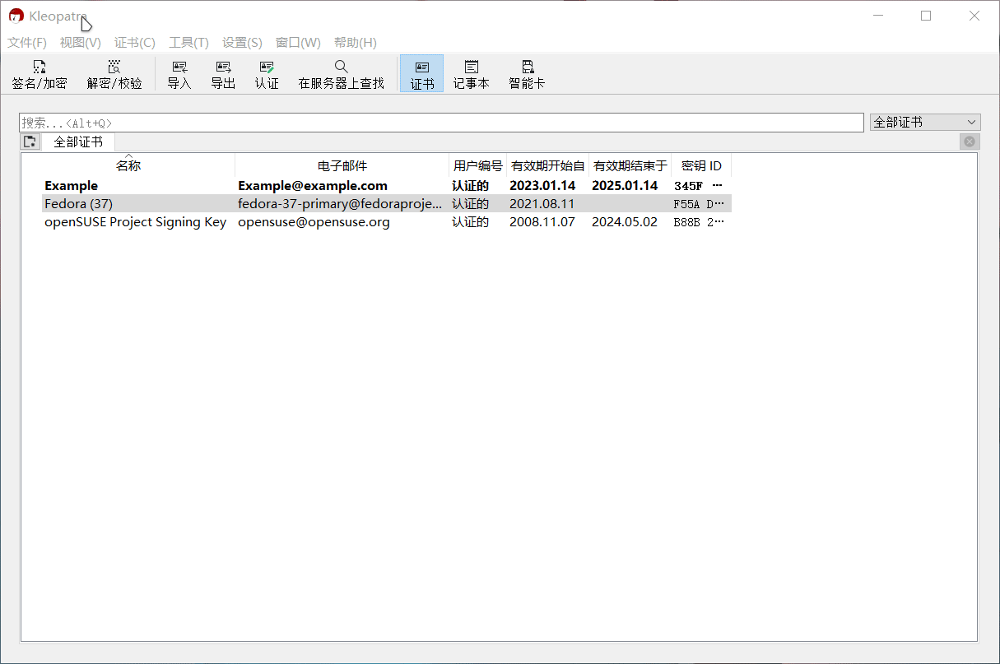
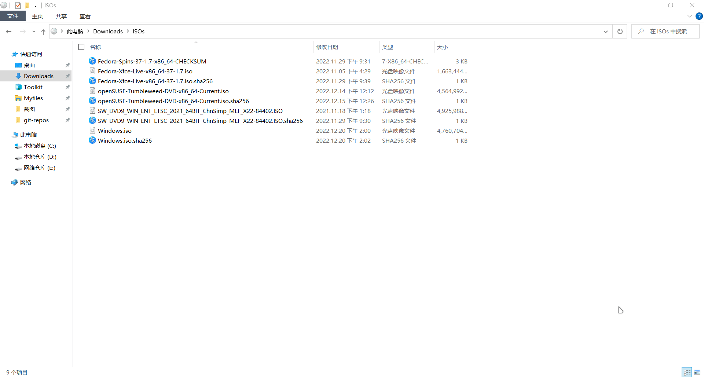

---
tags:
  - Linux 简明指南
  - 安装系统
  - 校验文件
  - 教程
  - GnuPG
---

# 使用 Kleopatra 校验文件

!!! note "注意"

    - 本文主要描述如何快速地校验文件，有关 GPG 的更多信息详见：<https://gnupg.org/>；
    - 有关哈希函数的详细介绍另见：<https://en.wikipedia.org/wiki/Hash_function>
    - 本文假定读者在使用 Windows。

所需的工具：

- [7-zip](https://www.7-zip.org/)
- [GnuPG](https://gnupg.org/)
- 文本编辑器

<center>



</center>

## 下载文件

根据[前文]，你需要下载如下文件：

[前文]: ./../install/prepare.md

```
openSUSE-Tumbleweed-DVD-x86_64-Current.iso
openSUSE-Tumbleweed-DVD-x86_64-Current.iso.sha256
openSUSE-Tumbleweed-DVD-x86_64-Current.iso.sha256.asc
```

请将它们放置在同一级文件夹中。

## 初始化 GnuPG

### 安装

你需要先下载适用于 Windows 系统的 [Gpg4win](https://gpg4win.org/download.html)，然后根据提示安装 Gpg4win。

!!! note "注意"

    - 下载站点会请求你对 Gpg4win 项目进行捐款，你可以使用页面上提示的支付方式进行赞助 Gpg4win 项目的运营；或者选择 0$ 直接下载安装包。
    - 如果你不清楚你在做什么，直接遵循 Gpg4win 安装程序的默认推荐值即可。
    - [Kleopatra](https://apps.kde.org/kleopatra/) 是一个跨平台软件，你也可以在 Linux 上使用它！

### 获取公钥

Gpg4win 安装完成后，打开开始菜单，找到并启动名为 Kleopatra 的应用程序：



点击**新建密钥对**，输入你的名字和邮件地址，点击 **OK** 确认生成密钥对，例如：



然后点击设置，选择**配置 Kleopatra**，在 **S/MIME 校验**中设定好 http 代理地址：

!!! tip "网络代理"

    你也可以直接在代理软件中开启系统代理。



点击此页面上方的**在服务器上查找**，然后在弹出的对话框中输入 “openSUSE”，找到并导入 *`openSUSE Project Signing Key<opensuse@opensuse.org>`*：


上述方法是有关于如何从 Kleopatra 内置的 key 服务器地址[^1][^2]获取公钥。当你需要添加某人或项目的公钥的时候，最好向本人直接索取或前往官网查找密钥。导入密钥的时候，记得对比一下导入的密钥指纹（Key fingerprint）和公钥发布者给出的密钥指纹是否吻合。

你需要前往 [openSUSE 官网]，然后在页面底部找到并下载公钥。公钥信息如下：

```
pub   rsa4096/0x35A2F86E29B700A4 2022-06-20 [SC] [expires: 2026-06-19]
      Key fingerprint = AD48 5664 E901 B867 051A  B15F 35A2 F86E 29B7 00A4
uid   openSUSE Project Signing Key <opensuse@opensuse.org>
```

[openSUSE 官网]: https://get.opensuse.org/tumbleweed/

### 验证签名

点击 Kleopatra 菜单栏上的**解密/校验**，选择对应的 sha256 文件或者 CHECKSUM 文件，进行校验：



## 校验哈希值

此处推荐使用 [7-zip](https://www.7-zip.org/) 对文件进行校验。

选中已下载的 sha256 文件，在鼠标右键菜单中，使用 **CRC SHA** 菜单中的**测试压缩包：校验和**功能，如下：

!!! tip "注意"

    如果你没有看到相似的选项，你可能需要在 7-zip 的设置（工具→选项→7-Zip）中，取消勾选**层叠右键菜单**。



[^1]: <https://keyserver.ubuntu.com/>
[^2]: 除了 Ubuntu 的密钥服务器，你可以前往 <https://keys.openpgp.org/> 下载公钥。