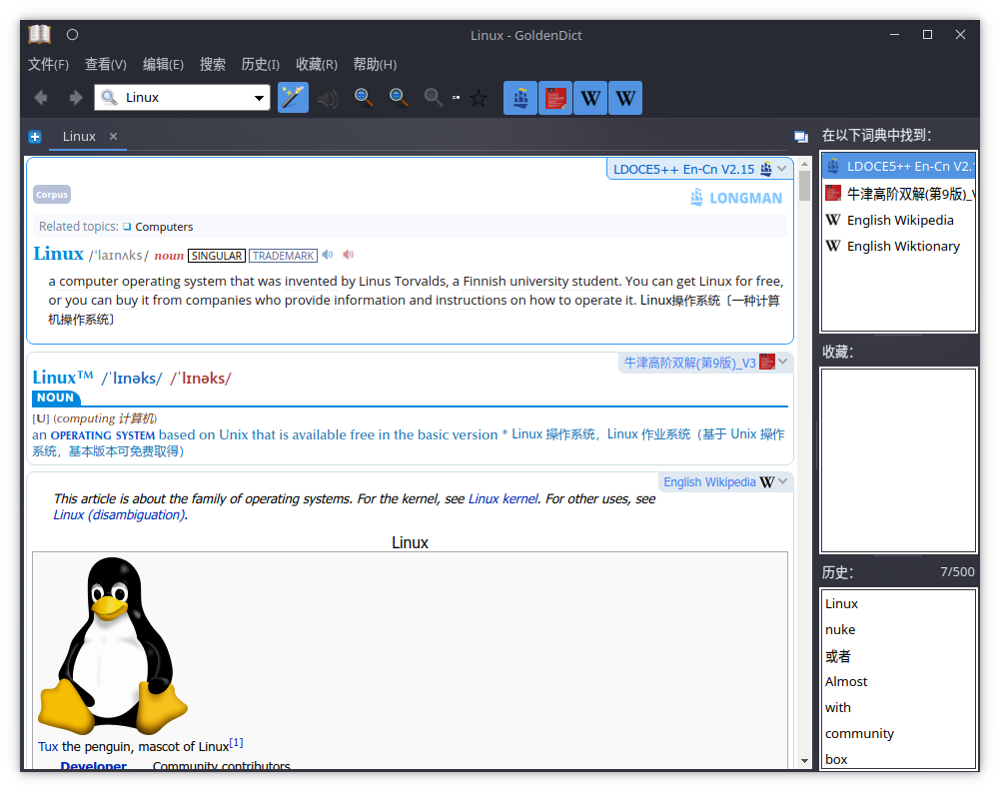

---
tags:
  - 随笔
  - Goldendict
  - markdown
---

# 2022-04-14

## Goldendict

今天群友推荐了一个词典软件，`Goldendict`。我试用了一下，发现比欧陆词典好用多了，还支持屏幕取词。而且没有字典的使用限制。还不错😄😄😄

以及一个词典爱好者的论坛：https://forum.freemdict.com/

## 纯文本文件

除了使用 docx 之类的文档格式记录信息，你也可以了解一下 [markdown](https://markdown.com.cn/)。Markdown 是一种轻量级标记语言，它允许人们使用易读易写的纯文本格式编写文档，Markdown 文件的后缀名便是 `.md`。

同时，使用纯文本文件也有几项优点：

1. 不再需要去关注，去比较各种商业软件公司的不断循环开发的，使用不兼容通用文档格式标准的私有文档格式的软件。并为之付出一笔可能并不需要花费的钱。
2. 商业公司不在乎你的文档能不能在数年后仍然可读，不在乎你是否能够真正与其他用户无缝交流，他们只在乎能不能将你和他们的产品绑定在一起，从而实现对你进行收费的终极目的。
3. 时至今日，任何的电脑，手机和任意的操作系统都原生支持纯文本文件。纯文本文件依靠自身就实现了诸多商业软件难以搞定的跨平台支持。  
    * 它足够简单，允许你基于纯文本文档添加各种顶层结构（比如 markdown 语法和 git 项目管理工具）。  
    * 它足够自由，你不必担忧未来出现你无法读取你的文档或者有人宣布你的文档格式不受支持的情况。  
    * 它足够开放，有大量的工具支持编辑纯文本文件，可以提供远比微软 notepad 之类的元老级文本编辑器更好的使用体验。