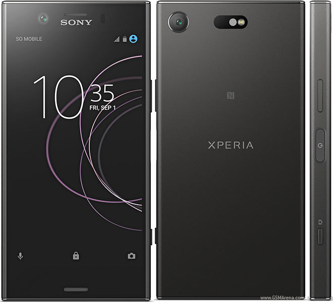
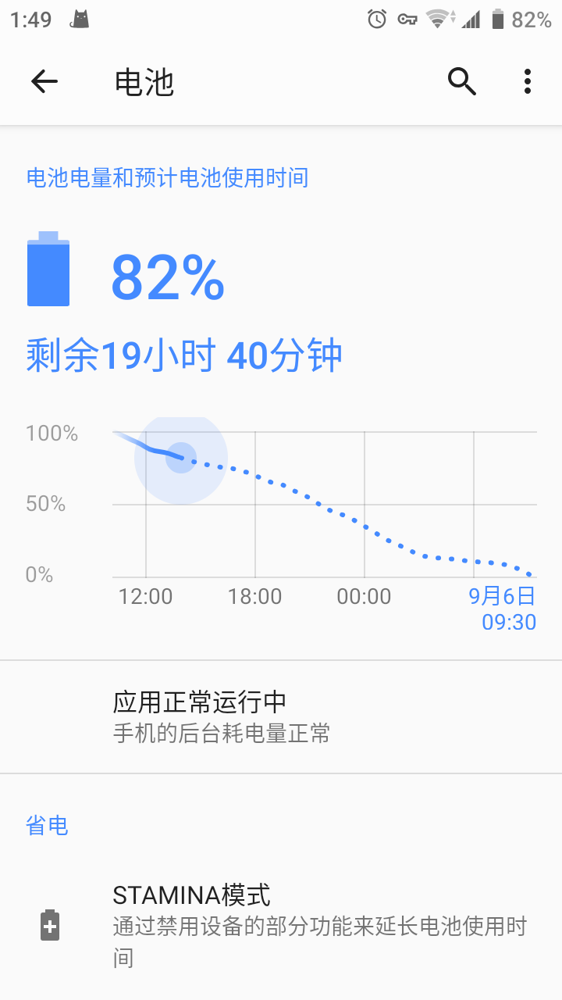
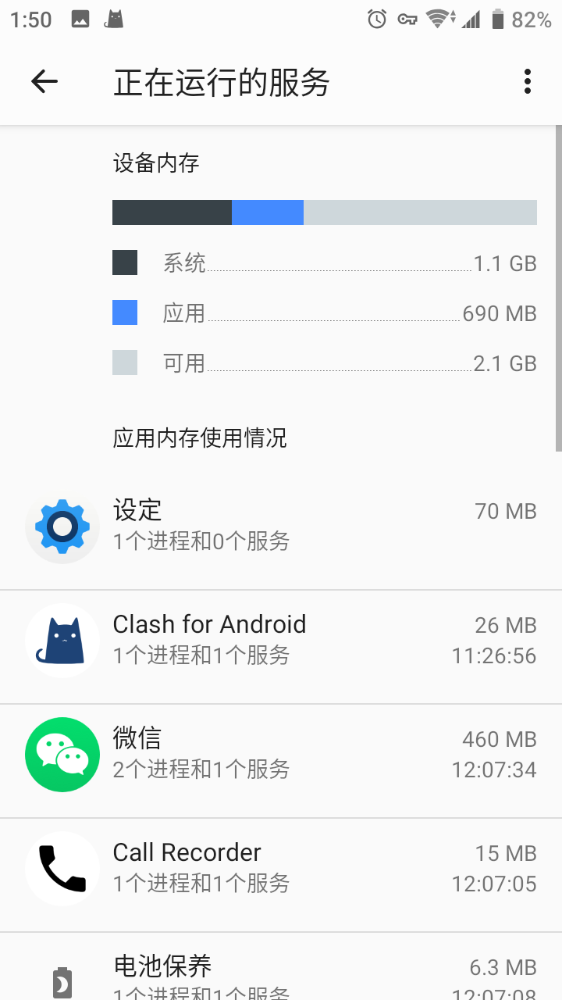
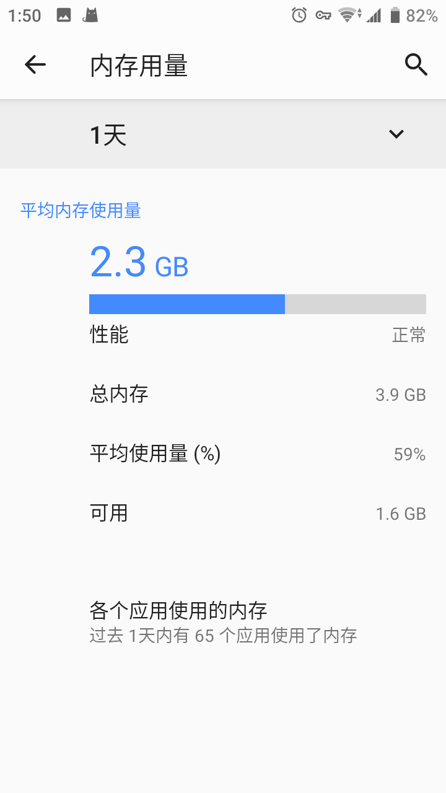

# 2022-09-05

## Sony Xperia XZ1 Compact

啊，自从上部手机暴毙（掉在路上被车碾碎了）后，我就在找新手机，本来想着整个 Redmi K40s（8+128 的版本在线下店居然没有卖）。

然后就在老友的帮助下，我借到了一部 sony xz2 当作临时机子用了几天，之后就又在老友的推荐下，我在海鲜市场花了三四百元整了一部（翻新/组装？）98新的 [sony xz1c](https://www.gsmarena.com/sony_xperia_xz1_compact-8610.php) 洋垃圾（日版，黑色）。

{ width=400 }

4.6 寸的机身非常迷你小巧，重量很轻，整个屏幕单手就能操作，握在手中颇有一种卡片机的感觉。我个人是挺喜欢这个屏幕的，没有异形，挖孔，刘海，水滴等一堆可以逼死强迫症的槽点。

319ppi 720P LCD 屏幕虽然可显示面积不如现如今大行其道的全面屏，xz1c 屏占比其实也不高；不过好在整个屏幕的色彩显示还算准确细腻，看不到明显的颗粒感。

xz1c 顶部边框有一个 3.5mm 耳机孔，不过这个东西在我买了个蓝牙耳机后，就用的不是很多了。比较生草的一点就是 SD 卡和 SIM 卡不支持热拔插，需要关机后才能拆卸。不过考虑到最高支持 256GB 扩展 SD 卡和可直接拆卸的结构，倒也不是不可以接受。xz1c 的内置存储空间只有 32GB，所以再额外加装一个大容量 SD 卡是很有必要的。

和现在的在售手机相比，我觉得相机很一般，不过对我来说，只要能扫码即可。倒也是不什么大问题。xz1c 的 WiFi 性能其实不很强，起码和我老电脑五五开吧，在网络差一点的地方，无线就要断线了。不过数据网络倒是没啥大问题。

侧边指纹用着很舒服，前提是手不是湿的。录入指纹的时候一定要根据解锁的时候使用的手指实际位置，实际角度进行录入，才能让系统快速准确地识别。

它的电池大小是 2700mAh，我个人日常用一天没啥问题（但我并不是以常见的方式使用它），也就是一天一充的频率。

{ width=300 }

内存为 4GB，放在 2022 年，大部分人肯定会认为这是电子垃圾。不过对我来说，神奇地正好够用😂😂😂，并且还能剩一点空间多开几个应用。骁龙 835 日用也不算拉跨。

{ width=300 }

在此不得不感慨一下国产软件将硬件的配置需求不断拉高，然后又在几年后把拉高的配置丢弃不用，转向更高的配置，不断折磨用户。

{ width=300 }

搞到最后，一部 12GB 的安卓旗舰内存调度还不如苹果的 4GB 内存祖传配方。

整个手机的系统是 Android 9 类原生（docomo 运营商定制版），由于无法解开 BL 锁，所以只能先依靠[冰箱](https://iceboxdoc.catchingnow.com/)将谷歌全家桶和 docomo 运营商全家桶能删则删，不能删就直接冻结。

!!! tip "相关内容"
    [无法解锁 bootloader 时，如何使用ADB工具精简日版系统 & ntt docomo 软件对照表](https://www.bilibili.com/read/cv8250761/)

此番清理后，整个手机就干净了不少。然后就是安装自用的软件。主要来源于 [F-droid](https://f-droid.org/)、[Apkpure](https://apkpure.com/) 和[酷安](https://coolapk.com/)。国产软件能尽量少安装就少安装，尽可能多地采用来自 F-droid 和 Github 的开源软件。

国产软件无法避免的也就是 TIM、微信和支付宝了。我对于微信和 TIM 选择放任自由，不管理他们的后台，剩余的国产软件全部塞冰箱里面。这样就能确保 qq 和微信基本不会漏消息了。至于剩下的软件，由于它们来自于开源社区，很多并不会自动驻留后台（需要用户手动开启驻留后台或根本就没有后台驻留的功能），整体的体积也很精简，没有臃肿无用的功能，所以对于续航和存储空间占用的影响微乎其微。

此外，还需要使用 ADB 工具和[流体手势导航](https://play.google.com/store/apps/details?id=com.fb.fluid&hl=zh&gl=US)，来替换 sony 祖传三大金刚键。

在这样的配置下，整个手机剩余的内存通常有 2GB，还算充裕。甚至还能在不显著缩减续航的情况下，支持 24 小时全程开启代理服务（clash for Android）🤣

xz1c 的游戏体验如何就不清楚，我一般用电脑打游戏也不指望 720p 的小屏幕能有多好的体验。

此外，不足之处，大概是

1. 屏占比其实更高一些
2. Android 9 原生权限管理很垃圾。  
    不过考虑到大部分应用都是守规矩，不守规矩已经被冻成冰了，倒也不是不可以原谅。  
3. WiFi 性能很菜