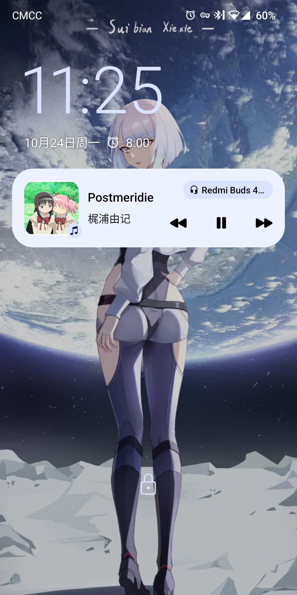
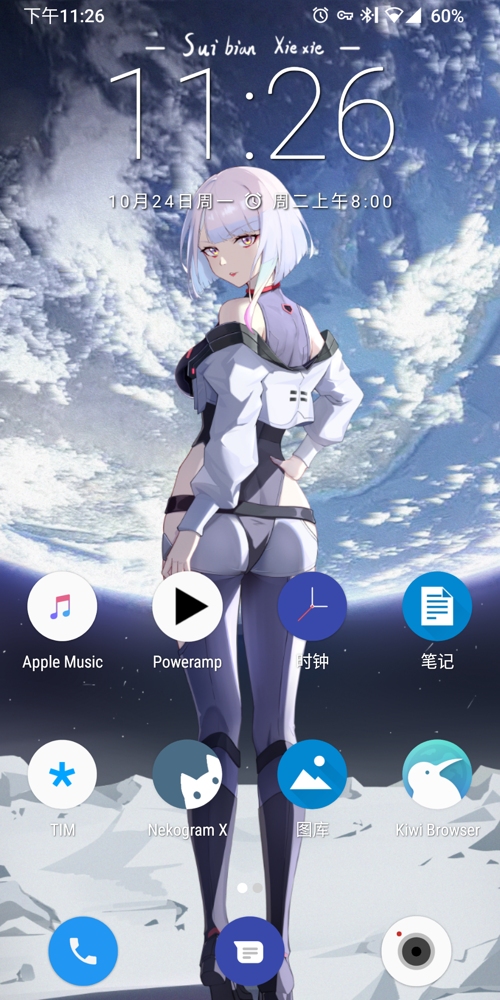
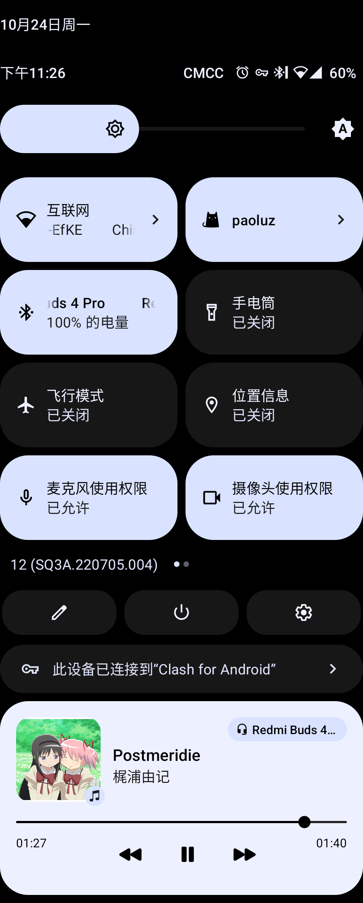
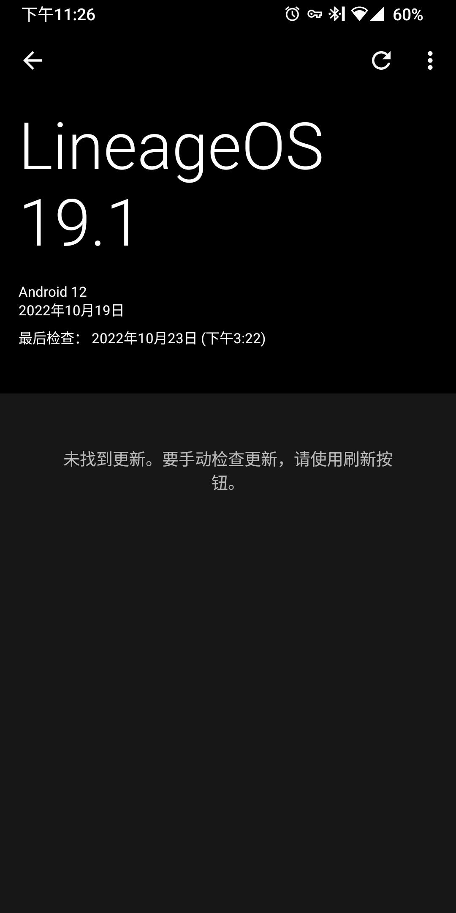

# 2022-10-24

距离上一次随笔已经快一个月，时间过的很快。

## Sony Xperia XZ2

在购入 xz1c 之后，我又在闲鱼上捡了一部 Sony Xperia XZ2（H8296，6GB RAM + 64GB ROM，银色）当作主力机。到手后发现电池和屏幕都存在问题（屏幕的 LED 灯珠损坏），于是又花了数百元购买了屏幕总成和魔改电池。

在更换电池后，续航在 7~10 小时，夜间掉电 2~3%（得益于黑域的后台管理和 scene 的功耗控制）。

### Sony Xperia XZ1 compact

这部经典的小屏手机就当作是备用机了，手感非常棒。🥰

## LineageOS

根据 LineageOS Wiki 的文档和一些 reddit 帖子，我成功地将 LingeaOS 19.1 安装到 Sony Xperia XZ2[^1] 上了。

=== "锁屏界面"

    { width=300 }

=== "桌面"

    { width=300 }

=== "控制面板"

    { width=300 }

=== "系统更新"

    { width=300 }

整体来说，协调统一的 material design UI 让我倍感舒适，同时整个系统也非常整洁，在保证基本功能正常的同时，没有多余的功能，可以说是尽显 ASOP 本色了。虽然它对于旁人来说很简陋，但正好是我中意的样子。🥰

当然，问题也是有的，但不多，我所遇到的就是切换应用的时候动画会掉帧。LineageOS 19.1 甚至修好一个 SonyASOP 11 的 BUG（？也有可能是特性<del>分享热点网络时必须连接到数据网络</del>）；以及自带了通话录音（SonyASOP 没有通话录音的功能困扰了我有一段时间了）。和其他同系产品相比，XZ2 可刷的 ROM 其实少的可怜（XDA 相关的帖子仅有两页），不过好在稳定的包是有的（比如 LineageOS 19.1）；同时，LineageOS 20（Android 13）也是可以期待一下的（XDA 上已经有人分享 BETA 版本的刷机包）。

原本打算写一篇备忘录，但是实在是没啥好写的（官方 WIKI 其实已经非常详尽），按部就班即可。至于 ROOT 权限的获取，可以通过刷入 Magisk 的方式实现；直接按照 magisk 修补 `boot.img` 的传统方法刷入即可。唯一需要注意的是，需要使用 [payload-dumper-go](https://github.com/ssut/payload-dumper-go) 解压加密的 `payload.bin` 文件来获取 `boot.img` 和 `vbmeta.img`。

### 结束，亦或是新起点

从误入 EMUI，到被骗入 MIUI（MTK 芯片通常莫得 ASOP 刷机包），再到闲鱼捡垃圾遇上索尼，我在这前前后后大约四年的时间中备受国产 ROM 的折磨（各种非标准件，无孔不入的牛皮癣广告还有各种各样的睿智设计），虽然后期借助 magisk 压制住了不断作妖的 MIUI，但总归只是缓解问题。

成功刷入 LineageOS 的时候，我是非常高兴的，算是真正意义上将手机的系统转换为类原生<del>虽然 SonyASOP 也是类原生，但索尼对于系统优化并不怎么上心……</del>，彻底摆脱了国产 ROM 的阴霾，颇有种刚刚爬出污浊的地道[^2]，重见天日的感慨。

## Mkdocs

mkdocs 的构建时间明显地变长了（起码需要半分钟），我或许应该考虑一个生成速度更加快速的文档框架？或者应该使用 hexo 或 hugo 创建一个预印版博客（用于发布新近翻译的译文）？

[^1]: 壁纸来源：https://www.pixiv.net/artworks/101690757  
[^2]: 图源：肖申克的救赎·经典剧照 https://www.theatlantic.com/entertainment/archive/2015/07/prison-break-escape-el-chapo-clinton-correctional/398546/