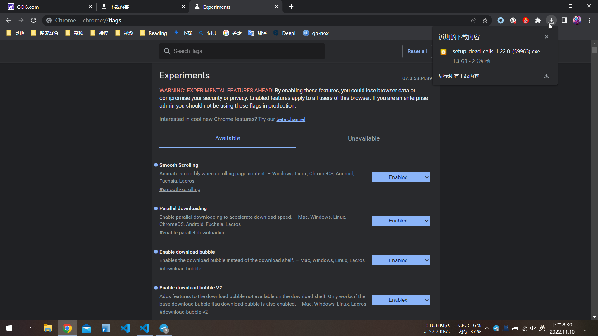

---
tags:
  - 随笔
  - chrome
  - markdown
  - HTML
---

# 2022-11-10

## Chrome 下载器

最近发现 chrome 悄悄发布了一个默认关闭的下载器样式：

外观和火狐的内置下载器非常类似。~~chrome 总算是把祖传的下载器更新了。~~ 🤣

关联 flags：  

- `#download-bubble`
- `#download-bubble-v2`

其他实用 flags：

- `#smooth-scrolling`
- `#enable-parallel-downloading`
- `#sharing-qr-code-generator`

*对于 Android 设备，似乎只能将主页设置为书签页，同时禁用阅读清单才能获得一个简洁的首页……*

## Markdown 与 HTML

在编写[小尺寸手机备忘录](./../others/small-size-phone.md)的时候，我意识到了要通过 markdown 实现自由排版（像 Word 那样）还是有一段距离的。

脱离预定样式的排版需要使用 HTML 或者 CSS 进行设定，这使得我产生了是否要学习以下 HTML 语法的想法……