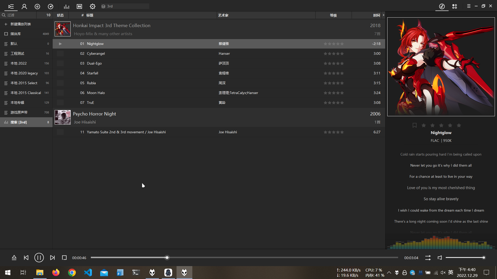
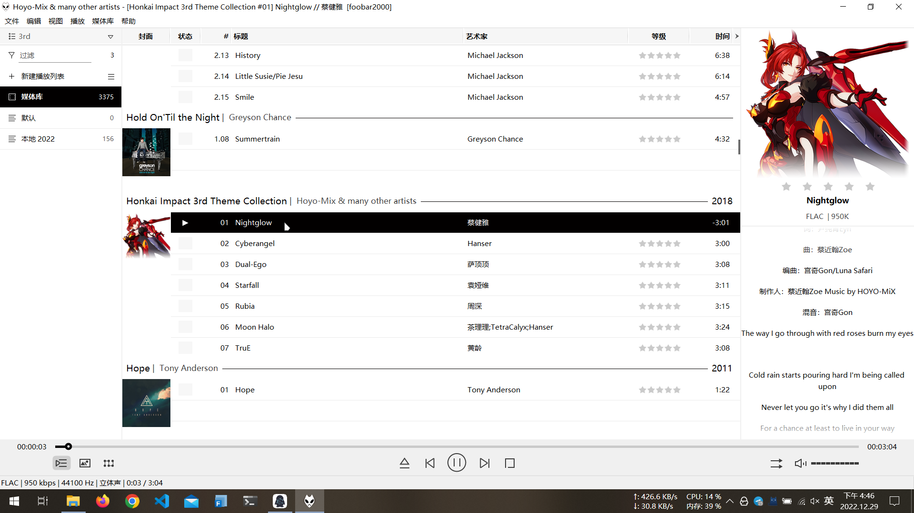
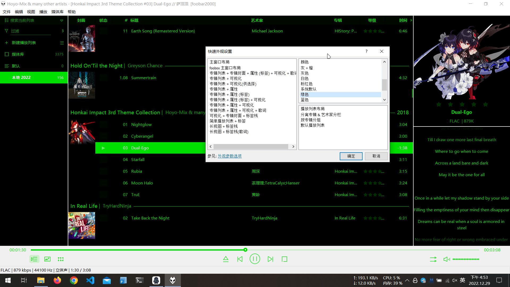

---
tags:
  - 随笔
  - 站点动态
  - Foobox
  - Fcitx5-android
  - Virtualbox
  - AMD
---

# 2022-12-29

## Blog

[mkdocs-material](https://squidfunk.github.io/mkdocs-material/) 自带的[博客功能](https://squidfunk.github.io/mkdocs-material/setup/setting-up-a-blog/)现在还处于内测阶段，估计正式上线还需要一段时间。

## Foobox 7.x

在 Windows 上，我将 [foobox](https://github.com/dream7180/foobox-cn) 作为默认的音乐播放器已经有很长的一段时间了。最近发现维护者重构了 GUI，发布了 7.x 版本[^1]，于是下载安装包试了一下。

- foobox 7.x 完整版本可在[此处](https://www.cnblogs.com/asionwu)获得。

总得来说，新的界面挺好看的，但是没有了旧版本的动态颜色变化，删除了 MPV 组件[^2]，以及非常实用的 [musictag](https://www.cnblogs.com/vinlxc/p/11347744.html) 内置组件。新的颜色样式同样也是非常地原始（有待后续优化）。

=== "旧版"

    

=== "新版"

    

=== "颜色样式"

    

我大概会继续使用旧版 foobox，直到它改进 GUI 的颜色样式问题为止。

## Fcitx5-android

[Fcitx5-android](https://github.com/fcitx5-android/fcitx5-android) 是一个未来可期的 Android 开源输入法。

在使用一段时间后，我还是因为它没有自动纠错功能退回到了 [GBoard](https://play.google.com/store/apps/details?id=com.google.android.inputmethod.latin&gl=US) 的怀抱……毕竟没有输入纠错功能对于输入法使用体验的影响是无法忽视的。

## 3D 加速

大概是我的显卡太老旧了又或是 virtualbox 的图形驱动性能不行，即便开了 3D 加速，依旧存在一些问题（比如虚拟机的一些图形元素出现错误），但现在不会致使黑屏了。

## phoenix point

AMD 的 7000 系 APU 的理论图形性能据报道[^3]可以和 3060M 持平，可以说是我最为期待的硬件设备之一了。

## 2023

时间过得真快，2023 年就要到了……

希望在新的一年里也能活得快快乐乐。

[^1]: [v7.0](https://github.com/dream7180/foobox-cn/releases/tag/7.0)：转用原生 DUI + 蜘蛛猴面板(SMP)，精简优化, 修正了很多 bug，更省资源更流畅。
[^2]: [v6.6.12 2022-10-18](https://github.com/dream7180/foobox-cn/releases/tag/6.6.12): 集成视频播放组件 foo_mpv，可方便观看简单的视频，体积大增，注意 foobar2000 路径不要含有中文名，否则视频不显示。
[^3]: [AMD Phoenix and Dragon Range leak: Up to 16 Zen 4 cores for Dragon Range and RTX 3060 mobile-like performance for Phoenix](https://www.notebookcheck.net/AMD-Phoenix-and-Dragon-Range-leak-Up-to-16-Zen-4-cores-for-Dragon-Range-and-RTX-3060-mobile-like-performance-for-Phoenix.631315.0.html)