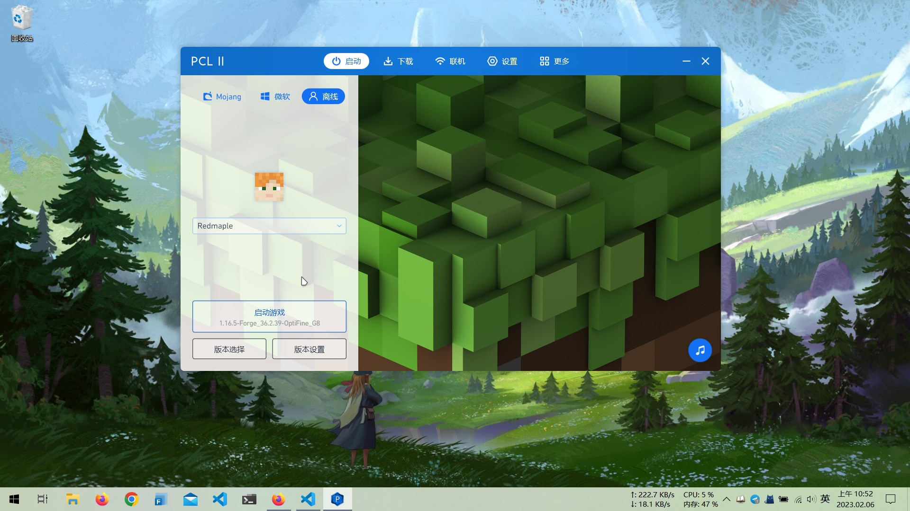
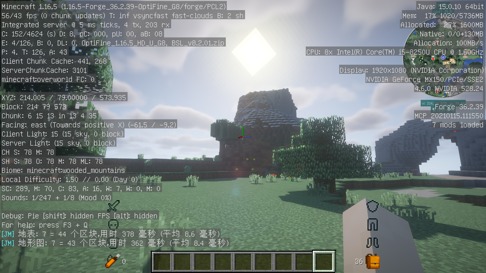
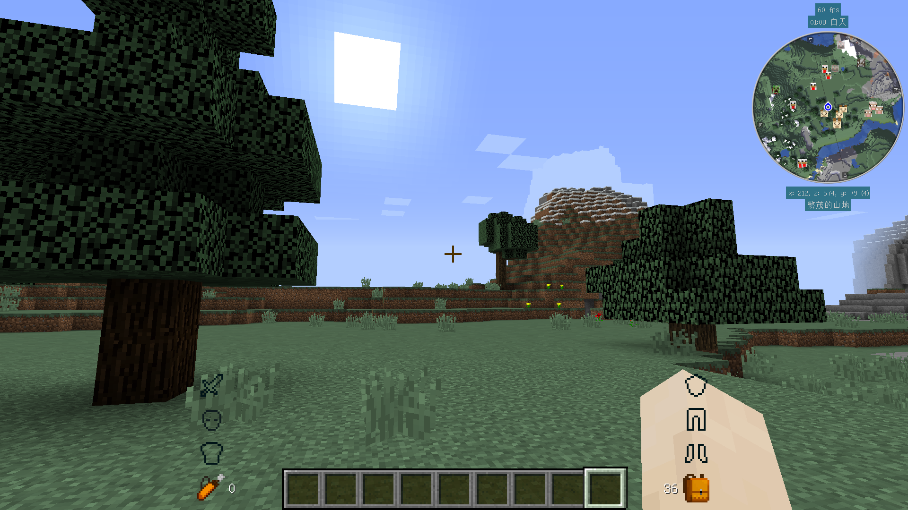
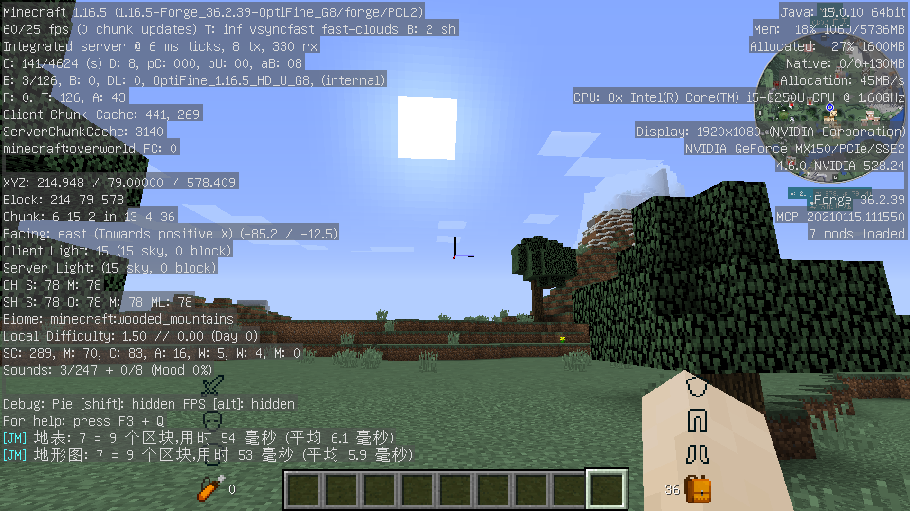

# 2023-02-06

## Minecraft

### OpenJDK

最近在安装 minecraft 的时候，发现 Java8 的支持周期很长，以至于至今都没有停更。

- Java SE 8 (LTS) 于 2014 年发布，仅 Oracle 就会把它维护到 2030 年。

而且 openJDK 的[维护情况](https://en.wikipedia.org/wiki/Java_version_history)也是有一点复杂，目前还在维护的就有 openJDK 8 (LTS)、11 (LTS)、17 (LTS)、19、20、21 (LTS) 六个版本。

同时根据 minecraft 维基[^1]以及一些实机运行结果。理论上，

- minecraft 1.12 至 1.16.5 版本，需要 Java 8 (1.8.0) 或更新的版本；
- minecraft 1.17 至 1.17.1 版本，需要 Java 16 或更新的版本；
- minecraft 1.18 及更新的版本，需要 Java 17 或更新版本。

我所安装的是 minecraft 1.16.5 版本，选择的是 minecraft 维基推荐的 [Zulu OpenJDK](https://www.azul.com/downloads/?package=jdk) 中的 openJDK 15[^2][^3]。minecraft 的版本需要和 openJDK 互相匹配，同时高版本的 JDK 可以带来更好的性能。

预计 minecraft 1.16.5 和 1.12.2、1.7.10 一样，会成为一个诸多 mod 玩家汇聚的版本。

### 启动器

这次我没选择 [HMCL](https://github.com/huanghongxun/HMCL) 作为游戏启动器，而是选择了 [PCL2](https://github.com/Hex-Dragon/PCL2)。就使用体验而言，还算不错。

### 光影包

由于在开启光影的情况下，如果再添加材质包会明显拉低游戏帧率（无法稳定 30FPS）[^4]。所以我只能使用原版材质。帧率低于 40FPS，我会感受到明显的画面撕裂……

光影包我选择的是 [BSL Shaders](https://bitslablab.com/bslshaders/)。光影包不需要版本号严格地一一对应（它可以向下兼容旧版本），但材质包不行。BSL 的默认预设是 `High`，将它调成 Low[^6] 就行了；同时在视频设置中将图像品质修改成流畅（默认是高画质）。

=== "BSL 光影"

    
    

=== "OptFine 内置光影"

    
    

### 数据包与 mod

除了许多可用的 [Mod](https://beta.curseforge.com/minecraft/search?index=1&gameId=432&pageSize=20&classId=6&sortType=2&gameVersion=1.16.5) 之外，1.16 也有许多的[数据包](https://minecraft.fandom.com/wiki/Data_pack)（datapak）可用。

### Fabric

虽然本次安装 minecraft mod 时，我选择的是 [Forge](https://files.minecraftforge.net/net/minecraftforge/forge/) 和 [OptFine](https://optifine.net/home)。但查资料的时候发现 [fabric](https://fabricmc.net/use/) 最好是和 [Iris Shaders](https://irisshaders.net/index.html) 与 [Sodium](https://www.curseforge.com/minecraft/mc-mods/sodium)[^5] 一并使用；这可以说是来自开源社区的解决方案（实机运行的效果也和前者大差不差）。

### 外部链接

一些有用的外部链接：

- [MC 百科](https://www.mcmod.cn/)
- [MCBBS](https://www.mcbbs.net/)
- [Minecraft - Curseforge](https://www.curseforge.com/minecraft/modpacks)
- [Minecraft Wiki](https://minecraft.fandom.com/wiki/Minecraft_Wiki)
- [Minecraft Data Packs | Planet Minecraft Community](https://www.planetminecraft.com/data-packs/?p=0)

[^1]: [Tutorials/Update Java](https://minecraft.fandom.com/wiki/Tutorials/Update_Java#Why_update?)
[^2]: Minecraft 1.16.5 在 openJDK 17 上无法运行。
[^3]: 据说 minecraft 1.16.5 是在 Java 8 开发，但测试环境是 Java 11。
[^4]: 当前设备的显卡是 MX150，算是一张已经入土的渣卡了。
[^5]: Sodium 是 Iris 的前置 mod。
[^6]: low 和 medium 画质预设其实差别很小，起码我感受不出来。但帧率却差了 5~10 FPS。