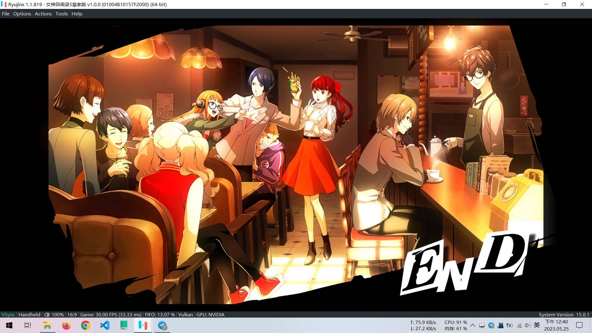

---
tags:
  - 随笔
  - openSUSE
  - P5R
---

# 2023-05-25

## P5R

[p5r]: https://store.steampowered.com/app/1687950/Persona_5_Royal/
[ryujinx]: https://ryujinx.org/
[yuzu]: https://yuzu-emu.org/

{ width=70% }

{ width=70% }

经过大约 100h 的游玩，我通关了 [Persona 5: Royal][p5r]。算上二周目，整个游戏的可游玩时间将达到 200h 以上。

[yuzu] 或者 [ryujinx] 都会卡在最后主角攻击亚当·卡蒙头部弱点的时候，可能是 bug。导致无法继续推进剧情。只能等待后续购买 steam 版（阿根廷区）后，重新游玩了。

### 结局

第三学期有两种结局：

* 一是，认同丸喜老师所构筑的现实，但是大团圆结局； → 【Bad End】
* 二是，否定丸喜老师的构筑的现实，主角团使丸喜老师悔改并将整个世界拉回原有的现实。→ 【True End】

我准备了两个存档，分别选择不同的结局。

个人感觉，应当选择第二个结局

> 归根结底，决定了丸喜的行为是否正确的，依然是“**丸喜有没有能力支撑起一个长期合理的美好世界**”，和“**拥有神的力量却没有神的精神的丸喜能否保证自己永不变质**”罢了。这两点丸喜都无法做到，他的阿撒托斯没有改写现实的能力，是依靠印象空间的能量才能长期供给，一旦外在环境变化就有崩溃甚至异变的可能；而他在和原人亚当合体之前，也无法保证自己一拍脑门改变想法的可能性不存在，而完全掌握现实的丸喜将会是绝对无法推翻的最可怕的魔王，长达数千年的人类历史不能交给一个自己心理上还有疾病的不稳定的人类来彻底掌控。
>
> — [如何评价P5R中的反派丸喜拓人？ | 叉子的回答][zhihu]

[zhihu]: https://www.zhihu.com/question/390878156/answer/2756743644

## openSUSE.Asia 峰会 2023

> 最后，openSUSE.Asia 委员会决定重庆为 2023 年 openSUSE.Asia 峰会的主办城市，时间为 2023 年 10 月 21 日至 10 月 23 日，地点为重庆邮电大学。 
> — [openSUSE.Asia 峰会 2023 公告]

[openSUSE.Asia 峰会 2023 公告]: https://suse.org.cn/%E7%A4%BE%E5%8C%BA%E6%96%B0%E9%97%BB/2023/05/21/openSUSE.Asia-%E5%B3%B0%E4%BC%9A-2023-%E5%85%AC%E5%91%8A.html