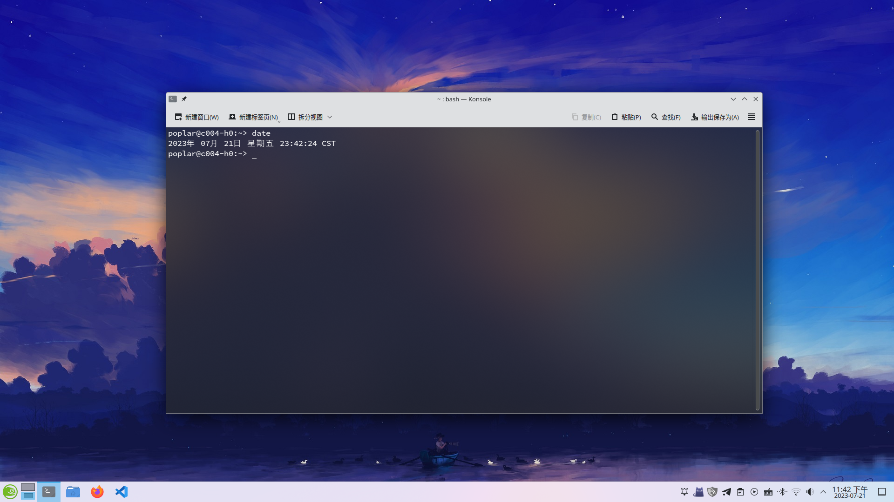
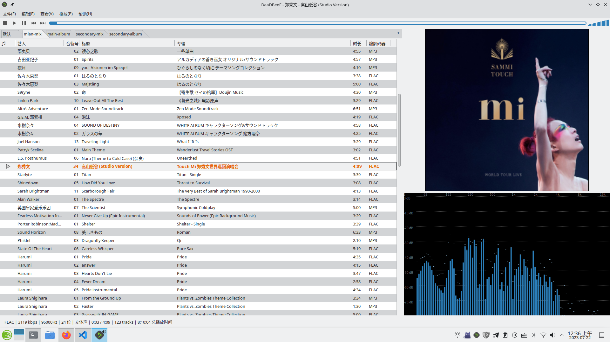

# 2023-07-21

## 操作系统

最近，我把系统刷回了 tumbleweed，这次是单系统了。Windows 系统则被我塞入虚拟机之中。

```
poplar@c004-h0:~> lsblk
NAME        MAJ:MIN RM   SIZE RO TYPE MOUNTPOINTS
sda           8:0    0   1.8T  0 disk 
└─sda1        8:1    0   1.8T  0 part /bt
nvme0n1     259:0    0 931.5G  0 disk 
├─nvme0n1p1 259:1    0   512M  0 part /boot/efi
├─nvme0n1p2 259:2    0     8G  0 part [SWAP]
├─nvme0n1p3 259:3    0    50G  0 part /var
│                                     /usr/local
│                                     /srv
│                                     /root
│                                     /opt
│                                     /boot/grub2/x86_64-efi
│                                     /boot/grub2/i386-pc
│                                     /.snapshots
│                                     /
└─nvme0n1p4 259:4    0   873G  0 part /home
```

同时，对于 KDE 的主题美化，这次我选择了很保守（相对于深度美化而言）的方案：默认的 breeze 浅色主题 + [Tela] 图标包 + [Qogir-white-cursors] 鼠标图标包。

这么做，一是为了提高一点桌面的鲁棒性（同时少折腾一点）；二是默认的 Breeze 主题已经挺精美了，开发者将 KDE 的模糊效果做得很不错。

[Tela]: https://github.com/vinceliuice/Tela-icon-theme
[Qogir-white-cursors]: https://github.com/vinceliuice/Qogir-icon-theme
[nord-dark]: https://github.com/tonyfettes/fcitx5-nord

=== "KDE 桌面"

    

=== "软件启动器"

    

=== "Konsole"

    

此次的 Fcitx5 主题我选了 [Nord-dark]，感觉还不错。

## LibreOffice 的 openJDK

在 openSUSE 的邮件列表与一些人交流后，我了解到 LibreOffice 需要的是一个基本的 JRE，而非特定版本的 openJDK。所以 tumbleweed 目前为 LibreOffice 打包的 openJDK 11 从技术上说是没有问题的。虽然 openJDK 11 已经停止了开发，但 SUSE 仍然为此版本（主要是为了 SLE 和 Leap）提供安全维护。

### 文档格式

markdown 终究只适合于简单的文档编写（可以认为是一种简化版的 HTML 语言）。在对比多种标记语言后，我并没有找到合适的，功能丰富同时又保持易用性的标记语言。如果不考虑易用性，倒有一种标记语言符合要求：[XML]。

[XML]: https://en.wikipedia.org/wiki/XML
[开放文档格式]: https://en.wikipedia.org/wiki/OpenDocument

但如果不限于标记语言时，则有一个成套方案的选择：LibreOffice。它使用的[开放文档格式]具有良好的向后兼容性。同时 LibreOffice 套件的功能很丰富： Writer（文字处理）、Calc（电子表格）、Impress（演示文稿）、Draw（矢量绘图）、Math（方程编辑器）和 Base（数据库）。这是 Markdown 增加再多的插件或扩展都无法比拟的优势，我最终放弃了寻找优秀的标记语言的行动，直接投入了 LibreOffice 怀抱。

## Appimage

这次我没有再使用 [AppimageLauncher]，感觉直接创建一个 desktop 文件，然后扔到 `~/.local/share/applications` 里面会更加简便一些。

[AppimageLauncher]: https://github.com/TheAssassin/AppImageLauncher

## Deadbeef 的歌词

我在网上搜了一阵子，然后发现显示歌词，可以借助 `osdlyrics`（它同时需要 `deadbeef-plugin-mpris2`）显示歌曲的歌词。实际操作后，我发现这东西只能显示外置歌词文件或者网络歌词，但很可惜的是我只使用内嵌歌词。

啊，就，很寄。 🥲

稍微编辑了一下播放器的界面，感觉又不是不能用（毕竟歌词不影响音质……）。



## Hash

之前在 Windows 下使用 7zip 对许多文件生成了 `*.sha256` 文件，我后续得找个便捷地生成校验文件的办法。

```
57975812b87eb1d034525ad7ea77b5f92eccc914ea596bb10f49733540652b87  /home/poplar/音乐/main-album/磯村由紀子 - 風の住む街/01. 青の夜明け.flac
b12ede11f4fd48154be1311ec24bb540f2132cccb3b7307e75dc0bf137b8e9bc  /home/poplar/音乐/main-album/磯村由紀子 - 風の住む街/02. 風の住む街.flac
e6dc35aec26bbd6a64087eabb8a43fd79210ac27a70fe2a8028c7f495465c27a  /home/poplar/音乐/main-album/磯村由紀子 - 風の住む街/08. 公園通り.flac
ac5f8f445c288742a47605a2a8c7d0d2096fe16a648e3ec302f506705c30d66a  /home/poplar/音乐/main-album/磯村由紀子 - 風の住む街/09. 夢.flac
a9e4cad763e168cb1cc299840c5369a0e98c46e1541073de0a6b25ef75ed7dee  /home/poplar/音乐/main-album/磯村由紀子 - 風の住む街/03. 草原の涙.flac
0c2b61652ad3c5954967d6032fe72285d10d5a872f11654741b1c3f5359c60be  /home/poplar/音乐/main-album/磯村由紀子 - 風の住む街/04. Storm Of Autumn.flac
1e2fec3ff85b26f5df793957ec62514e54a7bb1e5724740329a403dd4eb2f42a  /home/poplar/音乐/main-album/磯村由紀子 - 風の住む街/10. グノシェンヌ.flac
a770f8032ecc2ed954db3012d6959c2b22563a23f352cb38ea518daff3aa54bd  /home/poplar/音乐/main-album/磯村由紀子 - 風の住む街/11. 緋のワルツ.flac
55ddc4855c907426a5d981b0a353d15117b608870c01a4824e5c2a711b5449ae  /home/poplar/音乐/main-album/磯村由紀子 - 風の住む街/05. サクラ.flac
96e2f8a7d6a80dff9d707fe6d8016a92477b2e0a9e659650fa8059b9e3ecb28d  /home/poplar/音乐/main-album/磯村由紀子 - 風の住む街/06. みんな転勤のせいだ.flac
7f2bbfb5c1747b17c85850b751e85fa68f28c741cffde4b54b257d2183493c95  /home/poplar/音乐/main-album/磯村由紀子 - 風の住む街/12. 亡き王女の為のパヴァーヌ.flac
306951b4e0024cb3b79e9c345b428581a659a4147b7cecc4088c1d55c2212a8f  /home/poplar/音乐/main-album/磯村由紀子 - 風の住む街/13. 風の住む街(Short Version).flac
bf428e8db7c0503f7a17c8363b29e1feac7e07362b487ccd649cf8eff7b7b221  /home/poplar/音乐/main-album/磯村由紀子 - 風の住む街/07. シチリアーノ.flac
```

以上是 `Kleopatra` 生成的校验文件，这个文件有一个严重的缺陷：它硬编码了文件的路径，一旦我改变文件的路径，它会导致校验失败。这并不是一个实用的校验文件。作为对比，7-zip 使用了相对路径，避免了这种问题：

```
57975812b87eb1d034525ad7ea77b5f92eccc914ea596bb10f49733540652b87  01. 青の夜明け.flac
b12ede11f4fd48154be1311ec24bb540f2132cccb3b7307e75dc0bf137b8e9bc  02. 風の住む街.flac
a9e4cad763e168cb1cc299840c5369a0e98c46e1541073de0a6b25ef75ed7dee  03. 草原の涙.flac
0c2b61652ad3c5954967d6032fe72285d10d5a872f11654741b1c3f5359c60be  04. Storm Of Autumn.flac
55ddc4855c907426a5d981b0a353d15117b608870c01a4824e5c2a711b5449ae  05. サクラ.flac
96e2f8a7d6a80dff9d707fe6d8016a92477b2e0a9e659650fa8059b9e3ecb28d  06. みんな転勤のせいだ.flac
bf428e8db7c0503f7a17c8363b29e1feac7e07362b487ccd649cf8eff7b7b221  07. シチリアーノ.flac
e6dc35aec26bbd6a64087eabb8a43fd79210ac27a70fe2a8028c7f495465c27a  08. 公園通り.flac
ac5f8f445c288742a47605a2a8c7d0d2096fe16a648e3ec302f506705c30d66a  09. 夢.flac
1e2fec3ff85b26f5df793957ec62514e54a7bb1e5724740329a403dd4eb2f42a  10. グノシェンヌ.flac
a770f8032ecc2ed954db3012d6959c2b22563a23f352cb38ea518daff3aa54bd  11. 緋のワルツ.flac
7f2bbfb5c1747b17c85850b751e85fa68f28c741cffde4b54b257d2183493c95  12. 亡き王女の為のパヴァーヌ.flac
306951b4e0024cb3b79e9c345b428581a659a4147b7cecc4088c1d55c2212a8f  13. 風の住む街(Short Version).flac
bd876af7ed8b830f9acc5f882370b2056f16c4d746919bc635b3354b9a377145  cover.jpg
```

### 图片查重

我使用了 [Czkawka] 进行图片查重。经过一些尝试，我发现如果要查找单一文件夹的相似图像时，只需要在路径中添加此文件夹，但不要设置为参考文件夹即可。哈希算法可以选择为 `Blockhash`，`32 bit`；此算法类型不会压缩图像质量，似乎可以提供更高的准确度。

后续如果有时间的话，我得查查这些算法彼此间的区别。

[Czkawka]: https://github.com/qarmin/czkawka

## vscode

本来有些担心在单个 vscode 内 github 和 gitlab 的仓库会不会互相冲突，但两个插件都安装上去后，我发现它们可以和谐相处的。

另外，我这次用的是一个还算不错的深色主题（之前挺喜欢的一个内置主题好像被开发者删了）：`tal7aouy.theme`。