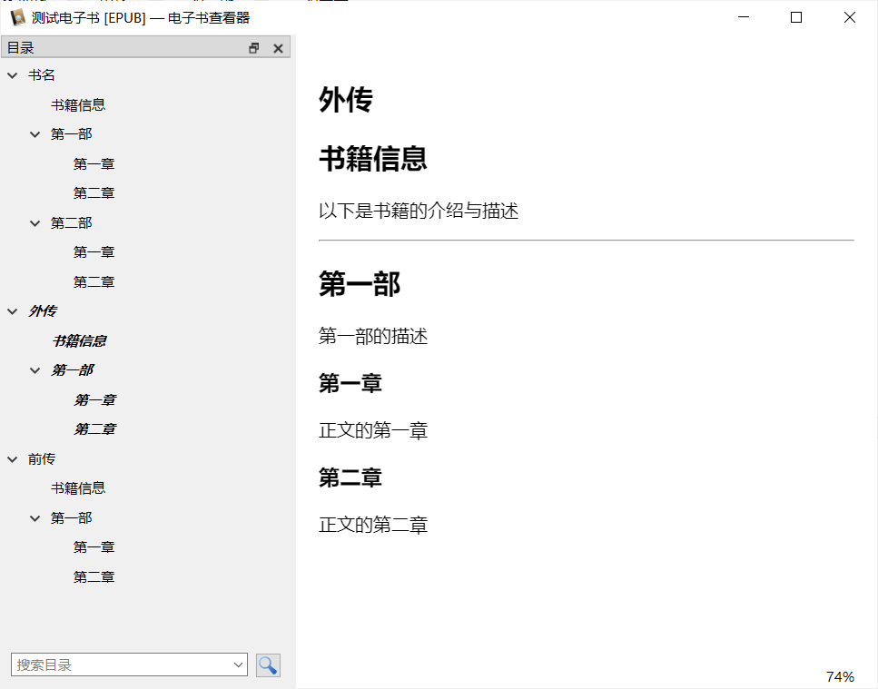

---
tags:
  - 杂谈
  - Pandoc
  - markdown
  - Epub
  - 教程
---

# 使用 Pandoc 制作简易的 Epub 电子书

本文主要记录如何使用 [pandoc] 制作一个简易的电子书文件。

对于专业化的电子书制作，推荐阅读赤霓编著的《[ePub指南——从入门到放弃][epub-ref]》

> <center>版权声明</center>  
> 　　本书的内容是作者多年制作 ePub 电子书的经验，在写书之际，引用了网络上公开的资料文档。本着互联网共享精神，现免费公之于网络，请不要把本书用于商业，谢谢！  
> 　　关于本书的更新版本可发送邮件至 <code>1620279970@qq.com</code> 索要或添加 QQ 获取。

[pandoc]: https://pandoc.org/
[epub-ref]: https://zhuanlan.zhihu.com/p/29954562 

## 准备

以下是需要准备和推荐准备的工具集：

1. [pandoc] 是一个功能丰富，支持许多文件格式的文件转换器，它可以将调制过的 [markdown] 文件转换为 [epub] 文件。

2. [calibre] 是一个电子图书管理软件，可以用来阅读、管理和编辑电子书文件，本文中将使用它编辑电子书的元信息。

3. [opencc] 是一个用于简繁文字转换的命令行工具，可以方便地将繁体中文文本转换为简体中文文本。

4. [Visual Studio Code][vscode]（简称：vscode）是由微软开发的源代码编辑器，它的编辑器功能很丰富，结合扩展插件可以完成更多的任务，本文中，将使用 vscode 编辑 markdown 文件。

5. [markdown] 是一种基于纯文本文件的标记语言规范，可以简单的语法结构生成简洁的排版效果。

[markdown]: https://en.wikipedia.org/wiki/Markdown
[epub]: https://en.wikipedia.org/wiki/EPUB
[calibre]: https://calibre-ebook.com/
[vscode]: https://code.visualstudio.com/
[opencc]: https://github.com/BYVoid/OpenCC

## 安装工具

### pandoc

你可以直接前往 [pandoc] 官网下载安装包文件，或者打开终端运行：

```shell
winget install JohnMacFarlane.Pandoc  #对于 Windows 用户
sudo dnf install pandoc                 #对于 Fedora 用户
```

- [winget] 是微软推出的软件包管理器，使用它安装软件时记得在代理软件内开启系统代理。

[winget]: https://learn.microsoft.com/en-us/windows/package-manager/winget/

### calibre

你可以前往 [calibre] 的官网下载安装包或运行：

```shell
winget install calibre.calibre  #对于 Windows 用户
sudo dnf in calibre               #对于 Fedora 用户
```

### OpenCC

你可以前往 [opencc] 的开发者仓库下载可执行文件包或运行：

```shell
sudo dnf in opencc  #对于 Fedora 用户
```

另见[使用 OpenCC 进行简繁中文转换](./opencc.md)。

### vscode

你可以前往 [vscode] 的开发者仓库下载可执行文件包或运行：

```shell
winget install Microsoft.VisualStudioCode      #对于 Windows 用户
flatpak install flathub com.visualstudio.code  #对于 Linux 用户
```

- 有用的扩展：
    - [Chinese (Simplified) (简体中文) Language Pack for Visual Studio Code](https://marketplace.visualstudio.com/items?itemName=MS-CEINTL.vscode-language-pack-zh-hans)  
    为 vscode 的用户界面提供中文语言支持。
    - [Epub Reader]  
    为 vscode 提供预览 epub 文件的能力
    - [Pandoc Markdown Preview](https://marketplace.visualstudio.com/items?itemName=kzvi.pandoc-markdown-preview)  
    为 vscode 提供以 [pandoc's markdown] 规范预览 markdown 的能力  

[pandoc's markdown]: https://pandoc.org/MANUAL.html#pandocs-markdown
[Epub Reader]: https://marketplace.visualstudio.com/items?itemName=cweijan.epub-reader

## 制作电子书

总的来说：

1. 先编写一份符合 [pandoc's markdown] 规范的 markdown 源文件；
2. 再使用 pandoc 将 markdown 转换为 epub 文件；
3. 最后使用 calibre 补齐电子书元信息。

### 编写 markdown

你可以先阅读 [Markdwon 中文快速入门指南]快速了解 markdown 的基本语法规则。然后再阅读 [pandoc's markdown] 了解 pandoc 所支持的 markdown 语法规范。最后再开始编写符合 pandoc 规范的 markdown 源文件。

个人建议：

1. 书写时 markdown 尽量避免同时使用多个一级标题（书名已经默认作为一级标题了）；
2. pandoc 的 markdown 规范提供了相较于 markdown 原版不具有的许多扩展特性（如文本高亮、上下标文件、制表等）；
3. 默认情况下，转换文件时，Pandoc 只能识别到第三级标题（`###`），更小一级的标题（`####`）无法被正确识别并录入目录；
4. 遇到 markdown 无法解决的排版问题，可以寻求使用 [HTML] 和 [CSS] 解决问题；
5. 如果你在某处使用了 html 标记，但 epub 生成品没有实现你预期的效果，你可能需要将此处的所有标记符号都修改为 html 标记，例如：`<center><strong><color-blue>使用了自定义样式的蓝色文本</color-blue></strong></center>`；
6. 使用 html 和 CSS 语法时，请注意遵守它们的规范。
7. [Epub Reader] 在预览文件的同时可以检测电子书中存在的问题（例如有未闭合的 html 标签或内部错误）；
8. 不要使用 calibre 预览测试文件，它可以将原本存在问题或缺陷的电子书按照你预想的方式进行渲染从而导致你忽略了某些潜在问题；
9. 要使用文本段落首行缩进，你可以在文本前插入两个全角空格（Unicode：U+3000）；要插入此符号，请将输入法切换至全角输入状态，然后按下空格键即可；
10. markdown 本身没有专门为中文优化过渲染方式，你需要仔细阅读规范文档，以了解哪些默认渲染方式可能会影响排版效果；
11. 若分段时不希望使用空格分段，请使用 `<br />`
12. [正则表达式]对于批量处理文本很有帮助；
13. 推荐阅读《[中文文案排版指北]》；
14. markdown 文件的编码必须为 UTF-8。

[HTML]: https://www.w3schools.com/html/html_basic.asp
[CSS]: https://www.w3schools.com/css/default.asp
[正则表达式]: https://www.runoob.com/regexp/regexp-tutorial.html
[中文文案排版指北]: https://github.com/sparanoid/chinese-copywriting-guidelines/blob/master/README.zh-Hans.md
[Markdwon 中文快速入门指南]: https://markdown.com.cn/

### vscode

vscode 的用户手册详见[此处](https://code.visualstudio.com/docs)。


### 标注元信息

你需要在 markdown 文件的第一行标注一下文档的元数据（以 % 开头），例如：

```
% 书名
% 作者

# 一级标题

以下是正文文本
```

你也可以标注多个作者，例如：

```
% 书名
% 作者1
  作者2
  作者3
```

calibre 可以修改电子书的元数据或电子书本身，所以以上的元数据已经够用了。若你对 pandoc 定义的元数据标注规范感兴趣，请阅读：[Epub Metadata][epub-metadata]。

[epub-metadata]: https://pandoc.org/MANUAL.html#epub-metadata

### 转换文件

在 markdown 文件所在的文件夹中打卡终端模拟器或虚拟控制台，调用 pandoc 将目标文件（如 example.md）转换为 epub 电子书，并保存至相同目录下，例如：

```shell
pandoc example.md -o example.epub
```

当文件名存在空格或其他字符时，你可以使用双引号将文件名包裹起来，例如：

```shell
pandoc "示例文件 - 示例作者~testing.md" -o 测试.epub
```

### 多文件转换为 EPUB 文档

对于内容量巨大的文档，你可以将其裁剪成多个 markdown 文档。同时应注意标题层次的划分。

最后，使用如下的命令生成一本电子书。

```shell
pandoc -o example.epub chapter01.md chapter02.md chapter03.md
```

如此类推，输入文件名时应保持文件逻辑上的先后顺序。

## 工程示例

!!! info "说明"

    以下是将多个 md 文档转换为单个 EPUB 的工程示例。

现有如下的工程文件：

```
PS D:\.R\小说\factory\epub-build> ls


    目录: D:\.R\小说\factory\epub-build


Mode                 LastWriteTime         Length Name
----                 -------------         ------ ----
-a----      2022.12.12  上午 11:36            187 part01.md
-a----      2022.12.12  上午 11:36            112 part02.md
-a----      2022.12.12  上午 11:37            187 part03.md
-a----      2022.12.12  上午 11:37            187 part04.md
```

每个文件的内容如下：

=== "part01.md"

    ````
    % 测试电子书
    % 测试员

    # 书名

    ## 书籍信息

    以下是书籍的介绍与描述

    ---

    ## 第一部

    第一部的描述

    ### 第一章

    正文的第一章

    ### 第二章

    正文的第二章
    ````

=== "part02.md"

    ````
    ## 第二部

    第二部的描述

    ### 第一章

    正文的第一章

    ### 第二章

    正文的第二章
    ````

=== "part03.md"

    ````
    # 外传

    ## 书籍信息

    以下是书籍的介绍与描述

    ---

    ## 第一部

    第一部的描述

    ### 第一章

    正文的第一章

    ### 第二章

    正文的第二章
    ````

=== "part04.md"

    ````
    # 前传

    ## 书籍信息

    以下是书籍的介绍与描述

    ---

    ## 第一部

    第一部的描述

    ### 第一章

    正文的第一章

    ### 第二章

    正文的第二章
    ````

生成电子书：

```
pandoc -o test.epub part01.md part02.md part03.md part04.md
```

实验成品示意图如下：

