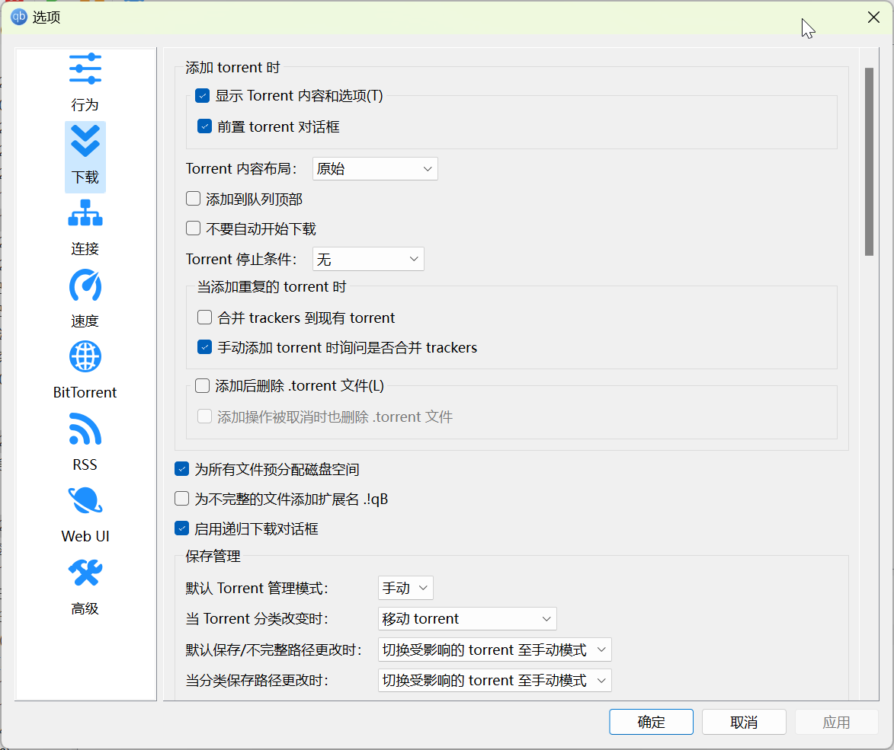
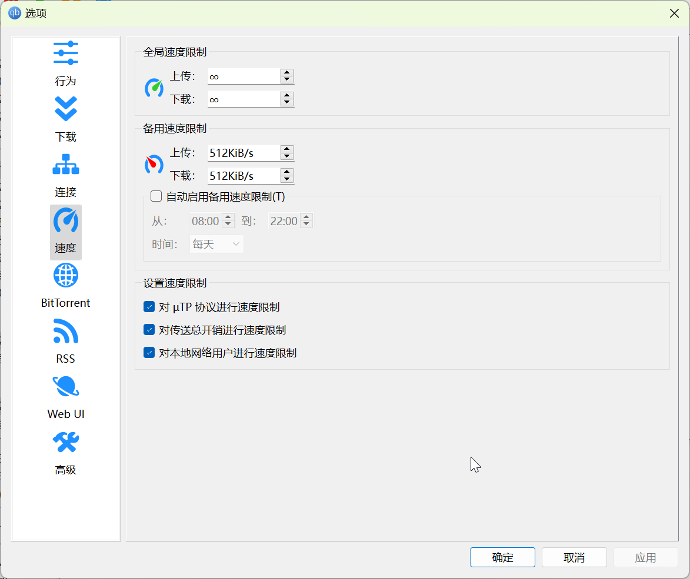
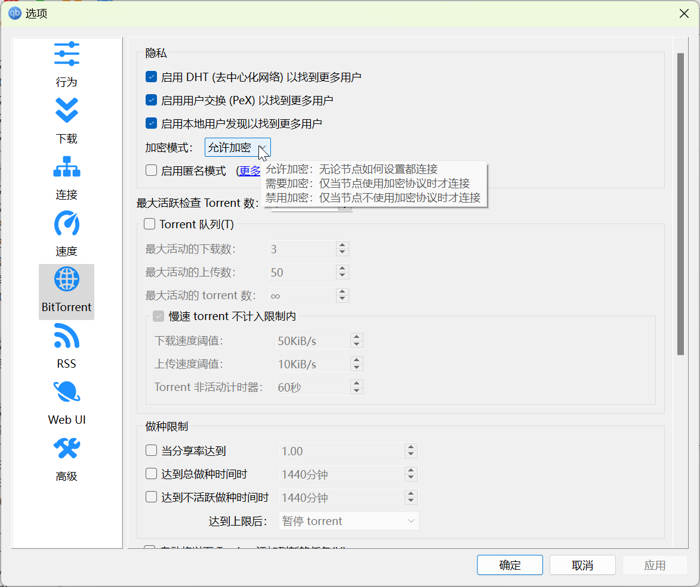
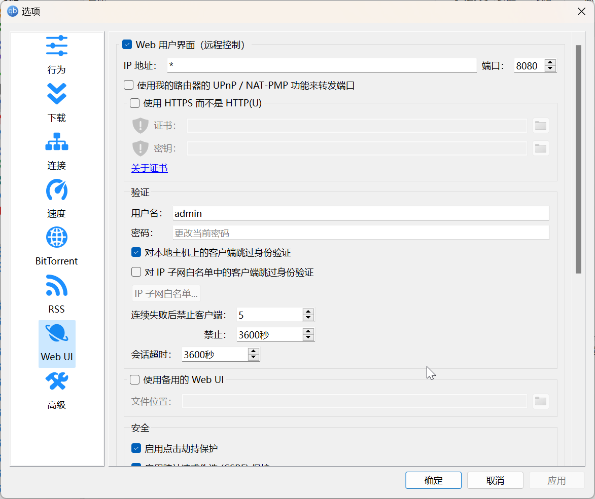
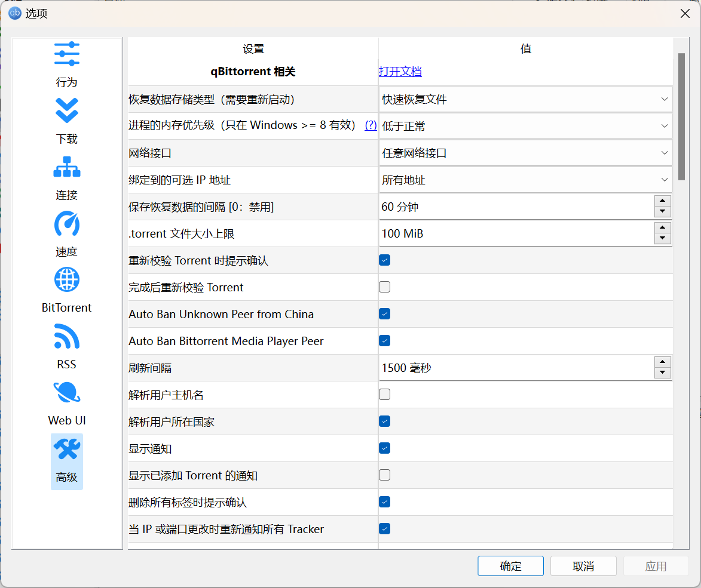
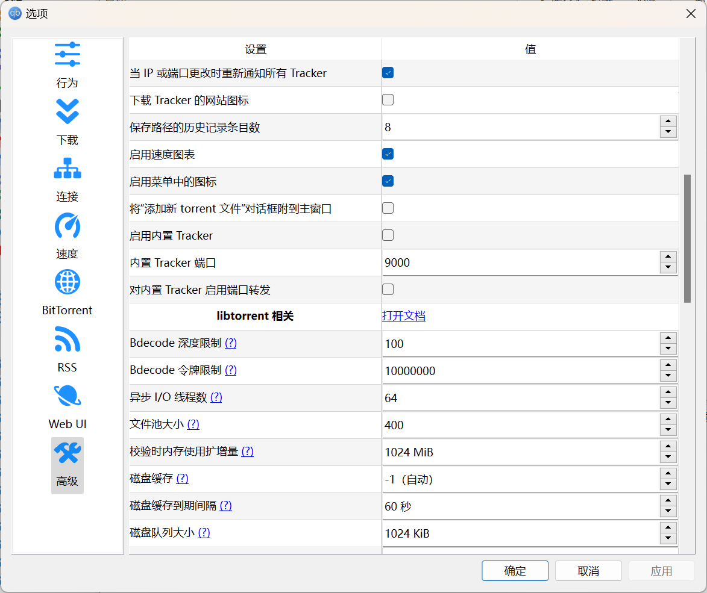
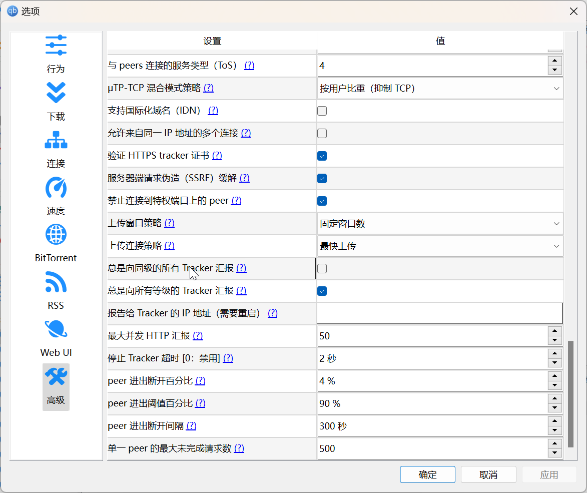

# qBittorrent 配置备忘录

这是以反吸血为目的的 qBittorrent 配置备忘录。

- 参考配置另见；
    - [qBittorrent 参数详细设置教程](./../../archives/qbittorrent-confs.md)
    - [libtorrent reference-Settings](https://www.libtorrent.org/reference-Settings.html)

## 安装

使用：[c0re100/qBittorrent-Enhanced-Edition]

[c0re100/qBittorrent-Enhanced-Edition]: https://github.com/c0re100/qBittorrent-Enhanced-Edition/releases

对于 Windows，安装完成后，在 qbittorrent 的安装文件中，新建一个名为 `profile` 的文件夹，以便携模式启动 qbittorrent。

## 日志

在菜单栏的 **视图** → **日志** 中，勾选全部类型的日志信息。

## 软件设置

### 行为


勾选：

- 删除 Torrent 时提示
- 确认 “暂停/继续所有” 操作
- 使用交替的行颜色
- 隐藏为 0 及无穷大的项：总是
- 在 Windows 启动时启动 qBittorrent
- 启动时的窗口状态：隐藏
- 如果退出时由 Torrent 活动则提示确认


勾选：

- 下载完成并自动退出时提示确认
  - 在通知区域显示 qBittorrent
  - 最小化 qBittorrent 到通知区域
  - 关闭 qBittorrent 到通知区域
- 使用 qBittorrent 打开 .torrent 文件
- 使用 qBittorrent 打开磁力链接
- 检查程序更新

由于当前系统不会因为睡眠而断开网络链接，所以不勾选：

- 下载时禁止系统自动睡眠
- 做种时禁止系统自动睡眠

### 下载



勾选：

- 显示 Torrent 内容和选项
- 前置 torrent 对话框
- 手动添加 torrent 时询问是否合并 trackers
- 为所有文件预分配磁盘空间
- 启用递归下载对话框

### 连接


- Peer 连接协议：TCP 和 µTP

勾选：

- 使用我的路由器 UPnP / NAT-PMP 端口转发
- 全局最大连接数：1000
- 每个 torrent 最大连接数：500

启用 IP 过滤

### 速度



勾选：

- 对 µTP 协议进行速度限制
- 对传送总开销进行速度限制
- 对本地网络用户进行速度限制

### BitTorret



勾选：

- 启用 DHT（去中心化网络）以找到更多用户
- 启用用户交换（PeX）以找到更多用户
- 启用本地用户发现以找到更多用户
- 加密模式：**允许加密**
- Automatically update public trackers list
    - <https://trackerslist.com>

### WebUI



勾选：

- Web 用户界面（远程控制）
- 对本地主机上的客户端跳过身份验证
- 启用点击劫持保护
- 启用跨站请求伪造（CSRF）保护
- 启用 Host header 属性验证

### 高级



修改：

- 保存恢复数据的间隔：60 分钟
- 网络接口设置为无线网卡或者以太网，以避免来自 TUN 模式的网络干扰。
  
额外勾选：

- Auto Ban Unknown Peer from China
- Auto Ban Bittorrent Media Player Peer
- 当 IP 或端口更改时重新通知所有 Tracker



修改：

- 异步 I/O 线程数：64
    - AMD 7840H
- 文件池大小：400
- 校验时内存使用扩增量：1024 MiB
- 磁盘缓存：-1


额外勾选：

- 合并读写
- 发送分块上传建议

修改：

- µTP-TCP 混合模式策略：按用户比重（抑制 TCP）



额外勾选：

- 禁止连接到特权端口上的 peer

----

## 附加的反吸血措施

### IP 过滤列表

要使用 IP 过滤列表，你需要新建一个名为 `ipfilter.dat` 的纯文本文件，并在 **设置** → **连接** → **IP 过滤** 中勾选此文件。

IP 过滤列表的示例：

```
1.180.24.0-1.180.25.255
240e:918:8008:4::0-240e:918:8008:4::ffff
```

### 客户端过滤列表

要启用客户端过滤列表，请在 `profile/qBittorrent/data` 目录下新建名为 `peer_blacklist.txt` 的文件。

格式为 `PeerIP 客户端名` 

示例：

```
-DT0001- dt/torrent/v1.00
-DT0001- dt/torrent/v1.01
-DT0001- DT\s0.0.0.1
```

### 辅助封禁工具

目前有两个流行的工具：

- [Simple-Tracker/qBittorrent-ClientBlocker](https://github.com/Simple-Tracker/qBittorrent-ClientBlocker)
- [Ghost-chu/PeerBanHelper](https://github.com/Ghost-chu/PeerBanHelper)

我使用的是 `Ghost-chu/PeerBanHelper`。

----

## PeerBanHelper

### Windows 端

一般地，下载自带 JDK 的 `PeerBanHelper.Windows.*.zip`。然后将它解压到 qbittorrent 的应用目录中。

将 `2) 以 GUI 模式启动（静默启动到托盘图标）.bat` 重命名为 `start-pbh.bat`，将此脚本的快捷方式拷贝到 `shell:startup` 目录。

然后新建一个名为 `force-stop-task.cmd` 的文件用于终止进程：

```
taskkill /im javaw.exe /t /f
```

点击 `start-pbh.bat` 启动脚本，登录网页端完成初始步骤，然后结束进程，打开 `\data\config\config.yml` 文件编辑下列配置：

- `language`：改为 `zh_CN`
- `btn`：改为 `true`，并填入 `app-id` 和 `app-secret`
- `ip-database`：填入申请的 `account-id` 和 `license-key`
- `proxy`：将 `setting: 0` 改为 `setting: 2`，并检查服务器地址和端口是否正确。

重新启动应用，检查 `data\logs\latest.log` 内容是否存在问题。

### Linux 端

`PeerBanHelper.jar` 启动测试脚本 `test-start.sh`：

```shell
#!/bin/sh
#测试启动
java -Xmx256M -XX:+UseG1GC -XX:+UseStringDeduplication -XX:+ShrinkHeapInSteps -jar PeerBanHelper.jar nogui
```

用于让 `PeerBanHelper` 开机自启动的 systemd 服务文件：

```
[Unit]
Description=Start PeerBanHelper Service
After=multi-user.target

[Service]
ExecStart=/usr/bin/java -Xmx256M -XX:+UseG1GC -XX:+UseStringDeduplication -XX:+ShrinkHeapInSteps -jar PeerBanHelper.jar nogui
Type=simple
WorkingDirectory=/home/poplar/bin/qbee/pbh/

[Install]
WantedBy=multi-user.target
```

服务文件需要放置到 `/etc/systemd/system/` 文件夹中，然后重载 systemd 守护进程，再开启服务：

```
sudo systemctl daemon-reload
sudo systemctl enable pbh --now
```

初次启动后，在 `/data/config` 目录下，打开 `config.yml`，修改配置：

- `language`：改为 `zh_CN`
- `btn`：改为 `true`，并填入 `app-id` 和 `app-secret`
- `ip-database`：填入申请的 `account-id` 和 `license-key`
- `proxy`：将 `setting: 0` 改为 `setting: 2`，并检查服务器地址和端口是否正确。

然后登录 <http://127.0.0.1:9898/>，添加需要连接的下载器，qBittorrent 一般是：

- <http://127.0.0.1:8080>

----

用于管理 PeerBanHelper 服务的脚本 `pbh`：

```shell
#!/bin/sh
#本脚本用于 Peerbanhelper 的日常维护

export PBH_DIR=/home/poplar/bin/qbee/pbh
#PeerBanHelper jar 文件的主目录
export PBH_UPDATE_DIR=/home/poplar/Downloads
#PeerBanHelper jar 新版本文件的默认存放路径

printf 'Hi! You are running pbh.sh, which is a script that simplifies the process of managing peerbanhelper with systemctl.\n'
printf 'Please note:\n'
printf '1. You can only enter one character at a time and the entry is not case sensitive.\n'
printf '2. This script requires systemctl, please be aware of the risks.\n'
printf '3. Please edit the script to set the correct PBH_DIR and PBH_UPGRADE_DIR.\n'
printf '4. Downgrading and removing jar files both require the existence of the specified jar file in PBH_DIR\n'
printf '5. The PeerBanHelper.jar.old file will not be deleted, because logically it should be stable (relative to the new version).\n' && echo

while true; do
    printf 'You can use the PeerBanHelper maintenance script for:\n'
    printf 'A - Registering systemd Services\nS - Stop service\nR - Reload service\nU - Update Jar file\nD - Degrade jar file\nL - Read latest log\nC - Clear problematic jar file\nT - Clear terminal output\nq - End script task\n' && echo
    read answer

    if [ "$answer" = "A" ] || [ "$answer" = "a" ]; then
    #注册 systemd 服务
        echo "Make sure that the pbh.service file is in the PBH_DIR file."
        sudo cp $PBH_DIR/pbh.service /etc/systemd/system
        #复制文件
        sudo systemctl daemon-reload
        #重载 systemd
        sudo systemctl enable pbh
        #设置开机启动
        echo "The PeerBanHelper service is registered and set to start at boot. You can start it by reloading the service."
        printf -- '-%0.s' {1..100} && echo
        #分隔符
    elif [ "$answer" = "S" ] || [ "$answer" = "s" ]; then
    #暂停服务
        sudo systemctl status pbh | grep "Active"
        #读取状态
        sudo systemctl stop pbh
        #关闭服务
        sudo systemctl status pbh | grep "Active"
        #读取状态
        printf -- '-%0.s' {1..100} && echo
    elif [ "$answer" = "R" ] || [ "$answer" = "r" ]; then
    #重载服务
        sudo systemctl restart pbh
        #重启服务
        sudo systemctl status pbh | grep "Active"
        #读取状态
        printf -- '-%0.s' {1..100} && echo
    elif [ "$answer" = "U" ] || [ "$answer" = "u" ]; then
    #更新服务
        echo "Please make sure the update file is in PBH_UPDATE_DIR folder!"
        sudo systemctl stop pbh
        #关闭服务
        sudo systemctl status pbh | grep "Active"
        #读取状态
        mv -f $PBH_DIR/PeerBanHelper.jar $PBH_DIR/PeerBanHelper.jar.old
        #强制备份旧文件
        echo "Backup files complete!"
        cp $PBH_UPDATE_DIR/PeerBanHelper.jar $PBH_DIR
        #拷贝新文件
        echo "Update files completed!"
        sudo systemctl restart pbh
        #重启服务
        sudo systemctl status pbh | grep "Active"
        #读取状态
        printf -- '-%0.s' {1..100} && echo
    elif [ "$answer" = "D" ] || [ "$answer" = "d" ]; then
    #降级更新
        sudo systemctl stop pbh
        #关闭服务
        sudo systemctl status pbh | grep "Active"
        #读取状态
        mv $PBH_DIR/PeerBanHelper.jar $PBH_DIR/PeerBanHelper.jar.error
        #停用有问题的文件
        mv $PBH_DIR/PeerBanHelper.jar.old $PBH_DIR/PeerBanHelper.jar
        #更换至旧版文件
        echo "Changed to old version files"
        sudo systemctl restart pbh
        #重启服务
        sudo systemctl status pbh | grep "Active"
        #读取状态
        printf -- '-%0.s' {1..100} && echo
    elif [ "$answer" = "L" ] || [ "$answer" = "l" ]; then
    #读取日志及状态
        tail -n 30 $PBH_DIR/data/logs/latest.log
        #读取最新日志
        echo
        sudo systemctl status pbh | grep "Active"
        #读取状态
        printf -- '-%0.s' {1..100} && echo
    elif [ "$answer" = "C" ] || [ "$answer" = "c" ]; then
    #删除有问题的文件
        rm $PBH_DIR/PeerBanHelper.jar.error
        echo "Problematic versions of files have been cleaned up.\n"
        printf -- '-%0.s' {1..100} && echo
    elif [ "$answer" = "T" ] || [ "$answer" = "t" ]; then
    #清理输出
        clear
    elif [ "$answer" = "Q" ] || [ "$answer" = "q" ]; then
    #清理并退出
        clear
        echo "The script task has ended."
        exit
    else
    #重新开始循环
        echo "ERROR! Invalid input."
        continue
    fi
done
```