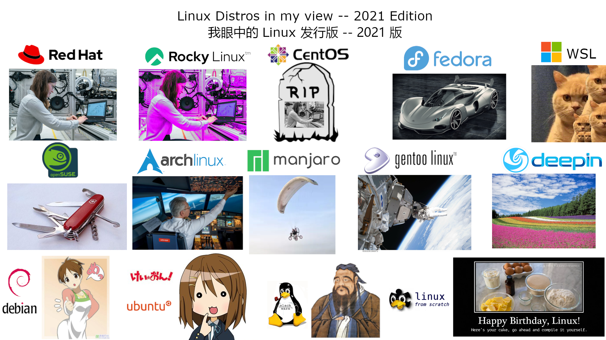

---
tags:
  - 杂谈
  - Linux
---

# Linux distro in my view

!!! note
    旧梗新图 1080P 高清重制版

- 原作者：Hanjingxue Boling
- 该作品以 [CC-BY](https://creativecommons.org/licenses/by/4.0/deed.zh) 的形式进行发布。
- 相关仓库：[Gitlab repo](https://gitlab.com/reuleaux-triangle/Documentation-archive)

=== "说明"
    由于篇幅有限（画布就那么大（1080x1920）），所以只涉及主流发行版。

=== "含义"
    - RedHat 是一张机械工程师的图片。  
    - Rocky Linux 本质是红帽的换色重涂版，所以使用了一张关闭了某些颜色通道的图片。  
    - CentOS 已死，所以得刻在墓碑上。  
    - Fedora 是一张具有未来感的汽车渲染图，和红帽有很大的关系。  
    - 我为 WSL 选用了一张猫猫图。<del>Big M$ is watching you.</del>  
        * <del>警惕微软明修栈道暗度陈仓。</del>   
    - 本来想给 openSUSE 找个女仆的图片，但是没找到原版，就干脆用了一张多功能的瑞士军刀。  
        * <del>YaST 是最棒的系统管理工具集。</del>    
    - Arch Linux 在我眼中就是个很复杂的发行版（琐碎的细节太多了）。  
    - Manjaro 的插图是群友建议的，好像是为了突出其更新慢，且有翻车的风险。  
    - Gentoo Linux 用的是宇航员和太空站的照片，以突出其运维难度第二高，可以定制系统的方方面面来实现各种需求的特点。  
    - 我对 deepin 的印象就是好看，然后就没有然后了。  
    - Ubuntu 和 Debian 的图是一个二次元梗。  
        * <del>[平泽唯](https://zh.moegirl.org.cn/%E5%B9%B3%E6%B3%BD%E5%94%AF)有一个特别能干的妹妹[平泽忧](https://zh.moegirl.org.cn/%E5%B9%B3%E6%B3%BD%E5%BF%A7)，但平泽唯只会吃吃喝喝玩玩。</del>  
    - Slackware 有着古典风范，所以采用了孔子的画像。  
        * <del>优秀的用户应当学会自己处理依赖。</del>  
    - LSF 的中文就是从头构建 Linux 的意思，所以就采用了一张来自网络的图（据说是在 Linux 某次周年庆的时候制作出来的梗图）。  
        * <del>优秀的用户应当学会自己给自己制作 Linux。</del> 