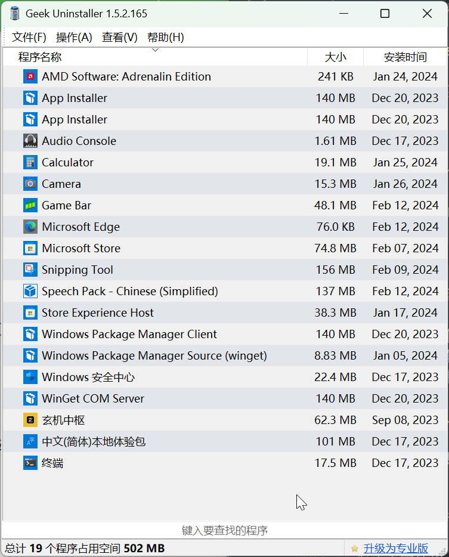

# Windows 11 安装与调教

!!! note "注意"
    本文最后一次更新时间是：2024 年 2 月；适用于 Windows 11 23H2。

本文仅记录一些本人认为特别需要修改的地方。

## 获取 ISO 文件

前往 [微软 Windows 11 下载页]，选择一个合适的选项。然后下载 `Windows.iso`（使用安装助手的时候，只需要让 Windows 下载镜像文件即可，不必刻录到 U 盘）。

下载工具推荐：[aria2]

[aria2]: ./aria2.md
[微软 Windows 11 下载页]: https://www.microsoft.com/software-download/windows11

### 使用 Ventoy 刻录 U 盘

使用 [Ventoy] 将 U 盘或可移动设备转换为一个可启动的安装介质。你只需要把 ISO 文件直接拷贝到 U 盘里面就可以启动了，无需其他操作。

!!! note "关于跳过 TPM 检查"

    启动 `VentoyPlugson.exe`，选择你刚刚作为启动 U 盘的设备，点击**启动**，然后你就会进入到 ventoy 的插件配置页面。在全局配置中，将 `VTOY_WIN11_BYPASS_CHECK` 设置为 `1`，这样启动时，就可以直接跳过 Windows 11 的安装检查。

    最后，记得关闭插件的应用程序。

[ventoy]: https://www.ventoy.net/cn/index.html

## 版本选择

个人推荐 Windows 11 专业版或者即将发布的 Windows 11 LTSC。

安装时，使用本地账户，且不设置密码，并在最后的设置页面拒绝所有的微软服务。

## 恢复 Windows 11 的鼠标右键菜单

!!! note "说明"

    此方法为使用注册表直接修改系统设置，你也可参看下文使用 Dism++ 修改此设置。

要将 Windows 11 的鼠标右键菜单恢复成 Windows 10 的样式。

1. 按下 `Win + R` 快捷键，并输入 `regedit`。
1. 定位到 `HKEY_CURRENT_USER\SOFTWARE\CLASSES\CLSID`，找到 `{86ca1aa0-34aa-4e8b-a509-50c905bae2a2}`
1. 右键点击新创建的**项**，新建一个名为 `InprocServer32` 的项，按下回车键保存即可。保存后，退出重启 `explorer.exe` 即可。

## 使用 Dism++ 调整系统

在启动 [Dism++] 后，点击左栏的**系统优化**，然后：

[Dism++]: https://github.com/Chuyu-Team/Dism-Multi-language

1. 在 **安全相关设置** 中，将 UAC 调整为，**总是提醒我**；  
1. 在 **开始菜单及 Windows 体验** 中，将除了 **登录界面默认打开小键盘** 和 **关闭 Onedrive** 以外的选项全部开启；注意每次编辑都需要重启一次 `explorer.exe`；  
1. 在 **Explorer** 中，打开
    - **打开资源管理器时显示此电脑**
    - **显示所有文件扩展名**
    - **创建快捷方式时不添加“快捷方式”文字**
    - **此电脑中视频、照片、文档、下载、音手、卓面、3D 对象七个文件夹**
    - **快速访问不显示常用文件夹**
    - **快速访问不显示最近使用的文件**
    - **禁用Win11加入的新右键菜单，默认显示更多的选项**
1. 在 **资源管理器导航窗口图标管理** 中，打开 
    - **隐藏资源管理器导航窗口中的库**
    - **隐藏资源管理器导航窗口中的收藏夹**  
1. 在 **微软拼音输入法** 中，打开
    - **微软拼音默认为英语输入**

## Windows 更新与反病毒

不建议关闭

### 创建排除项

为了使得一些应用程序正常工作，你可以打开 Windows 安全中心，点击 `病毒和威胁防护 → “病毒和威胁防护”设置 → 排除项`，在此处添加一些你会存放一些微软安全中心会认为是木马或病毒程序的东西的文件夹。

下载这些程序的时候，也直接把下载位置定向到此处，避免被微软安全中心直接干掉。

## Windows 设置

### 系统

- 屏幕：  
    在 **显示卡** 选项中，添加需要使用独显运行的程序。需要添加 UWP 应用时，可将 **添加应用** 的过滤器从 `桌面应用` 更换为 `Microsoft Store 应用`。
- 储存：  
    建议打开 **储存感知**，并设置自动运行存储感知。个人会将储存感知运行时间设置为 1 个月。
- 剪贴板：  
    建议打开 **剪贴板历史记录**
- 通知：</br>在 **其他设置** 中，取消勾选  
    - **更新以及登录后显示 Windows 欢迎体验以显示新增功能和建议内容**
    - **建议我如何充分利用 Windows 并完成设置此设备**
    - **当我使用 Windows 时获取提示和建议**
- 电源和电池：  
    根据需要调整 **电源模式**  
    **屏幕和睡眠** 设置可全部设置为 3 分钟[^sleep]。
- 系统信息：  
    - 在 **重命名这台电脑中** 设置你的设备的名称。
    - 在 **高级系统设置** → **高级** → **环境变量** → **Path** 中，点击 `编辑`，即可插入你需要的环境变量。

[^sleep]: 我的设备在睡眠状态下不会断开网络链接，所以此设置只需要遵循 Windows 的节能建议即可。

### 蓝牙和其他设备

- 触摸板：  
    根据需要设置触摸板的手势与交互动作；  
    将 **三指手势** 的点击动作，修改为 **鼠标中键**  
    将 **四指手势** 的点击动作，修改为 **通知中心**

### 个性化

- 背景：  
    将 **个性化设置背景** 修改为 **幻灯片放映**，并打开 **扰乱图片顺序** 和 **在使用电池供电时仍允许运行幻灯片放映**
- 颜色：  
    个人偏好 `钢蓝色`
- 锁屏界面：  
    **个性化锁屏界面** 修改为 **图片**  
    取消勾选 **在锁屏界面上获取花絮、提示、技巧等**
- 开始：  
    - **布局** 选择为 **更多固定项**  
    - 关闭：  
        - **显示最近添加的应用**
        - **显示最常用的应用**
        - **在“开始”、“跳转列表”和“文件资源管理器”中显示最近打开的项目**
        - **有关提示、快捷方式、新应用等建议**
    - 在 **文件夹** 中，只打开 **设置**
- 任务栏：  
    - 在 **任务栏项** 和 **系统托盘图标** 中关闭或隐藏全部选项，除了 **任务视图**
    - 在 **其他系统托盘图标** 中，选择性开启所需应用图标。
    - 在 **任务栏行为** 中，勾选 **单击任务栏右下角以显示桌面**
- 设备使用情况：  
    关闭全部选项

### 账户

在 **登陆选项** 中，设置密码。

### 游戏

- **Game Bar**：  
    打开 **允许控制器打开 Game Bar**
- 打开 **游戏模式**

### 辅助功能

- **键盘**：  
    关闭与粘滞键、过滤键和切换键相关的全部选项
- **字幕**：  
    启用实时字幕，等待系统自带安装相关工具包。  
    你可以使用 `Win + Ctrl + L` 的快捷键组合唤出实时字幕栏。

### 隐私和安全性

- 在 **常规** 中，关闭全部选项
- 在 **诊断和反馈** 中，将反馈频率调成 **从不**。

### Windows 更新：  
    
在 **高级选项** 中，关闭 **传递优化**。

## 软件管理

### UWP 应用

使用 [Geek Uninstaller] 清理系统的 UWP 软件。

[Geek Uninstaller]: https://geekuninstaller.com/

<center>
{ width=50% }</br>
<em>只保留最基本的 UWP 应用（含厂商驱动）</em>
</center>

微软的计算器和 Game Bar 是一个不错的 UWP 应用。

Edge 已经和系统深度绑定了，卸载它可能会导致更新失败。

卸载 Snipping Tool 会导致 `PrtSc` 键无法正常截图。

### 中文输入法

在设置中，将默认的输入模式设置为英文，并取消设置 `Shift` 键作为输入法切换按键。

## 基础程序

### AMD Software

在安装 [AMD Software] 之前，请先将旧驱动完全卸载，并重启系统。

[AMD Software]: https://www.amd.com/en/support

对于 AMD 驱动的设置，在 **游戏** → **显卡** 中，推荐选择 **自定义** 方案。并只开启：

- Radeon™ Anti-Lag
- Radeon™ 增强同步（仅对独显有效）

在 **游戏** → **显示器** 中，

- 打开 AMD FreeSync
- 关闭 Vari-Bright

#### 独显直连相关

另见：[【答疑篇】玄机星游戏本性能模式&显卡模式，全方位大讲解以及切换方法！](https://www.bilibili.com/video/BV1m94y1B73f/)

### 运行库

- [DirectX 最终用户运行时 Web 安装程序](https://www.microsoft.com/zh-cn/download/details.aspx?id=35)
- [Microsoft Visual C++ 可再发行程序包最新支持的下载](https://docs.microsoft.com/zh-CN/cpp/windows/latest-supported-vc-redist?view=msvc-170)（推荐安装 `Microsoft Visual C++ 2015-2022 Redistributable`）

## 常用程序

### winget

[winget] 是微软推出的软件包管理器。该工具由预装的 UWP 应用提供。

[winget]: https://learn.microsoft.com/en-us/windows/package-manager/winget/

列出可用命令：

```
winget --help
```

列出可升级的软件（不适用于便携版软件）：

```
winget upgrade
```

升级软件：

```
winget upgrade [应用 ID]
```

### 不需要配置

- [Auto Night Mode](https://github.com/AutoDarkMode/Windows-Auto-Night-Mode)
- [CrystalDiskMark](https://crystalmark.info/en/software/crystaldiskmark/)
- [Eclipse Temurin JDK](https://adoptium.net/temurin/releases/)
- [GIMP](https://www.gimp.org/)
- [Gpg4win](https://gpg4win.org/download.html)
- [Kate](https://kate-editor.org/zh-cn/)
- [LibreOffice](https://www.libreoffice.org/)
- [Mozilla Firefox](https://www.mozilla.org/en-US/firefox/new/)
- [Pandoc](https://pandoc.org/releases.html)（另见 [Pandoc’s Markdown spec](./../note/pandoc's-markdwon-spec.md)）
- [Python](https://www.python.org/)
- [Steam](https://store.steampowered.com/)
- [VLC](https://www.videolan.org/vlc/)

### 需要配置

- [7-zip](https://www.7-zip.org/download.html)  
    打开 **工具** → **选项**：  
    在 **7-Zip** 页面，取消勾选 **层叠右键菜单**、**压缩并邮寄**、**压缩<档案>.7z并邮寄** 和 **压缩<档案>.zip并邮寄**；  
    在 **显示** 页面，勾选 **显示 ⌜...⌟ 项**、**显示真实图标**、**整行选择**、**显示网格线**、**单击打开项目**。
- [Git](https://git-scm.com/)  
    配置文件在 `C:\Users\用户名\.gitconfig`  
    示例配置文件：  
    ```
    [https]
	    proxy = http://127.0.0.1:7890
    [http]
	    proxy = http://127.0.0.1:7890
    [user]
	    name = Poplar at Twilight
	    email = poplar.cubic@gmail.com
    ```
- [VirtualBox](https://www.virtualbox.org/wiki/Downloads)  
    另见：[部署虚拟机](./../guide/install/vm.md)
- [qBittorrent-Enhanced-Edition](https://github.com/c0re100/qBittorrent-Enhanced-Edition)  
    另见：[qBittorrent 参数详细设置教程](./../../archives/qbittorrent-confs.md)
- [Fluent-Reader](https://github.com/yang991178/fluent-reader)  
    设置快捷方式：  
    ```
    "D:\Software\portable\fluent-reader\Fluent Reader.exe" --proxy-server=http://127.0.0.1:7890
    ```

### 便携软件

- [aegisub](https://github.com/arch1t3cht/Aegisub)
- [aria2](https://aria2.github.io/)  
    另见：[安装与使用 aria2](./aria2.md)
- [Calibre](https://calibre-ebook.com/download_portable)
- [DiskGenius](https://www.diskgenius.cn/download.php)
- [Dism++]
- [Everything](https://www.voidtools.com/zh-cn/downloads/)
- [Foobox](https://github.com/dream7180/foobox-cn/)
- [GoldenDict-ng](https://github.com/xiaoyifang/goldendict-ng)  
    需要在 `GoldenDict.exe` 所在目录新建一个名为 `portable` 的文件夹  
    词典文件只能放置在 `content` 文件夹中
- [Honeyview](https://www.bandisoft.com/honeyview/dl.php?portable)
- [HWiNFO](https://www.hwinfo.com/download/)
- [KeePassXC](https://keepassxc.org/download/)
- [MusicTag](https://www.cnblogs.com/vinlxc/p/11347744.html)  
    安装包解压密码：`www.coolapk.com`
- [nekoray](https://github.com/MatsuriDayo/nekoray)
- [Rufus](https://rufus.ie/zh/)
- [ShareX](https://getsharex.com)
- [spek](https://www.spek.cc/p/download)
- [Telegram](https://telegram.org/dl/desktop/win64_portable)
- [VSCode](https://code.visualstudio.com/)  
    需要在 `code.exe` 所在目录新建一个名为 `data` 的文件夹
- [Autoruns64.exe](https://learn.microsoft.com/en-us/sysinternals/downloads/autoruns)
- [BOOTICEx64.exe](https://www.majorgeeks.com/files/details/bootice_64_bit.html)
- [ContextMenuManager](https://github.com/BluePointLilac/ContextMenuManager/)
- [Geek Uninstaller]
- [KMS-Cangshui.net.bat](https://kms.cangshui.net/)
- [MicrosoftProgram_Install_and_Uninstall.meta.diagcab](https://support.microsoft.com/en-gb/topic/fix-problems-that-block-programs-from-being-installed-or-removed-cca7d1b6-65a9-3d98-426b-e9f927e1eb4d)
- [SpaceSniffer](http://www.uderzo.it/main_products/space_sniffer/)
- [ventoy]