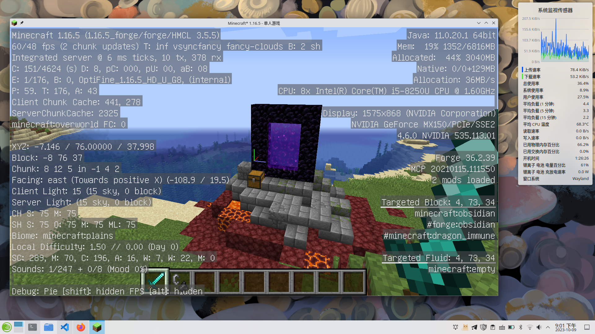

---
tags:
  - 杂谈
  - NVIDIA
  - Wayland
  - openSUSE
---

# 在 openSUSE KDE Wayland 会话中使用 NVIDIA 显卡运行游戏

## 前提条件

根据 [KDE wiki Plasma/Wayland/Nvidia 词条]，你需要满足以下前置条件：

[KDE wiki Plasma/Wayland/Nvidia 词条]: https://community.kde.org/Plasma/Wayland/Nvidia

- 使用 Plasma 5.20.2 或更高版本。
- 确保 NVIDIA 闭源驱动版本不低于 495.44。
- 确保 Qt 版本高于 Qt5.15.0
- 确保 Nvidia EGL 库已安装，它在 openSUSE 软件源的包名是 `libnvidia-egl-wayland1`[^1]。

[^1]: `libnvidia-egl-wayland1` 是 `nvidia-video-G06` 的依赖项，会自动安装。

要在 XWayland 应用程序上使用带有硬件加速的 Plasma Wayland 会话，你需要确保系统已安装：

- Xorg 1.20.12 及更高版本；
- XWayland 21.1.2 及更高版本；
- libxcb 1.1.7 及更高版本。

以上条件对于风滚草用户来说，一般是自动满足的。

## 删除 suse-prime

`suse-prime` 只能在 X11 下工作，它会影响接下来的操作。

```
sudo zypper rm -u suse-prime
```

如果你根据[维基词条]还安装了额外的模块，请一并卸载：

[维基词条]: https://zh.opensuse.org/SDB:NVIDIA_SUSE_Prime

```
sudo zypper rm bbswitch-kmp-default
```

然后重启系统。

## 使用 modesetting 驱动

使用下列命令检查驱动是否运行在 modesettings mode：

```
sudo cat /sys/module/nvidia_drm/parameters/modeset
```

终端输出结果应该是 “Y”。

如果不是，打开 YaST，找到并打开 **引导加载器** -> **内核参数(K)**，在 **可选内核命令行参数(P)** 中，填入 `nvidia-drm.modeset=1`，保存设置并退出 YaST。

然后重启系统。

## 登陆

在 KDE 登陆界面选择 **Plasma (wayland)**，然后登陆系统。

## prime-run

要让程序调用 NVIDIA 显卡，你可以使用下列命令[^nvidia]：

```
__NV_PRIME_RENDER_OFFLOAD=1 __VK_LAYER_NV_optimus=NVIDIA_only __GLX_VENDOR_LIBRARY_NAME=nvidia [命令]
```

[^nvidia]: https://download.nvidia.com/XFree86/Linux-x86_64/435.17/README/primerenderoffload.html

你可以将这个命令写成名为 `prime-run` 的 shell 脚本，放置到 `$PATH` 中：

```shell
#!/bin/bash
__NV_PRIME_RENDER_OFFLOAD=1 __VK_LAYER_NV_optimus=NVIDIA_only __GLX_VENDOR_LIBRARY_NAME=nvidia "$@"
```

然后使用此命令运行应用：

```
$ prime-run [应用程序名、命令或脚本]
```

----

## 其他

### 查看哪些应用程序在使用 xwayland

你可以安装 `xlsclients`[^xwayland]：

```
sudo zypper in xlsclients
```

[^xwayland]: https://askubuntu.com/questions/1393618/how-can-i-tell-if-an-application-is-using-xwayland

### NVIDIA Optimus

有关多种 NVIDIA Optimus[^optimus] 方案，详见 [NVIDIA Optimus - archlinux wiki]。

[^optimus]: 即具有混合 Intel + Nvidia 或 AMD + Nvidia 显卡配置的笔记本电脑

[NVIDIA Optimus - archlinux wiki]: https://wiki.archlinux.org/title/NVIDIA_Optimus

### envycontrol

[EnvyControl] 是一个用于在 Linux 下，实现 Nvidia Optimus 笔记本电脑的 GPU 轻松切换的 CLI 工具。

[EnvyControl]: https://github.com/bayasdev/envycontrol

克隆仓库（例如克隆到 `~/bin`）：

```
cd ~/bin && git clone https://github.com/bayasdev/envycontrol.git
```

然后在 `~/.bashrc` 文件中写入： 

```
alias envycontrol="python3 /home/poplar/bin/envycontrol/envycontrol.py"
```

重新载入 bash shell 配置

```
source ~/.bashrc
```

将图形模式设置为 `Hybrid`：

```
sudo envycontrol -s hybrid --rtd3
```

在设置完成后，重启系统。

其他详细内容另见项目自述文件。

----

<strong><center>祝你玩得愉快！☕</center></strong>

