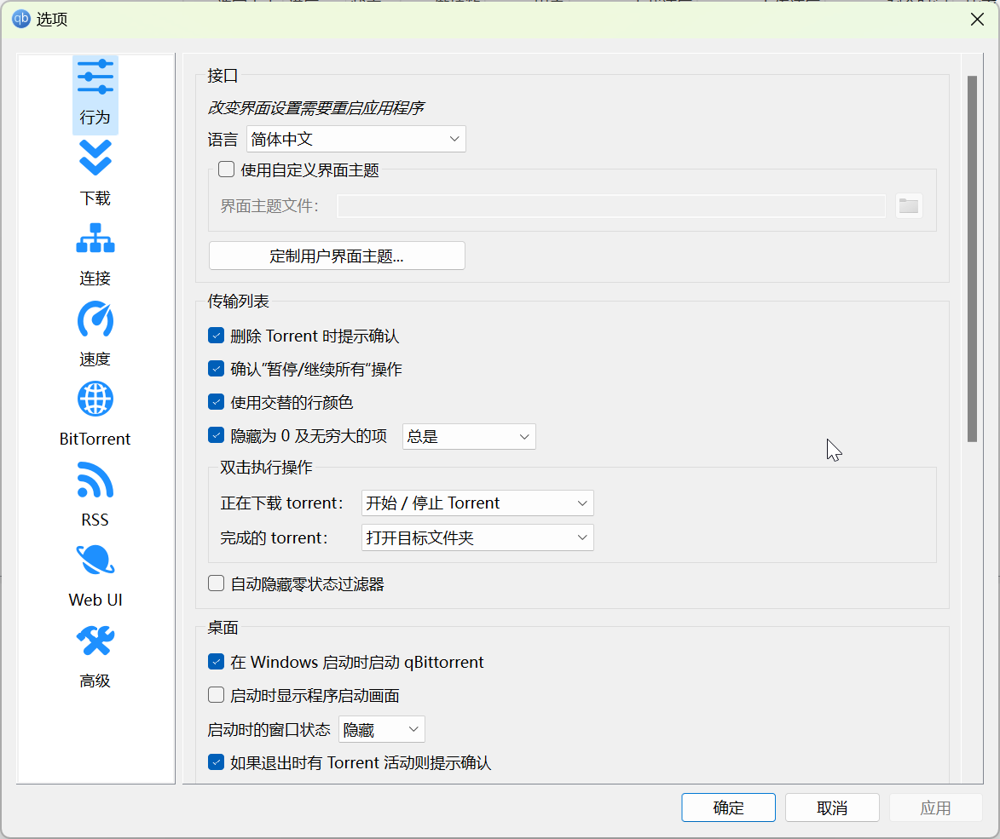
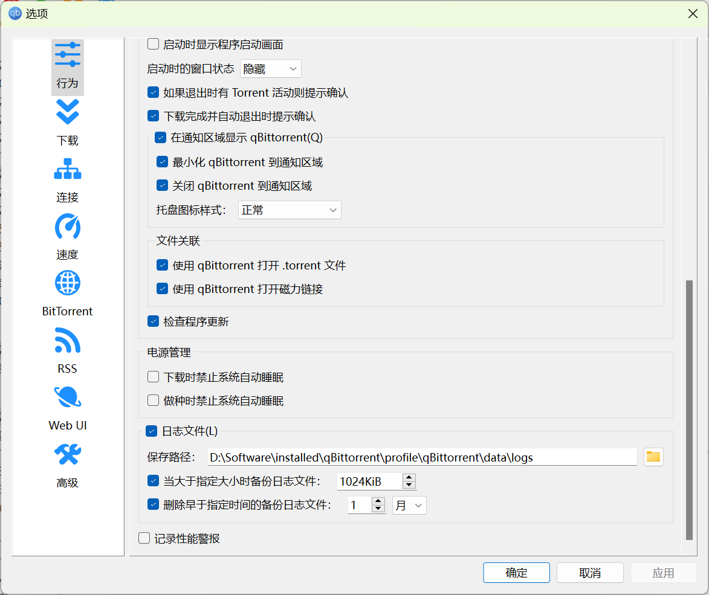
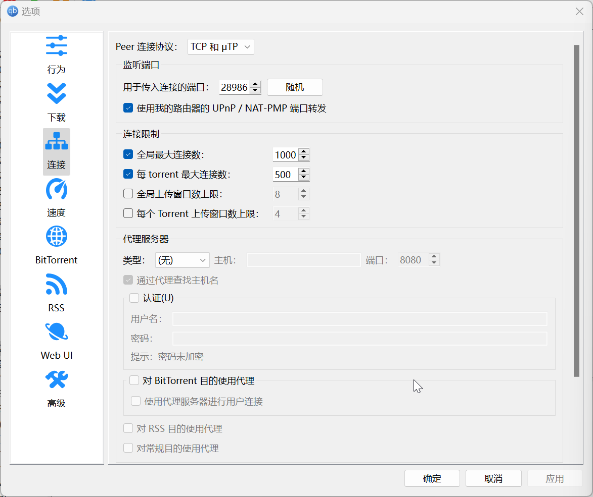
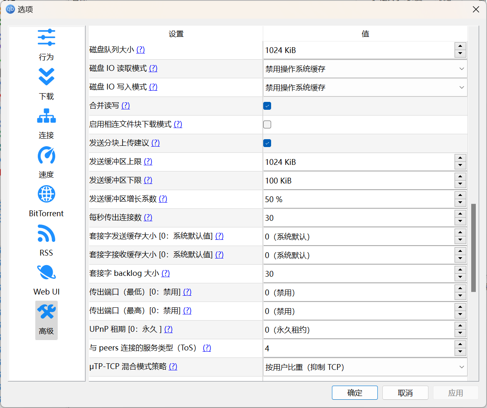

# qBittorrent 配置备忘录

这是以反吸血为目的的 qBittorrent 配置备忘录。

- 参考配置另见；
    - [qBittorrent 参数详细设置教程](./../../archives/qbittorrent-confs.md)
    - [libtorrent reference-Settings](https://www.libtorrent.org/reference-Settings.html)

## 安装

使用：[c0re100/qBittorrent-Enhanced-Edition] -  `qbittorrent_enhanced_*_qt6_x64_setup.exe`

[c0re100/qBittorrent-Enhanced-Edition]: https://github.com/c0re100/qBittorrent-Enhanced-Edition/releases

安装完成后，在 qbittorrent 的安装文件中，新建一个名为 `profile` 的文件夹，以便携模式启动 qbittorrent。

## 日志

在菜单栏的 **视图** → **日志** 中，勾选全部类型的日志信息。

## 软件设置

### 行为



勾选：

- 删除 Torrent 时提示
- 确认 “暂停/继续所有” 操作
- 使用交替的行颜色
- 隐藏为 0 及无穷大的项：总是
- 在 Windows 启动时启动 qBittorrent
- 启动时的窗口状态：隐藏
- 如果退出时由 Torrent 活动则提示确认



勾选：

- 下载完成并自动退出时提示确认
  - 在通知区域显示 qBittorrent
  - 最小化 qBittorrent 到通知区域
  - 关闭 qBittorrent 到通知区域
- 使用 qBittorrent 打开 .torrent 文件
- 使用 qBittorrent 打开磁力链接
- 检查程序更新

由于当前系统不会因为睡眠而断开网络链接，所以不勾选：

- 下载时禁止系统自动睡眠
- 做种时禁止系统自动睡眠

### 下载


勾选：

- 显示 Torrent 内容和选项
- 前置 torrent 对话框
- 手动添加 torrent 时询问是否合并 trackers
- 为所有文件预分配磁盘空间
- 启用递归下载对话框

### 连接



- Peer 连接协议：TCP 和 µTP

勾选：

- 使用我的路由器 UPnP / NAT-PMP 端口转发
- 全局最大连接数：1000
- 每个 torrent 最大连接数：500

启用 IP 过滤

### 速度


勾选：

- 对 µTP 协议进行速度限制
- 对传送总开销进行速度限制
- 对本地网络用户进行速度限制

### BitTorret


勾选：

- 启用 DHT（去中心化网络）以找到更多用户
- 启用用户交换（PeX）以找到更多用户
- 启用本地用户发现以找到更多用户
- 加密模式：**允许加密**
- Automatically update public trackers list
    - <https://trackerslist.com>

### WebUI


勾选：

- Web 用户界面（远程控制）
- 对本地主机上的客户端跳过身份验证
- 启用点击劫持保护
- 启用跨站请求伪造（CSRF）保护
- 启用 Host header 属性验证

### 高级


修改：

- 保存恢复数据的间隔：60 分钟
  
额外勾选：

- Auto Ban Unknown Peer from China
- Auto Ban Bittorrent Media Player Peer
- 当 IP 或端口更改时重新通知所有 Tracker


修改：

- 异步 I/O 线程数：64
    - AMD 7840H
- 文件池大小：400
- 校验时内存使用扩增量：1024 MiB
- 磁盘缓存：-1



额外勾选：

- 合并读写
- 发送分块上传建议

修改：

- µTP-TCP 混合模式策略：按用户比重（抑制 TCP）


额外勾选：

- 禁止连接到特权端口上的 peer

## IP 过滤列表

要使用 IP 过滤列表，你需要新建一个名为 `ipfilter.dat` 的纯文本文件，并在 **设置** → **连接** → **IP 过滤** 中勾选此文件。

IP 过滤列表的示例：

```
1.180.24.0-1.180.25.255
36.102.218.0-36.102.218.255
36.143.31.0-36.143.31.255
36.143.102.0-36.143.102.255
36.143.112.0-36.143.112.255
36.143.114.0-36.143.114.255
36.143.133.0-36.143.133.255
36.143.147.0-36.143.147.255
36.143.176.0-36.143.176.255
36.143.209.0-36.143.209.255
36.143.220.0-36.143.220.255
39.150.2.0-39.150.2.255
39.164.32.0-39.164.33.255
39.164.41.0-39.164.41.255
39.164.45.0-39.164.45.255
39.164.253.0-39.164.254.255
42.52.131.0-42.52.131.255
59.47.225.0-59.47.225.255
59.47.235.0-59.47.235.255
59.47.237.0-59.47.237.255
59.83.212.0-59.83.212.255
112.45.16.0-112.45.16.255
112.45.20.0-112.45.20.255
112.192.189.0-112.192.189.255
119.53.106.0-119.53.107.255
119.53.110.0-119.53.112.255
119.53.163.0-119.53.163.255
123.184.152.0-123.184.152.255
123.186.146.0-123.186.146.255
139.210.254.0-139.210.254.255
175.19.0.0-175.19.0.255
175.19.2.0-175.19.3.255
175.19.8.0-175.19.8.255
175.19.10.0-175.19.10.255
183.197.12.0-183.197.12.255
183.197.21.0-183.197.21.255
183.197.24.0-183.197.25.255
183.197.30.0-183.197.31.255
183.197.250.0-183.197.251.255
183.198.40.0-183.198.42.255
183.198.83.0-183.198.83.255
183.198.160.0-183.198.160.255
183.198.162.0-183.198.162.255
183.198.165.0-183.198.167.255
183.198.224.0-183.198.224.255
183.198.226.0-183.198.228.255
183.199.90.0-183.199.90.255
183.199.148.0-183.199.149.255
183.199.208.0-183.199.209.255
183.199.217.0-183.199.217.255
183.199.238.0-183.199.239.255
183.227.110.0-183.227.111.255
183.228.140.0-183.228.143.255
218.7.138.0-218.7.138.255
218.24.113.0-218.24.113.255
218.60.174.0-218.60.174.255
218.92.139.0-218.92.139.255
218.104.106.0-218.104.106.255
221.9.12.0-221.9.12.255
221.9.18.0-221.9.19.255
221.11.96.0-221.11.96.255
221.203.3.0-221.203.3.255
221.203.6.0-221.203.6.255
223.88.223.0-223.88.223.255
2408:862e:ff:ff0d::0-2408:862e:ff:ff0d::ffff
2408:8631:2e09:d05::0-2408:8631:2e09:d05::ffff
2408:8738:6000:d::0-2408:8738:6000:d::ffff
240e:90c:2000:301::0-240e:90c:2000:301::ffff
240e:90e:2000:2006::0-240e:90e:2000:2006::ffff
240e:918:8008:1::0-240e:918:8008:1::ffff
240e:918:8008:2::0-240e:918:8008:2::ffff
240e:918:8008:3::0-240e:918:8008:3::ffff
240e:918:8008:4::0-240e:918:8008:4::ffff
```

## 客户端过滤列表

要启用客户端过滤列表，请在 `profile/qBittorrent/data` 目录下新建名为 `peer_blacklist.txt` 的文件。

格式为 `PeerIP 客户端名` 

示例：

```
-DT0001- dt/torrent/v1.00
-DT0001- dt/torrent/v1.01
-DT0001- DT\s0.0.0.1
```

## 辅助封禁工具

目前有两个流行的工具：

- [Simple-Tracker/qBittorrent-ClientBlocker](https://github.com/Simple-Tracker/qBittorrent-ClientBlocker)
- [Ghost-chu/PeerBanHelper](https://github.com/Ghost-chu/PeerBanHelper)

我使用的是 `Ghost-chu/PeerBanHelper`

使用 `PeerBanHelper-*-Windows-Lazy-Pack.zip`，以防止自动触发独显直连。

双击启动 `start.bat` 文件，然后关闭终端窗口。

在 `/data/config` 目录下，打开 `config.yml`，修改配置：

- 隐藏 Transmission 的配置
- 修改 webui 地址
- 删除用户密码

```shell
# 客户端设置
client:
  # 名字，可以自己起，会在日志中显示，只能由字母数字横线组成，数字不能打头
  qbittorrent-001:
    # 客户端类型
    # 支持的客户端列表：
    # qBittorrent
    # Transmission
    # 其它也许以后会加
    type: qBittorrent
    # 客户端地址
    endpoint: "http://127.0.0.1:8080"
    # 登录信息（暂不支持 Basic Auth）
    # 用户名
    username: ""
    # 密码
    password: ""
    # Basic Auth - 不知道这是什么的话，请保持默认
    basic-auth:
      user: ""
      pass: ""
  #transmission-002:
    #type: Transmission
    #endpoint: "http://127.0.0.1:9091"
    #username: "admin"
    #password: "admin"
# Http 服务器设置
server:
  # 监听端口
  http: 9898
  # 客户端远程 URL 设置
  # Docker 网络请改 host 模式使用或者设置容器端口暴露
  # 当客户端需要与 PBH 通信时，客户端的 URL 会被更改为 http://<address>:<http-port>/<client-api-route>
  address: "127.0.0.1"
# 日志记录器配置
logger:
  # 是否隐藏 [完成] 已检查 XX 的 X 个活跃 Torrent 和 X 个对等体 的日志消息？
  # 在 DSM 的 ContainerManager 上有助于大幅度减少日志数量，并仅记录有价值的封禁等日志条目
  hide-finish-log: false
# 线程控制
threads:
  # 全局检查线程池并发等级
  # 此线程用于执行通用并发任务：如：Peers 任务提交处理，执行规则集
  # 提升此值将允许更多任务执行，但过高的值并不会带来显著收益
  general-parallelism: 6
  # 封禁检查线程池并发等级
  # 此线程池用于执行功能模块
  # 提升此值将允许更多的功能模块实例同时执行
  check-ban-parallelism: 8
  # 规则执行线程池并发等级
  # 此线程池用于执行用户定义的规则检查，如：执行主动探测的耗时规则子项
  rule-execute-parallelism: 16
  # 下载器 API 操作线程池并发等级
  # 此线程池用于调用下载器 API，如：获取 Torrents 或 Peers 列表
  # 提升此值将允许同时执行更多的 API 请求以提升速度，但可能对下载器产生压力，建议不要设置的过大，以免造成下载器进程卡住或崩溃
  downloader-api-parallelism: 8
```

保存，然后在 `start.bat` 同一目录中，新建 `HideRun-peerbanhelper.vbs`：

```
CreateObject("WScript.Shell").Run "start.bat",0
```

将 `HideRun-peerbanhelper.vbs` 的快捷方式拷贝到 `shell:startup` 中，以实现开机启动。

Peerbanhelper 的实时日志在 `/data/logs/latest.log`，归档的日志文件在 `/logs`