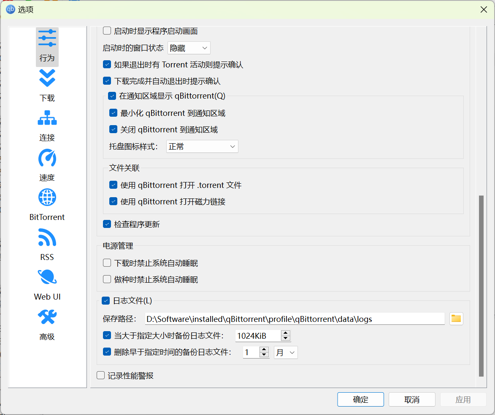
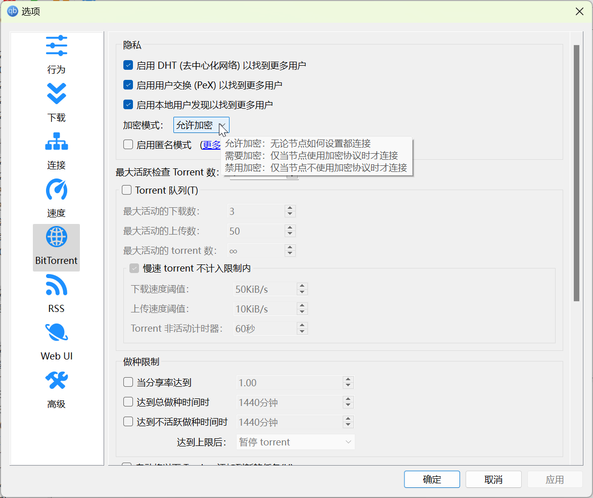
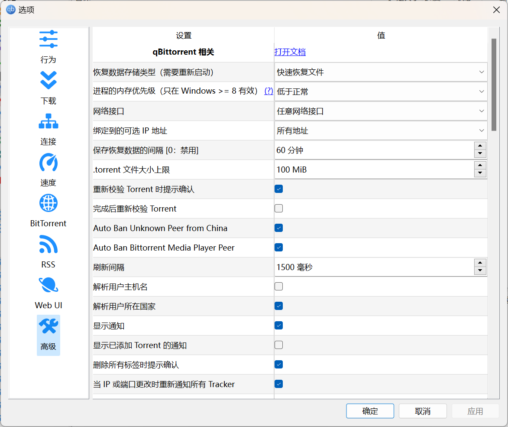

# qBittorrent 配置备忘录

这是以反吸血为目的的 qBittorrent 配置备忘录。

- 参考配置另见；
    - [qBittorrent 参数详细设置教程](./../../archives/qbittorrent-confs.md)
    - [libtorrent reference-Settings](https://www.libtorrent.org/reference-Settings.html)

## 安装

使用：[c0re100/qBittorrent-Enhanced-Edition]

[c0re100/qBittorrent-Enhanced-Edition]: https://github.com/c0re100/qBittorrent-Enhanced-Edition/releases

对于 Windows，安装完成后，在 qbittorrent 的安装文件中，新建一个名为 `profile` 的文件夹，以便携模式启动 qbittorrent。

## 日志

在菜单栏的 **视图** → **日志** 中，勾选全部类型的日志信息。

## 软件设置

### 行为


勾选：

- 删除 Torrent 时提示
- 确认 “暂停/继续所有” 操作
- 使用交替的行颜色
- 隐藏为 0 及无穷大的项：总是
- 在 Windows 启动时启动 qBittorrent
- 启动时的窗口状态：隐藏
- 如果退出时由 Torrent 活动则提示确认



勾选：

- 下载完成并自动退出时提示确认
  - 在通知区域显示 qBittorrent
  - 最小化 qBittorrent 到通知区域
  - 关闭 qBittorrent 到通知区域
- 使用 qBittorrent 打开 .torrent 文件
- 使用 qBittorrent 打开磁力链接
- 检查程序更新

由于当前系统不会因为睡眠而断开网络链接，所以不勾选：

- 下载时禁止系统自动睡眠
- 做种时禁止系统自动睡眠

### 下载


勾选：

- 显示 Torrent 内容和选项
- 前置 torrent 对话框
- 手动添加 torrent 时询问是否合并 trackers
- 为所有文件预分配磁盘空间
- 启用递归下载对话框

### 连接


- Peer 连接协议：TCP 和 µTP

勾选：

- 使用我的路由器 UPnP / NAT-PMP 端口转发
- 全局最大连接数：1000
- 每个 torrent 最大连接数：500

启用 IP 过滤

### 速度


勾选：

- 对 µTP 协议进行速度限制
- 对传送总开销进行速度限制
- 对本地网络用户进行速度限制

### BitTorret



勾选：

- 启用 DHT（去中心化网络）以找到更多用户
- 启用用户交换（PeX）以找到更多用户
- 启用本地用户发现以找到更多用户
- 加密模式：**允许加密**
- Automatically update public trackers list
    - <https://trackerslist.com>

### WebUI


勾选：

- Web 用户界面（远程控制）
- 对本地主机上的客户端跳过身份验证
- 启用点击劫持保护
- 启用跨站请求伪造（CSRF）保护
- 启用 Host header 属性验证

### 高级



修改：

- 保存恢复数据的间隔：60 分钟
  
额外勾选：

- Auto Ban Unknown Peer from China
- Auto Ban Bittorrent Media Player Peer
- 当 IP 或端口更改时重新通知所有 Tracker


修改：

- 异步 I/O 线程数：64
    - AMD 7840H
- 文件池大小：400
- 校验时内存使用扩增量：1024 MiB
- 磁盘缓存：-1


额外勾选：

- 合并读写
- 发送分块上传建议

修改：

- µTP-TCP 混合模式策略：按用户比重（抑制 TCP）


额外勾选：

- 禁止连接到特权端口上的 peer

----

## 附加的反吸血措施

### IP 过滤列表

要使用 IP 过滤列表，你需要新建一个名为 `ipfilter.dat` 的纯文本文件，并在 **设置** → **连接** → **IP 过滤** 中勾选此文件。

IP 过滤列表的示例：

```
1.180.24.0-1.180.25.255
240e:918:8008:4::0-240e:918:8008:4::ffff
```

### 客户端过滤列表

要启用客户端过滤列表，请在 `profile/qBittorrent/data` 目录下新建名为 `peer_blacklist.txt` 的文件。

格式为 `PeerIP 客户端名` 

示例：

```
-DT0001- dt/torrent/v1.00
-DT0001- dt/torrent/v1.01
-DT0001- DT\s0.0.0.1
```

### 辅助封禁工具

目前有两个流行的工具：

- [Simple-Tracker/qBittorrent-ClientBlocker](https://github.com/Simple-Tracker/qBittorrent-ClientBlocker)
- [Ghost-chu/PeerBanHelper](https://github.com/Ghost-chu/PeerBanHelper)

我使用的是 `Ghost-chu/PeerBanHelper`。

`PeerBanHelper.jar` 启动脚本：

```
#!/bin/bash
java -jar -Xmx256M -XX:+UseG1GC -XX:+UseStringDeduplication -XX:+ShrinkHeapInSteps -jar PeerBanHelper.jar nogui
```

用于让 `PeerBanHelper` 开机自启动的 systemd 服务文件：

```
[Unit]
Description=Start PeerBanHelper jar file
After=multi-user.target

[Service]
ExecStart=/usr/bin/java -jar -Xmx256M -XX:+UseG1GC -XX:+UseStringDeduplication -XX:+ShrinkHeapInSteps -jar /home/poplar/bin/qbee/peerbanhelper/PeerBanHelper.jar nogui
Type=simple
WorkingDirectory=/home/poplar/bin/qbee/peerbanhelper

[Install]
WantedBy=multi-user.target
```

服务文件需要放置到 `/etc/systemd/system/` 文件夹中，然后重载 systemd 守护进程，再开启服务：

```
sudo systemctl daemon-reload
sudo systemctl enable pbh --now
```

初次启动后，在 `/data/config` 目录下，打开 `config.yml`，修改配置：

- 删除 Transmission 的配置
- 修改 webui 地址
- 删除用户密码（需要启动跳过验证本地客户端的链接）

Peerbanhelper 的日志文件在 `/data/logs/` 中。

WebUI 地址默认是 <http://127.0.0.1:9898/>