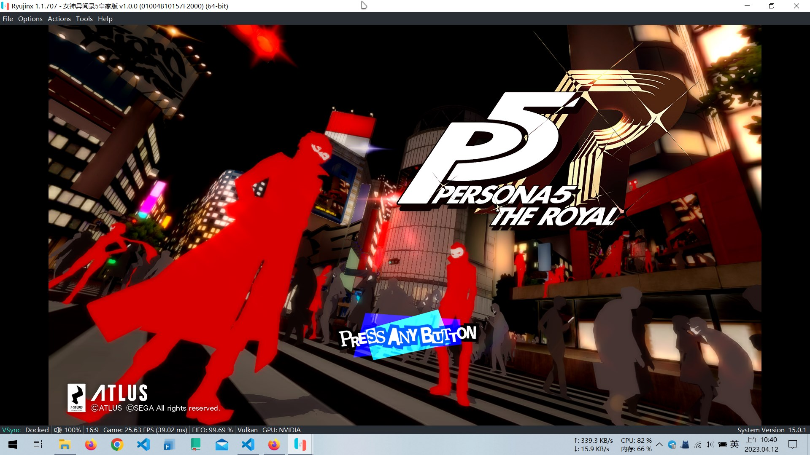

# 使用 Nintendo Switch 模拟器游玩 P5R

*本文记录如何在 Windows 10 上安装 [ryujinx] 或 [yuzu]，游玩[《女神异闻录 5：皇家版》][p5r][^p5r]的大致流程。*

[^p5r]: 《女神异闻录5：皇家版》，英文名称为：*Persona 5 Royal*，简称 P5R。注意，P5R 只有港版才有中文。

[ryujinx]: https://ryujinx.org/
[yuzu]: https://yuzu-emu.org/
[p5r]: https://store.steampowered.com/app/1687950/Persona_5_Royal/

!!! warning "注意"

    请在安装模拟器前，将显卡驱动更新至最新版本。

## ryujinx

### 安装 ryujinx

ryujinx 的安装包可在此下载：

- <https://github.com/Ryujinx/release-channel-master>

将下载完毕的压缩包（如：`ryujinx-1.1.808-win_x64.zip`）解压至路径中不含非 ASCII 字符的文件夹中。

在与 `Ryujinx.exe` 同级的文件夹中，新建一个名为 `portable` 的文件夹，让 ryujinx 自动以便携模式启动。 

点击 `Ryujinx.exe` 启动 ryujinx。

### 导入 keys 和固件

初次启动 ryujinx 后，会提示 `prod.keys` 文件未找到的错误弹窗，这是正常的。点击 **OK** 关闭此窗口。

然后 ryujinx 就会询问使用 Vulkan 还是 OpenGL 作为后端；此处建议选择 **Vulkan**；如果选择 OpenGL，switch 模拟器会遇到一些奇奇怪怪的问题。

使用搜索引擎搜索并下载适用于 ryujinx 的，最新版本的 `prod.keys` 和固件文件。

将下载好的 `ProdKeys *.zip` 文件解压，将解压后的 `prod.keys` 和 `title.keys` 文件放置到 ryujinx 的 `/portable/system` 文件夹中，然后重新启动 ryujinx。

- 注意，固件和 key 的版本要保持一致。
- 不必使用最新版本的固件和 key。

在 ryujinx 中，点击菜单栏中的 **Tools** -> **Install Firmware** -> **Install a firmware from XCI or ZIP**，在弹出的文件选择框中，选择刚刚下载完毕的 `Firmware *.zip`，进行安装固件。

### 导入游戏

你可以与 `Ryujinx.exe` 同级的文件夹中，新建一个名为 `Roms` 的文件夹用来放置游戏文件；或者点击菜单栏中的 **Options** -> **Settings**，在 **General** 页面的 **Game Directories** 中，添加游戏文件夹的路径。

### 配置设置

点击菜单栏中的 **Options** -> **System**，将 **System Region** 和 **System Language** 修改为 **China** 和 **Simplified Chinese**。

在 **Graphics** 页面中，将 **Upscale** 修改为 **FSR**。

- 垂直同步（**Enable VSync**）的设置在菜单栏上的 **Options** -> **System** 中。

在 **Input** 页面中，点击 **Player1** 的 **Configure** 即可预览模拟控制器的按键映射。

- 此处建议将映射方案修改为：  
    * **A** -> **C**、**B** -> **X**、**X** -> **Z** 和 **Y** -> **V**；  
    * **+** -> **M**、**-** -> **N**；  
    这样以便于操作的时候，左手手指不需要频繁地移动。

### 启动游戏

保存修改完的设置后，双击游戏条目即可启动游戏。按下 **F11** 或菜单栏上的 **Options** -> **Enter Fullscreen**，进入全屏模式。

要关闭游戏，点击菜单栏上的 **Actions**，先点击 **Pause Emulation**，再点击 **Stop Emulation**。

要导入存档，鼠标右键单击游戏条目，选择 **Open User Save Directory**，将游戏存档文件夹拷贝至此处，然后再启动游戏即可。

----

## yuzu

### 安装 yuzu

yuzu 的安装包可在此下载：

- <https://github.com/yuzu-emu/yuzu-mainline>

将下载完毕的压缩包（例如：`yuzu-windows-msvc-20230518-1e398e6c3.7z`）解压至路径中不含非 ASCII 字符的文件夹中。

在与 `yuzu.exe` 同级的文件夹中，新建一个名为 `user` 的文件夹，让 yuzu 自动以便携模式启动。 

点击 `yuzu.exe` 启动 yuzu。

### 导入 keys 和固件

初次启动 yuzu 后，会提示组件丢失，密钥丢失的错误弹窗，这是正常的。点击 **OK** 关闭此窗口。

使用搜索引擎搜索并下载适用于 yuzu 的，最新版本的 `prod.keys` 和固件文件。

将下载好的 `ProdKeys *.zip` 文件解压，将解压后的 `prod.keys` 和 `title.keys` 文件放置到 ryujinx 的 `/user/keys` 文件夹中，然后重新启动 yuzu。

- 注意，固件和 key 的版本要保持一致。
- 不必使用最新版本的固件和 key。

在 yuzu 中，点击菜单栏中的 **文件** -> **打开 yuzu 文件夹**，将下载好的固件解压至 `user/nand/system/Contents/registered` 文件夹之下。然后重启 yuzu。

### 导入游戏

点击主页面的**添加游戏目录**，添加游戏 rom 文件所在的路径。

### 配置设置

点击菜单栏的 **模拟** -> **设置**，打开 yuzu 的设置页面。

在 **系统** 页面，将语言设置为简体中文，地区设置为中国。

在 **图形** 页面，确保图形 API 为 Vulkan，并选取了相应的独显设备。窗口滤镜建议选择 FSR。

在 **控制** 页面，根据自己的喜好调整快捷键映射。

- 此处建议将映射方案修改为：  
    * **+** -> **M**、**-** -> **N**

如果游戏闪退，可以在 **通用** 页面中，将 CPU 运行速度限制修改至 100% 以上（如 800%）。

### 启动游戏

双击游戏条目即可启动游戏，按下 **F11** 进入全屏模式。

要关闭游戏，点击菜单栏上的 **模拟**，先点击 **暂停**，再点击 **停止**。

要导入存档，鼠标右键单击游戏条目，选择 **打开存档位置**，将游戏存档文件夹拷贝至此处，然后再启动游戏即可。