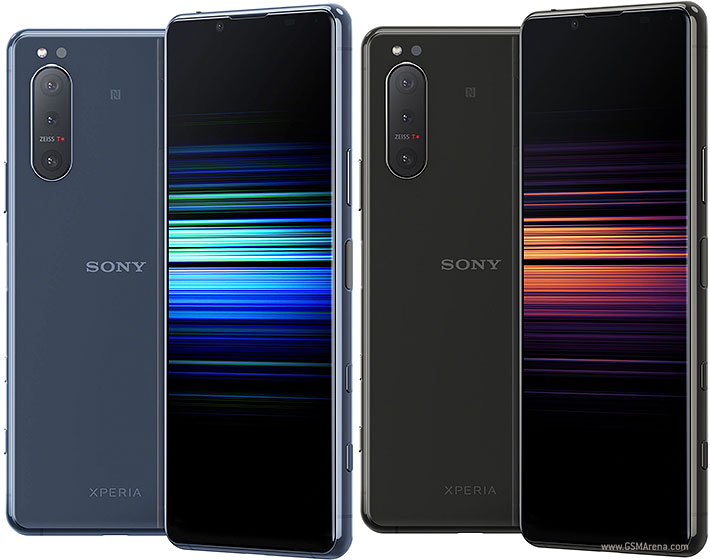
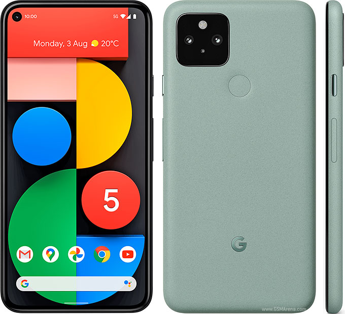
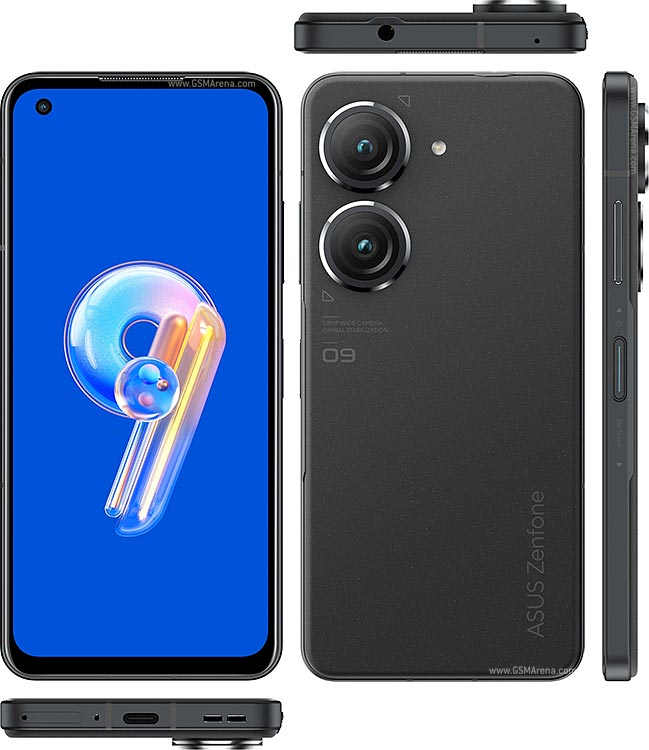
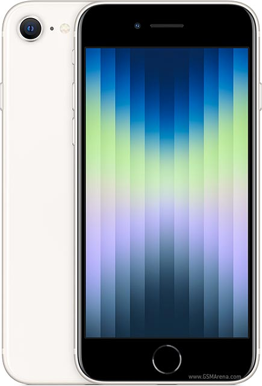

# 小尺寸手机备忘录

## 要求：

!!! warning "注意"
    - ==标黄内容== 为不符合要求的部分；  
    - 本文所引用的图片与数据均来源于 [Gsmarena](https://www.gsmarena.com/)。

1. 机身宽度不超过 70mm；
2. 系统应为 AOSP 类原生；
3. 屏幕外形不能是刘海屏；
4. 必须有 USB 3.0 接口；
5. 电池容量不低于 3400mAh；
6. 存储空间不低于 64GB；
7. 内存不低于 6GB。

----

### Sony Xperia 5 II

{ width=400px }

- 6.1 寸，直屏  
    - OLED, 120Hz, HDR BT.2020
    - 1080 x 2520（~449 ppi）  
    - 158 x 68 x 8 mm
    - 163g
- 高通骁龙 865 5G
- 支持 microSDXC
- 128GB 8GB RAM, 256GB 8GB RAM
- 支持 3.5mm 耳机孔
- USB Type-C 3.1, USB On-The-Go
- 侧边指纹解锁
- 4000 mAh
- 系统：SonyAOSP 12.1

### Google Pixel 5

{ width=400px }

- 6.0 寸，==打孔屏==
    - OLED, 90Hz, HDR10+  
    - 1080 x 2340（~432 ppi）
    - ==144.7 x 70.4 x 8 mm==
    - 151g
- 高通骁龙 765G 5G
- 128GB 8GB RAM
- USB Type-C 3.1
- 后置指纹解锁
- 4080 mAh
- 系统：Android 13

### Asus Zenfone 9

{ width=400px }

- 5.9 寸，==打孔屏==  
    - Super AMOLED, 120Hz, HDR10+, 1100 nits (peak)
    - 1080 x 2400（~445 ppi）
    - 146.5 x 68.1 x 9.1 mm
    - 169g
- 高通骁龙 8+ Gen 1
- 128GB 6GB RAM, 128GB 8GB RAM, 256GB 8GB RAM, 256GB 16GB RAM
- 支持 3.5mm 耳机孔
- USB Type-C, USB On-The-Go
- 侧边指纹解锁
- 4300 mAh
- 系统：ZenUI（Android 12）

### iPhone SE 2022

{ width=400px }

- 4.7 寸，直屏  
    - Retina IPS LCD, 60Hz  
    - 750 x 1334 (~326 ppi)  
    - 138.4 x 67.3 x 7.3 mm  
    - 144g
- Apple A15
- 64GB 4GB RAM, 128GB 4GB RAM, 256GB 4GB RAM
- 无耳机孔
- ==Lightning, USB 2.0==
- 前置指纹解锁
- 2018 mAh
- ==系统：iOS==