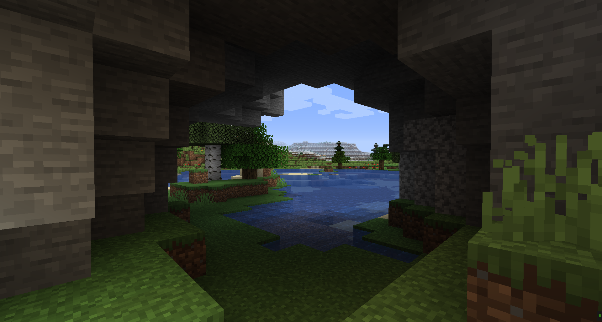
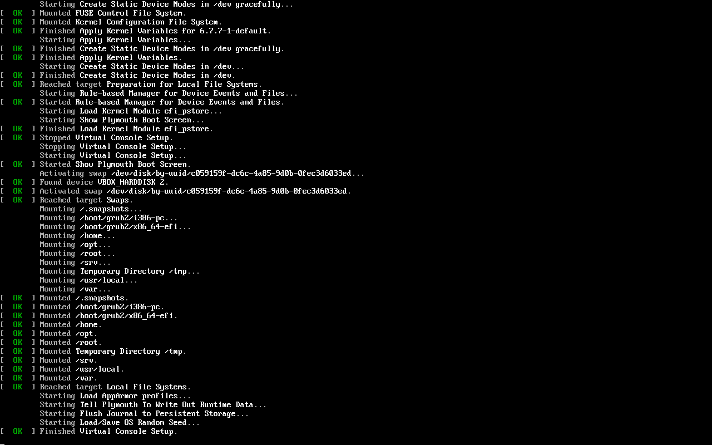

# 欢迎来到我的个人文档站！

<!---

  
> 正在冷启动……

图源 [HTTP Cats]

[HTTP Cats]: https://http.cat/

停更中，更多信息另见 [二月更新动态](./blog/posts/2024-02.md)。

--->

## 关于本站

=== "本月更新"

    上月总结请翻阅本站[博客](./blog/index.md)。

    - [预留日期：Fedora 40 发行派对，5 月 24 日至 25 日](./translation/fedora40-release-party.md)

=== "主要内容"

    - 开源组织的新闻或博客的译文
        - 仅包含 FOSS 社区的市场营销/广告/捐款求助
    - 一些说明文档，备忘录
    - 个人随笔杂谈
    - 有趣的东西……

    **注意：本站的绝大部分内容都具有时效性。如果你认为某些内容需要更新，欢迎提交 [PR] 或 [issue] 以协助改进站点内容。**

=== "关注的动态"

    当前长期跟踪的内容：

    - [GIMP Blog](https://www.gimp.org/news/)
    - [Fedora Magazine](https://fedoramagazine.org/)
        - 不包含技术教程、测试请求、流行应用推荐的博客。
    - [Xfce Blog](https://blog.xfce.org/)
    - openSUSE
        - 不经常更新的内容；经常更新的官方新闻另见 [suse.org.cn](https://suse.org.cn)。

=== "支持的功能"

    - [CC BY-SA 4.0](http://creativecommons.org/licenses/by-sa/4.0/) Licensed ✅
    - 站内搜索 ✅
    - 日夜间主题切换 ✅
    - 评论系统（基于 [giscus](https://giscus.app)）✅
    - [标签地图](./about/tags.md) ✅
    - [RSS 订阅](./blog/posts/hello-world.md) ✅
    - 文档归档（请提交 [PR] 与许可协议副本） ✅
    - 镜像：
        - [GitHub Pages](https://poplar-at-twilight.github.io/whiteboard/) ✅
        - [Cloudflare Pages](https://whiteboard-ui8.pages.dev/) ✅
        - [互联网档案馆快照](https://web.archive.org/web/*/https://whiteboard-ui8.pages.dev)（内容不完整） 🔄️

=== "第三方内容/cookie/数据追踪"

    - 【待完善】
    - Cloudflare 站点数据追踪
    - YouTube
    - GitHub Discussion

---

<em>

欢迎提交 [PR] 或 [issue] 以协助改进站点内容。许可证清单详见[此处]。 Feel free to submit [PR] or [issue] to help improve site content. See [here][此处] for a list of licenses.

</em>

----> [朋友们] <----

[PR]: https://github.com/poplar-at-twilight/whiteboard/pulls
[issue]: https://github.com/poplar-at-twilight/whiteboard/issues
[此处]: ./about/license.md
[朋友们]: ./about/friends.md