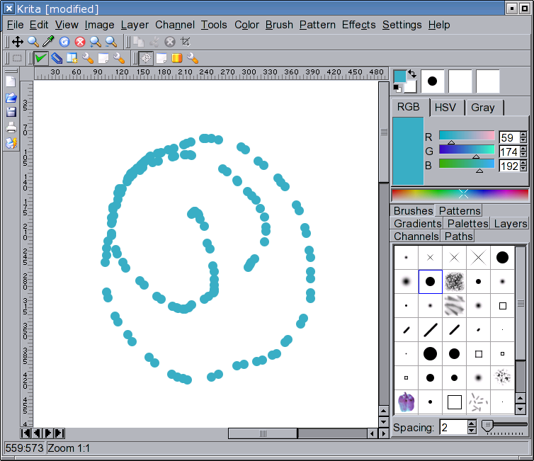
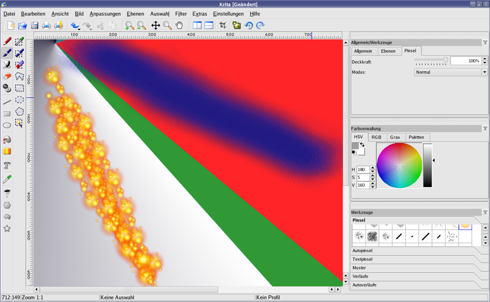
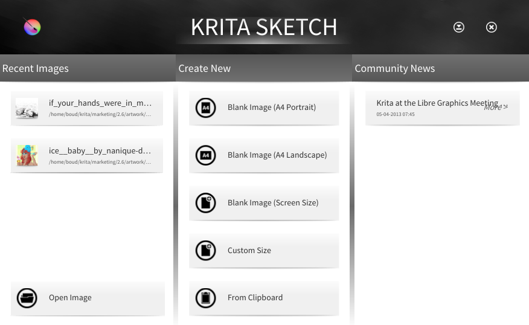
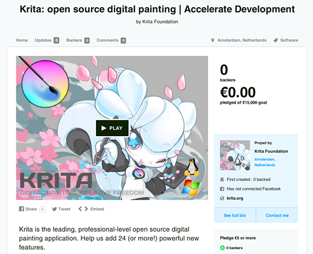
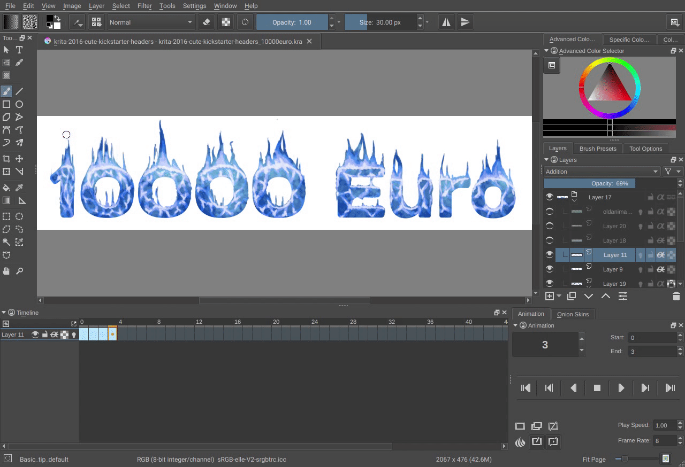
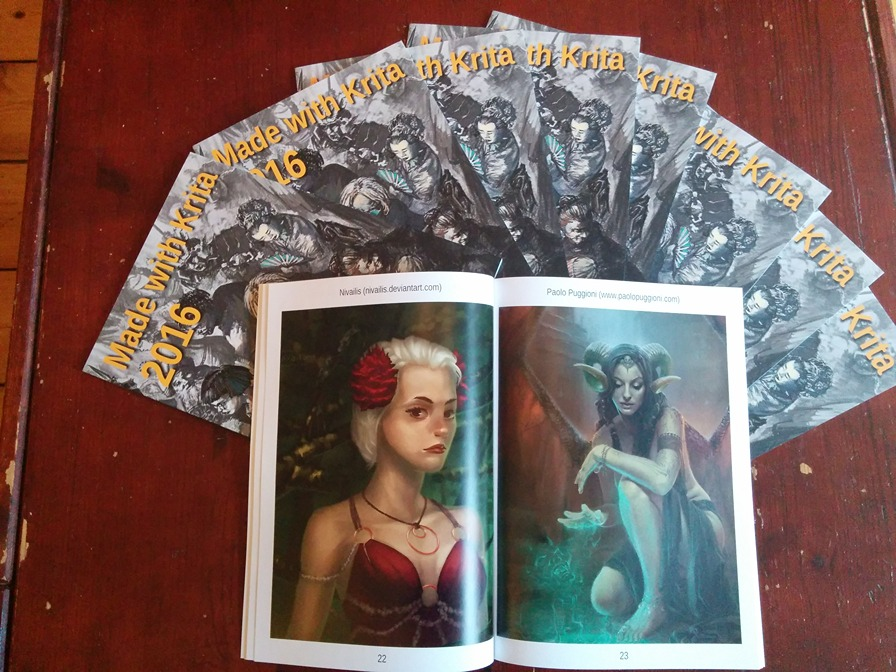

# Krita 25 周年快乐！

- 译文信息：
    - 源文：[25 Years of Krita!](https://krita.org/en/posts/2024/krita-25-years/)
    - 作者：[Halla Rempt - Krita project](https://krita.org)  
    - 许可证：[CC-BY-SA 4.0](https://creativecommons.org/licenses/by-sa/4.0/)
    - 译者：暮光的白杨
    - 日期：2024-06-05

----

二十五年，四分之一世纪。我们已经在 Krita 上工作了这么久。嗯，其实最初并不叫 Krita，它最开始叫做 KImageShop，但这个名字被一个已经去世很久的德国律师否决了。然后改名为 Krayon，这个名字也被否决了。最后改名为 Krita，这个名字一直保留了下来。

我是在 2003 年加入 Krita 团队的，当时 Krita 还是 KDE 生产力应用套件 [KOffice] 的一部分，后来它改名为 [Calligra]……2004 年，Patrick Julien 将工作交接给我，[我成为了 Krita 的维护者][exlink1]。这意味着在这二十五年里，我陪在 Krita 身边已经有二十年。因此，希望亲爱的读者您能原谅我将这篇文章写得如此个人化；我的生命中有很大一部分都与 Krita 紧密相连，而这点将在后文中体现。

[koffice]: http://koffice.org/
[exlink1]: https://marc.info/?l=kde-kimageshop&m=107877497900328&w=2
[Calligra]: https://en.wikipedia.org/wiki/Calligra

但首先，让我们回到我需要一个数字绘画应用程序之前；Krita 的最初种子早在 1998 年就已经播下，甚至比最初的代码还要早。当时围绕 Linux 有很多激动人心的事情，许多项目试图为 Linux 创建出色的应用程序。其中一个项目是 [GIMP]，另一个项目是 Qt。GIMP 是一个数字图像处理应用程序，而 [Qt] 是一个用于用 [C++] 创建用户友好应用程序的工具包。但 GIMP 并没有使用 Qt，而是使用了它自己开发的用户界面工具包（尽管它最初使用的是闭源的 [Motif]），即 [GTK]。Qt 爱好者 Matthias Ettrich 将 GIMP 实验性地移植到 Qt 上，并在 [1998 年的 Linux Kongress][exlink2] [^f1]上做了演示。这并没有得到很好的回应，反而引发了那种开源社区典型的争论。那时的人们年轻气盛，情绪激动。

[exlink2]: http://www.linux-kongress.org/1998/abstracts.html
[GIMP]: https://www.gimp.org/
[gtk]: https://www.gtk.org/
[qt]: https://www.qt.io/
[C++]: https://en.wikipedia.org/wiki/C%2B%2B
[Motif]: https://en.wikipedia.org/wiki/Motif_%28software%29

[^f1]: Kongress，德语中表示 “congress（正式会议）”的意思

嗯，在这种情况下，唯一的解决办法就是自己动手，这就是当时发生的事情。虽然经历了几次失败的尝试，但在 1999 年 5 月的最后一天，[Matthias Elter 和 Michael Koch 启动了 KImageShop][exlink3]：请看看下面的邮件，因为我们遵循和不遵循最初的设想的方式很有趣（KOM 是一个类似 [Corba] 的东西，如果你从未听说过 Corba，那可能是因为 Corba 是个糟糕的主意）。

[Corba]: https://en.wikipedia.org/wiki/Common_Object_Request_Broker_Architecture
[exlink3]: https://marc.info/?l=kde-devel&m=92815444812221&w=2

=== "邮件译文"

    <pre>
    List:       <a href="https://marc.info/?l=kde-devel&r=1&w=2">kde-devel</a>
    Subject:    <a href="https://marc.info/?t=92815471800001&r=1&w=2">KImageShop project started</a>
    From:       <a href="https://marc.info/?a=91479317900001&r=1&w=2">Matthias Elter <me () main-echo ! net\></a>
    Date:       <a href="https://marc.info/?l=kde-devel&r=1&w=2&b=199905">1999-05-31 12:30:42</a>
    [Download RAW <a href="https://marc.info/?l=kde-devel&m=92815444812221&q=mbox">message</a> or <a href="https://marc.info/?l=kde-devel&m=92815444812221&q=raw">body</a>] 
    大家好！ 
    你可能还记得最近在这个邮件列表上进行的关于 KIMP/KImageShop 的讨论。我很高兴地宣布，
    Michael Koch（KImage）和我（Matthias Elter，KHelpCenter）已经启动了一个名为 
    KImageShop 的图像处理应用程序。 
    我们把上周末的时间花在了一个基本概念/设计的工作上： 
    类似于 KodeKnight，KImageShop 将基于 KOM。所有接口，比如导入/导出过滤器，都将以 
    KOM 组件实现。KImageShop 的核心应用将被设计得轻量且快速。核心应用将<strong>仅仅</strong>处理图像数据、
    图层和基本工具，如移动工具或选择工具。其他所有功能都将以 KOM 组件实现，并根据需要加载。
    将会有定义明确的 KOM 接口用于： 
    - 导入过滤器，
    - 导出过滤器，
    - 图像处理过滤器，
    - 和工具。 
    像渐变编辑器或屏幕截图工具这样的附加工具也将以 KOM 组件实现。 
    KImageShop 使用自己的基于 XML 的文件格式。我们决定使用 XML DTD，因为它极大地简化了
    导入/导出过滤器的实现。为了与 GIMP 兼容， KImageShop 将拥有用于 GIMP 文件格式的导
    入和导出过滤器。 
    KImageShop 将提供数种类型的颜色表示（color representation）。其中包括 RGB 和 
    CMYK 颜色表示。 
    由于使用 GIMP 插件接口可以获得大量高质量图像修改插件，我们决定实现一个兼容层，以便将 
    GIMP 插件与 KImageShop 结合使用。我们决定不使用 GIMP 插件接口作为 KImageShop 
    的原生插件接口，因为我们认为基于 CORBA/KOM 的插件接口功能更强大，并且简化了插件的实现。 
    与 KSpread 类似，可以使用 Python 为 KImageShop 编写脚本。 
    KImageShop 将使用基于我们希望与 Mosfet 一起开发的，即将推出的 ImageMagick lib 
    的高级画布小部件。 
    我们已经收到了一些感兴趣的人的来信，但对于这样规模的项目，需要更多的开发人员。如果您对这
    个项目感兴趣，请订阅 KImageShop 邮件列表 (kimageshop@kde.org)。向 
    kimageshop-request@kde.org 发送主题为 “subscribe” 的邮件。 
    致以问候，
    Matthias
    </pre>

=== "邮件原文"

    <pre>
    List:       <a href="https://marc.info/?l=kde-devel&r=1&w=2">kde-devel</a>
    Subject:    <a href="https://marc.info/?t=92815471800001&r=1&w=2">KImageShop project started</a>
    From:       <a href="https://marc.info/?a=91479317900001&r=1&w=2">Matthias Elter <me () main-echo ! net\></a>
    Date:       <a href="https://marc.info/?l=kde-devel&r=1&w=2&b=199905">1999-05-31 12:30:42</a>
    [Download RAW <a href="https://marc.info/?l=kde-devel&m=92815444812221&q=mbox">message</a> or <a href="https://marc.info/?l=kde-devel&m=92815444812221&q=raw">body</a>] 
    Hello 
    You perhaps remember the KIMP/KImageShop discussion that recently took place on
    this mailinglist. I'm happy to announce that Michael Koch (KImage), and myself
    (Matthias Elter, KHelpCenter) have started an image manipulation application
    called KImageShop. 
    We spent the last weekend working on a basic concept/design: 
    Similar to KodeKnight, KImageShop will be based on KOM.
    All interfaces like import/export filters will be implemented as KOM
    components. The KImageShop core application will be designed to be
    light-weight and fast. The core application will "only" handle the image data,
    layers and basic tools, like the move tool or the selection tools. Everything
    else will be implemented as KOM components and loaded as needed. There will
    be well defined KOM interfaces for: 
    - import filters,
    - export filters,
    - image manipulation filters,
    - and tools. 
    Additional tools like a gradient editor or a screen shot utility
    will be implemented as KOM components, too. 
    KImageShop comes with it's own XML based file format.
    We decided to use an XML DTD because it greatly simplifies the
    implementation of import/export filters.
    To be compatible with GIMP KImageShop will have import- and export-filters for
    the GIMP-fileformat. 
    KImageShop will provide several types of color representation. This will include
    RGB- and CMYK-color representation. 
    With the vast amount of high quality image modification plugins available
    using the GIMP plugin interface we decided to implement a compatibility layer
    for using GIMP plugins with KImageShop. We decided against using the GIMP plugin
    interface as native plugin interface for KImageShop because we feel that a
    CORBA/KOM based plugin interface is much more powerful and simplifies the
    implementation of plugins. 
    Similar to KSpread, KImageShop will be scriptable using python. 
    KImageShop will make use of the advanced canvas widget based on the upcomign
    KImageMagick lib we would like to develop together with Mosfet. 
    We already have been contacted by a few interested people but for a project of
    this size additional developers are needed. If you are interested in this
    project please subscribe to the KImageShop mailinglist (kimageshop@kde.org).
    Send a mail with the subject line "subscribe" to kimageshop-request@kde.org. 
    Greetings,
    Matthias
    </pre>

----

开发已经开始，不管你相信与否，Krita 的代码库中仍然有一些可以追溯到那时的实际代码，尽管剩余的大部分代码都是左括号和右括号。

然后开发停止了，因为……嗯，做一个合适的图像处理应用程序并不是一件容易或快速的工作。开发工作断断续续地进行中。在我于 2003 年寻找一个良好、高性能的代码库用于绘画应用程序之前，Krita 已经有几位维护者了。我当时不懂 C++；但我已经写过了第一本关于如何将 [Python] 和 Qt 结合使用的书。

[Python]: https://www.python.org/

Krita 已经被重写到了连绘画工具都没有的地步，所以这是我想要的第一件东西。这并不容易！

{ width=70% }

但……坦诚地说，这意味着人们并不容易对此感兴趣，然后我们开始吸引到了贡献者。因此，到了 2004 年，我们拥有了一支充满热情的小团队。那一年发生了很多事情；Camilla Boemann 重写了 Krita 的核心，使我们拥有了自动调整大小的图层，Adrian Page 编写了基于 [OpenGL] 的后端，Cyrille Berger 添加了插件和脚本的最初雏形。尽管我们的方法仍然相当技术性，但我们没有成功发布版本。

[OpenGL]: https://www.opengl.org/

直到 2005 年，我们才将 Krita 作为 KOffice 1.4 的一部分发布。虽然还很不成熟，但所有人都认为它很有前途，在一些 Linux 杂志上也得到了好评——这在 2005 年是一件引人注目的事情。

{ width=70% }

然后到了 2006 年。Krita 1.5 发布，支持 [CMYK] 色彩管理。Krita 1.5还具有短暂的真实颜色混合水彩图层功能，但这个功能太复杂了，无法维护。同一年，我们发布了 Krita 1.6：Linux Journal 称其为 “[State of the Art][exlink4]（最先进的）”。我们认为这是一个相当成熟的版本，但向我们提供反馈的艺术家仍然发现它还有很多不足。

[CMYK]: https://en.wikipedia.org/wiki/CMYK_color_model
[exlink4]: https://www.linux.com/news/krita-16-state-art/

然后灾难降临了。Qt3 生命周期结束，Qt4 发布。移植工作量巨大，花费了很长时间，这也是因为我们愚蠢地决定重写大量的 1.x 代码，以便在 KOffice 应用程序之间共享组件。重写工作占据了 2007 年至 2008 年，以及 2009 年上半年的大量时间。

与此同时，当我们拼命试图修复移植和重写引入的所有错误时，我们举办了第一次筹款活动：购买 [Wacom] 数位板来测试 Krita，并配有美术笔。我至今仍在使用我们当时得到的 [Wacom Intuos 3]！

[Wacom]: https://www.wacom.com/
[Wacom Intuos 3]: https://101.wacom.com/productsupport/manual/I3_UsersManual.pdf

2009 年，我们发布了 Krita 2.0。它并不是真正可用的，但对我们来说很重要的是能够发布一个可以让人们测试的东西。Krita 2.1 也于 2009 年发布。我们还招到了我们的[第一个赞助开发者，Lukáš Tvrdý][exlink5]，他的具体任务是修复所有错误。后来，他还改进了 Krita 笔刷的性能。

[exlink5]: https://dot.kde.org/2009/12/02/krita-team-seeking-sponsorship-take-krita-next-level

随着 Krita 的认可度越来越高，我们收到了越来越多的反馈意见，在 2010 年，我们决定在[代芬特尔]举办一次大型冲刺活动（[Krita Sprint]），以确定我们希望 Krita 为用户提供什么。是 [Photoshop]、GIMP 或 [Corel Painter] 的复制品？还是一款独立的产品？我们为谁开发 Krita？

[Krita Sprint]: https://en.wikipedia.org/wiki/Krita#Sprint_events
[代芬特尔]: https://en.wikipedia.org/wiki/Deventer
[Photoshop]: https://www.adobe.com/products/photoshop.html
[Corel Painter]: https://www.painterartist.com/

答案至今仍然如此：我们正在为数字艺术家开发 Krita，他们大多从零开始创作艺术品。对于世界各地的各种艺术家来说，使用 Krita 绘画应该很有趣。

但要实现这个目标还需要一段时间。我们于 2010 年发布了 Krita 2.2 和 Krita 2.3：我们认为 Krita 2.3 已经可以供艺术家使用了，但直到 2012 年 Krita 2.4 和 2.5 的出现，Krita 才真正变得相当不错！事实上，我们有一个极其精准的焦点：多年来，我们的号召是“让 Krita 对 [David Revoy] 有用！”——部分出于幽默，但也部分出于严肃。在开发冲刺（dev sprints）期间，我们花时间观察艺术家，并让他们现场评论他们喜欢和不喜欢的内容，而观察的开发人员不许插嘴，无论是反驳还是帮助艺术家。

[David Revoy]: https://en.wikipedia.org/wiki/David_Revoy

与此同时，我创建了 Krita 基金会，以便我们可以进行筹款活动，赞助全职开发人员。我们赞助的第一个开发者是 Dmitry Kazakov，他现在也是 Krita 的首席开发者。

当时，Krita 仍然是 KDE 办公套件的一部分，但由于与一名 KOffice 开发人员（KWord 维护者）发生了无休止的冲突，现在它被称为 Calligra。在那次冲突上花费的所有精力本可以用于开发上，这是一个巨大的浪费。从 Calligra 时代开始，开发进展得更加顺利。诺基亚此时参与了 Calligra 的开发，由此产生的改进（所有应用使用的）核心库的工作也帮助改进了 Krita，但相反，支持非常多样化的应用程序集所需的复杂性仍然给我们带来负担。

时间辗转到了 2013 年，这一年十分平淡。我们发布了 2.6 和 2.7，进行了筹款活动，添加了功能（如动画支持），创建了一个带有特殊用户界面的 Krita 版本，适用于触摸板/数位板用户（由英特尔赞助：我们与我们的主要开发基金赞助商 Intel 仍然保持着良好的关系）。看到人们正在创作的艺术作品是件很棒的事情，从用户那里得到反馈也是很棒的事情，并且我们纯粹地享受开发的乐趣。

{ width=70% }

2014 年，我们将 Krita 移植到了 Windows 平台，这也是因为 Krita 的触摸板/数位板版本。Krita 2.9 是我们发布的第 11 个版本，这真是一个非常出色的版本。

同样在 2014 年，我们举办了我们的第一次 [Kickstarter] 活动。Kickstarter 在当时是新鲜事，而且非常令人兴奋。我们吸引了将近 700 人赞助了 Krita！我们还将 Krita 移植到了 MacOS。有一段时间，我们每年都会进行一次 Kickstarter 活动，这对我们和我们的开发人员来说都很有趣，我们设定了延伸目标，让人们投票决定他们希望我们做什么。

[Kickstarter]: https://www.kickstarter.com/discover/advanced?ref=nav_search&term=krita

{ width=70% }

那时我还有一份全职工作，所以所有与 Krita 有关的工作都是在晚上、周末以及上下班的路上火车上完成的。

我们还开始再次将 Krita 移植到 Qt5。这次的移植工作没有从 Qt3 到 Qt4 的移植那么困难，但由于 Qt5 使得我们无法将基于 OpenGL 的画布正确集成到 Qt5 库的触摸版本中，我们失去了对 Krita 的平板版本的支持。我们花了数月的时间和相当多的资金进行尝试，但最终未能成功。

然后我摔断了肩膀，失去了我在 [Blue Systems] 的全职工作，突然之间，Krita 基金会也需要支付我的工资。幸运的是，我们找到了一个赞助商来支持 Qt5 的移植工作，那是我的第一个赞助项目。

[Blue Systems]: https://blue-systems.com/

2016 年，我们发布了 Krita 3.0——它不如 Krita 2.9 好，但幸运的是，我们仍然记得当时进行重写和移植时所遭受的痛苦，所以我们只是先进行了移植，而没有将它与大规模的重写结合在一起。这个版本具备了动画功能！

{ width=70% }

我们还发布了我们的第一本也是最后一本纸质艺术书。对我来说，这是一项巨大的工作，从 2015 年就开始了，最终也损失了一大笔钱。

{ width=70% }

我们在 2016 年和 2017 年全年都在改进 Krita 的 3.0 版本。我们在 2018 年发布了 Krita 4.0，其中包含了 Kickstarter 赞助的工作成果。然而并非包含全部成果，因为在 2017 年，我被税收大灾难所困扰。荷兰税务局要求我们为 Dmitry 所做的工作支付数万欧元的增值税；那时我们雇了一位专业的会计师，而不是一个当地小镇的小型企业管理办公室。

当我们[公开问题]后，捐款纷至沓来，[PIA] 也进行了一笔巨额捐赠：他们基本上支付了账单。

[PIA]: https://www.privateinternetaccess.com/
[公开问题]: https://krita.org/en/posts/2017/krita-foundation-in-trouble/

为了避免再次发生这种情况，我将所有商业活动都纳入了一个独立的单人公司。这变得更加重要，因为在 2017 年，我们将 Krita 上架到了 [Windows 商店]。这是继2014 年将 Krita 上架 [Steam 商店]之后的第二个商店。从那时起，我们已经在 [Epic 商店]、[Google Play 商店]甚至是苹果 [MacOS 商店]上发布了 Krita。

[Windows 商店]: https://apps.microsoft.com/detail/9n6x57zgrw96?hl=en-us&gl=US
[Steam 商店]: https://store.steampowered.com/app/280680/Krita/
[Epic 商店]: https://store.epicgames.com/en-US/p/krita
[Google Play 商店]: https://play.google.com/store/apps/details?id=org.krita
[MacOS 商店]: https://apps.apple.com/us/app/krita/id1594607976?mt=12

时间飞逝，我们在 2018 年发布了 Krita 4.1，2019 年发布了 4.2，2020 年发布了 Krita 4.3 和 4.4。这些是相对较平静的年份，有着积极的开发活动，用户群不断增长，知名度也在不断提高。越来越多的赞助开发人员加入进来，Krita 取得了很多进展。

尽管 [Krita YouTube 频道]早已存在，但在 2019 年，我们请 Ramón Miranda 为我们的频道制作定期视频：

[Krita YouTube 频道]: https://www.youtube.com/c/KritaOrgPainting

<iframe width="517" height="291" src="https://www.youtube.com/embed/_9zZNHj5A_Y" title="Trailer for Krita channel. Are you  ready for digital painting freedom?" frameborder="0" allow="accelerometer; autoplay; clipboard-write; encrypted-media; gyroscope; picture-in-picture; web-share" referrerpolicy="strict-origin-when-cross-origin" allowfullscreen></iframe>

到目前为止，我们已经建立了一系列令人印象深刻的各种教程，教授从数字绘画本身到创建画笔预设的所有内容！

然后开发速度放缓了。到了 2020 年，新冠疫情的影响变得越来越明显。我们再也无法举行冲刺活动，因此也就没有了超高效的面对面开发会议。团队成员生病了，对一些人来说，病情非常严重。长期新冠病毒感染导致我的工作效率大幅下降：很多天我除了躺在昏暗的房间里什么也做不了。

到了 2021 年，即使我们不必将 Krita 移植到新版本，我们仍然决定将矢量图层从 [ODG] 更改为 [SVG]，这使得 Krita 文件在 4.x 版本和 5.x 版本之间不兼容。换句话说，这是文件格式的重大变化。我们仍在继续开发 Krita 5 的新版本： 2022 年发布了 5.1 版本，2023 年发布了 5.2 版本。

[ODG]: https://en.wikipedia.org/wiki/OpenDocument#Specifications
[SVG]: https://en.wikipedia.org/wiki/SVG

未来有望推出非常出色的 Krita 5.3！

另外，还有 Krita 6.0，因为我们已经开始将 Krita 移植到 Qt6。这并不令人愉快，因为 Qt6 再次对 Qt 提供和允许的功能进行了巨大改变。

这就是我投入了 25 年时间的项目，最初只是因为我想在我的笔记本电脑上为一本奇幻小说绘制地图而开始涉足其中的。

----

如果您希望的话，可以通过每月捐款来支持[开发基金]。或者您也可以在这里进行[一次性捐款]。

[开发基金]: https://fund.krita.org/
[一次性捐款]: https://krita.org/en/support-us/donations/

{ width=40% }

