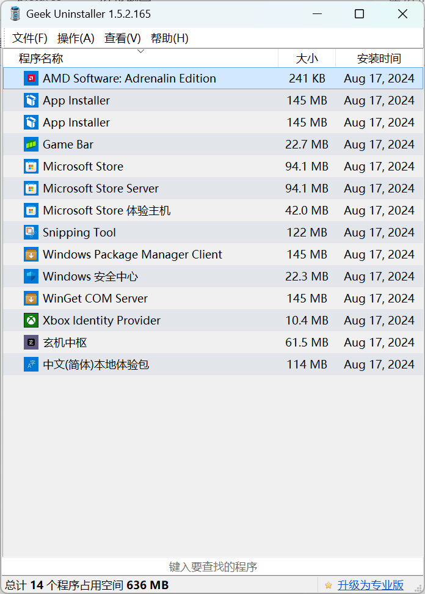

# Windows 11 安装与配置

**注意：**
* 本文最后更新于 2024 年 8 月 29 日；
* 本文适用于 Windows 11 23H2；
* 本文优先使用便携软件；
* 本文不具有普适性。

----

## 流程概览

1. 下载 ISO 文件；
2. 使用 ventoy 安装系统；
3. 等待 Windows Update 更新完毕；配置 Windows 系统设置，安装基本的运行库；
4. 再次检查是否有更新；
5. 安装显卡驱动；
6. 卸载无用软件；
7. 安装软件；
8. 便携软件列表。

----

## 1、获取 ISO 文件

从[下载 Windows 11] 页面获取 **Windows 11 安装助手**。使用这个助手仅下载 `Windows.iso` 而不直接刻入到 U 盘。

[下载 Windows 11]: https://www.microsoft.com/software-download/windows11

## 2、使用 ventoy 安装系统

使用 [Ventoy] 将 U 盘或可移动设备转换为一个可启动的安装介质。

[ventoy]: https://www.ventoy.net/cn/index.html

使用 `VentoyPlugson.exe` 配置设备，在 **全局控制插件** 中，在 **指定搜索目录** 中设置 ISO 文件存放的文件夹。

开机时连按 Esc 进入 BIOS，从 BIOS 启动 U 盘。安装系统时：

- 断开网络
- 使用本地账户
- 不设置密码
- 拒绝所有的微软服务

## 3.1、更新系统

在系统设置中，重命名此电脑。连接 WiFi，然后重启系统。

启动 Windows update，此时并不建议卸载任何软件。

Windows 和 Officee 激活见[沧水的 KMS 服务]。

[沧水的 KMS 服务]: https://kms.cangshui.net/

## 3.2、配置 Windows 系统设置

### 使用 Dism++ 调整系统

在启动 [Dism++] 后，点击左栏的**系统优化**，然后：

[Dism++]: https://github.com/Chuyu-Team/Dism-Multi-language

1. 在 **开始菜单及 Windows 体验** 中，将除了 **登录界面默认打开小键盘** 和 **关闭 Onedrive** 以外的选项全部开启；注意每次编辑都需要重启一次 `explorer.exe`；  
2. 在 **Explorer** 中，打开
    - **打开资源管理器时显示此电脑**
    - **显示所有文件扩展名**
    - **创建快捷方式时不添加“快捷方式”文字**
    - **此电脑中视频、照片、文档、下载、音手、卓面、3D 对象七个文件夹**
    - **快速访问不显示常用文件夹**
    - **快速访问不显示最近使用的文件**
    - **禁用Win11加入的新右键菜单，默认显示更多的选项**
3. 在 **桌面图标管理中** 隐藏全部的图标
4. 在 **资源管理器导航窗口图标管理** 中，打开 
    - **隐藏资源管理器导航窗口中的库**
    - **隐藏资源管理器导航窗口中的收藏夹**  
5. 在 **微软拼音输入法** 中，打开
    - **微软拼音默认为英语输入**

### Windows 设置

#### 系统

- 通知：<br />在 **其他设置** 中，取消勾选  
    - **更新以及登录后显示 Windows 欢迎体验以显示新增功能和建议内容**
    - **建议我如何充分利用 Windows 并完成设置此设备**
    - **当我使用 Windows 时获取提示和建议**
- 电源和电池：  
    **屏幕和睡眠** 设置为默认设置[^sleep]。
- 储存：  
    **存储感知** 应当是自动开启的。打开 **优化驱动器** 整理磁盘碎片。
- 就近共享：  
    关闭此功能
- 剪贴板：  
    打开 **剪贴板历史记录**
- 系统信息：  
    - 在 **高级系统设置** → **高级** → **环境变量** → **Path** 中，点击 `编辑`，插入环境变量。

```
D:\software\lib
D:\software\lib\git
D:\software\lib\git\cmd
D:\software\lib\python
D:\software\lib\python\Scripts
```

[^sleep]: 我的设备在睡眠状态下不会断开网络链接，所以此设置只需要遵循 Windows 的节能建议即可。

#### 蓝牙和其他设备

- 触摸板：  
    将 **三指手势** 的点击动作，修改为 **鼠标中键**  

#### 个性化

- 背景：  
    将 **个性化设置背景** 修改为 **幻灯片放映**，打开 **在使用电池供电时仍允许运行幻灯片放映**
- 颜色：  
    设置为 `钢蓝色`
- 锁屏界面：  
    **个性化锁屏界面** 修改为 **图片**  
    取消勾选 **在锁屏界面上获取花絮、提示、技巧等**
- 开始：  
    - **布局** 选择为 **更多固定项**  
    - 关闭 **布局** 下方所有的选项  
    - 在 **文件夹** 中，只打开 **设置**
- 任务栏：  
    - 在 **任务栏项** 和 **系统托盘图标** 中关闭或隐藏全部选项，除了 **任务视图**
    - 在 **其他系统托盘图标** 中，选择性开启所需应用图标。
    - 在 **任务栏行为** 中，勾选 **单击任务栏右下角以显示桌面**
- 设备使用情况：  
    关闭全部选项

#### 账户

在 **登陆选项** 中，设置密码和头像。

#### 时间和语言

在 **语言和区域** 中，修改 **区域格式**。

修改 **微软拼音输入法**：

- 在 **按键** 中，取消勾选 **Shift**
- 在 **词库和自学习** 中，启用全部的专业词典

#### 辅助功能

- **键盘**：  
    关闭与粘滞键、过滤键和切换键相关的全部选项

#### 隐私和安全性

- 在 **常规** 中，关闭全部选项
- 在 **诊断和反馈** 中，将反馈频率调成 **从不**。
- 在 **活动历史记录** 中，关闭活动历史记录
- 在 **搜索权限** 中，关闭所有选项
- 在 **搜索 Windows** 中，打开 **编制索引时遵从电源设置**

#### Windows 更新：  
    
在 **高级选项** 中，关闭 **传递优化**。

## 3.3、安装基本的运行库

1. 安装 [Microsoft Visual C++ 2015-2022 Redistributable] 和 [Chrome]。
2. 启动下列软件，将其集成到文件资源管理器中或关联文件格式：
      - [7-zip]（需要管理员权限）
3. 启动 [v2rayN] 并设置开机启动。

[chrome]: https://www.google.com/chrome/
[7-zip]: https://www.7-zip.org/
[Microsoft Visual C++ 2015-2022 Redistributable]: https://docs.microsoft.com/zh-CN/cpp/windows/latest-supported-vc-redist?view=msvc-170
[v2rayN]: https://github.com/2dust/v2rayN

使用 [ContextMenuManager] 编辑鼠标右键菜单，启用 **其他规则** 中的 **新建文件夹**、**重启资源管理器** 和 **复制路径**。

[ContextMenuManager]: https://github.com/BluePointLilac/ContextMenuManager

## 4、再次检查是否有更新

在更新完重启系统后，重新检查一下 Windows update 是否有可用更新。

## 5、安装显卡驱动

下载 [AMD Software]（[AMD Software 旧版本]）并安装。

[AMD Software]: https://www.amd.com/en/support
[AMD Software 旧版本]: https://www.amd.com/zh-cn/support/downloads/previous-drivers.html/graphics/radeon-rx/radeon-rx-7000-series/amd-radeon-rx-7600m-xt.html

完成后调整音量和屏幕亮度。

对于 AMD 驱动的设置，在 **游戏** → **显卡** 中，推荐选择 **自定义** 方案。并只开启：

- Radeon™ Anti-Lag
- Radeon™ 增强同步（仅对独显有效）

在 **游戏** → **显示器** 中，

- 关闭 Vari-Bright
- 打开自定义颜色，将色温调整到 `6900`

在 **系统** → **屏幕** → **显示卡** 中，添加需要使用显卡的应用。

按 `Alt` + `R` 启动 AMD Software 面板。

## 6、卸载无用软件

使用 [Geek Uninstaller] 清理系统的 UWP 软件（包括 OneDrive），仅保留（含厂商驱动）：



[Geek Uninstaller]: https://geekuninstaller.com/

然后使用微软商店更新 UWP 应用。更新过程中，已删除的应用可能会被重新安装回来。

使用**强制删除**卸载无法卸载的 Edge 和 webview2 ，并使用 [Edge Blocker] 禁止系统再次安装 edge。

[Edge Blocker]: https://www.sordum.org/9312/edge-blocker-v2-0/

## 7、安装软件

- 注意：安装后会产生大量小文件的应用默认不以便携模式进行部署。

使用 [Office Tool Plus] 安装 Microsoft Office，并卸载 Office 2021 稍后自动安装的一个应用。

[Office Tool Plus]: https://otp.landian.vip/zh-cn/

安装：

- [Auto Night Mode]
- [Bandiview]
- [GIMP]
- [gpg4win]  
    - 安装时只需要 Kleopatra 和 GpgEX 即可。
- [steam]  
    - 关闭开机启动
    - 修改默认库
    - 修改默认启动时显示的页面
    - 修改下载服务器
    - 修改按下控制器按钮时的操作
- [VirtualBox]
- [VLC]

[Auto Night Mode]: https://github.com/AutoDarkMode/Windows-Auto-Night-Mode
[bandiview]: https://www.bandisoft.com/bandiview/
[gpg4win]: https://gpg4win.org/download.html
[VirtualBox]: https://www.virtualbox.org/wiki/Downloads
[steam]: https://store.steampowered.com/

无线与蓝牙驱动：

- [Intel® Wi-Fi 6E AX210]

[Intel® Wi-Fi 6E AX210]: https://www.intel.com/content/www/us/en/products/sku/204836/intel-wifi-6e-ax210-gig/downloads.html

## 8、便携软件列表

注意：以下是以便携模式或类似状态使用的软件。

<center>D:\software\portable</center>

- [7-zip](https://www.7-zip.org/download.html)（本质是个便携软件，需要管理员权限以便于重新注入 shell）  
    打开 **工具** → **选项**：  
    - 在 **7-Zip** 页面，取消勾选 **层叠右键菜单**、**压缩并邮寄**、**压缩<档案>.7z并邮寄** 和 **压缩<档案>.zip并邮寄**；  
    - 在 **显示** 页面，勾选 **显示 ⌜...⌟ 项**、**显示真实图标**、**整行选择**、**显示网格线**、**单击打开项目**。
- [aria2](https://aria2.github.io/)  
    另见：[安装与使用 aria2](./aria2.md)
- benchmark-toolkit  
    - [CPU-Z]（需要管理员权限）
    - [CrystalDiskMark]（需要管理员权限）
    - [Furmark]（需要管理员权限）
    - [HWiNFO]（需要管理员权限）
- [ContextMenuManager]（需要管理员权限）
- [Dism++]（需要管理员权限）
- [Everything]（需要管理员权限）
- [FreeFileSync]（本质是个便携软件）  
    仅同步 git 仓库的压缩包文件
- [GoldenDict-ng]  
    - 需要在 `GoldenDict.exe` 所在目录新建一个名为 `portable` 的文件夹  
    - 便携模式下，词典文件只能放置在 `content` 文件夹中
- [KeePassXC]
- music-toolkit:
    - [Foobox]  
        - [foobar2000 Asion 汉化版]（关联格式需要管理员权限）
    - [MusicTag]  
        安装包解压密码：`www.coolapk.com`
    - [spek]
- [Notepad3]（本质是个便携软件）
- sordum toolkit
    - [EdgeBlock][Edge Blocker]（需要管理员权限）
    - [W11ClassicMenu]（需要管理员权限）
    - [win update blocker]（需要管理员权限）
- sysinternals  
    - [Autoruns64]（需要管理器权限）
    - [procexp64]（需要管理员权限）
    - [RaMMap]（需要管理员权限）  
    - [tcpview64]（需要管理员权限）
- [Telegram]
- [v2rayN]（TUN 模式需要管理员权限）
- [VSCode]  
    需要在应用目录中新建一个 `data` 文件夹。

[Everything]: https://www.voidtools.com/downloads/
[GIMP]: https://www.gimp.org/
[FreeFileSync]: https://freefilesync.org/
[GoldenDict-ng]: https://github.com/xiaoyifang/goldendict-ng
[KeePassXC]: https://keepassxc.org/download/
[MusicTag]: https://www.cnblogs.com/vinlxc/p/11347744.html 
[spek]: https://www.spek.cc/p/download
[Foobox]: https://github.com/dream7180/foobox-cn/
[Notepad3]: https://github.com/rizonesoft/Notepad3
[W11ClassicMenu]: https://www.sordum.org/14479/windows-11-classic-context-menu-v1-2/
[win update blocker]: https://www.sordum.org/9470/windows-update-blocker-v1-8/
[Telegram]: https://telegram.org/dl/desktop/win64_portable
[VLC]: https://www.videolan.org/vlc/
[VSCode]: https://code.visualstudio.com/
[foobar2000 Asion 汉化版]: https://www.cnblogs.com/asionwu
[Furmark]: https://geeks3d.com/furmark/
[CPU-Z]: https://www.cpuid.com/softwares/cpu-z.html

----

- [aegisub]
- [AMD CleanUp Utility]（会直接启动到安全模式）
- [AntiDupl.NET]
- [BOOTICEx64]（已停更）
- [Calibre Portable]
- [DiskGenius]（需要管理员权限）
- [draw.io]
- [Geek Uninstaller]（需要管理员权限）
- [KMS-Cangshui.net.bat][沧水的 KMS 服务]（需要管理员权限）
- [Office Tool Plus]
- [Rufus]（需要管理员权限）
- [SpaceSniffer]（需要管理员权限）
- [Umi-OCR_Paddle]
- [ventoy]（需要管理员权限）
- [WinMemoryCleaner]（需要管理员权限）

[aegisub]: https://github.com/arch1t3cht/Aegisub
[AMD CleanUp Utility]: https://www.amd.com/en/resources/support-articles/faqs/GPU-601.html
[AntiDupl.NET]: https://github.com/ermig1979/AntiDupl/releases
[Autoruns64]: https://learn.microsoft.com/en-us/sysinternals/downloads/autoruns
[BOOTICEx64]: https://www.majorgeeks.com/files/details/bootice_64_bit.html
[Calibre Portable]: https://calibre-ebook.com/download_portable
[CrystalDiskMark]: https://crystalmark.info/en/software/crystaldiskmark/
[DiskGenius]: https://www.diskgenius.cn/
[draw.io]: https://github.com/jgraph/drawio-desktop/
[HWiNFO]: https://www.hwinfo.com/
[Rufus]: https://rufus.ie/
[SpaceSniffer]: http://www.uderzo.it/main_products/space_sniffer/
[Umi-OCR_Paddle]: https://github.com/hiroi-sora/Umi-OCR
[RaMMap]: https://learn.microsoft.com/en-us/sysinternals/downloads/rammap
[此处]: https://cn.windows-office.net/?p=22621
[procexp64]: https://learn.microsoft.com/en-us/sysinternals/downloads/process-explorer
[tcpview64]: https://learn.microsoft.com/en-us/sysinternals/downloads/tcpview
[WinMemoryCleaner]: https://github.com/IgorMundstein/WinMemoryCleaner

----

<center>D:\software\lib</center>

- [git]  
    - 需要将它添加至环境变量中，详见上文。
    - 配置文件（C:\Users\Poplar\.gitconfig）：
    ```
    [user]
        name = Poplar at twilight
        email = poplar.cubic@gmail.com
    [http]
        proxy = http://127.0.0.1:7890
    ``` 
- [python]  
- [pandoc]

[git]: https://git-scm.com/download/win
[python]: https://www.python.org/
[pandoc]: https://pandoc.org/

----

<center>D:\software\installed</center>

- [qBittorrent-Enhanced-Edition]
    - 详见：[qBittorrent 配置备忘录](./qbittorrent-conf.md)
- [PeerBanHelper]

[qBittorrent-Enhanced-Edition]: https://github.com/c0re100/qBittorrent-Enhanced-Edition/releases
[PeerBanHelper]: https://github.com/PBH-BTN/PeerBanHelper/issues